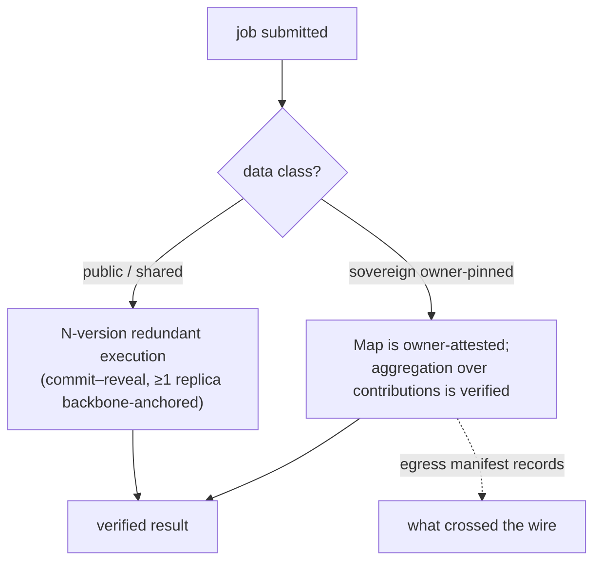
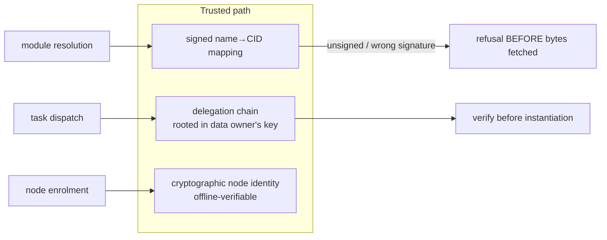
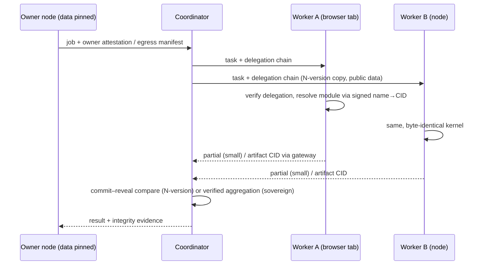

# o2.services — Architecture Overview

> Draft architecture documentation by an external reviewer (Praxis), based on the public
> repository as of 2026-09-17 (milestone v1.1, 5/14 phases). Diagrams are Mermaid.
> Where a statement is a *claim not yet measured*, it is marked ⚠.

## 1. What the system is

A peer-to-peer compute fabric that:

- runs **untrusted code safely** on volunteer and enterprise nodes;
- **moves code to data** instead of data to code;
- keeps each owner's data **pinned to the owner's device**.

The node agent is TypeScript + WASM; the same build runs in a browser tab, in Node.js,
or embedded — which is why "every visitor of a page is a potential compute node".

## 2. Topology

```mermaid
flowchart LR
    subgraph Browser["Browser peer (tab/phone)"]
        B1[node agent, TS+WASM]
        B2[WebRTC only]
    end
    subgraph NodeJS["Node.js / host peer"]
        N1[node agent]
        N2[TCP + Noise + yamux]
    end
    REL[Circuit Relay v2\n(signalling only:\n2 min, 128 KiB, 15 slots)]
    GW[IPFS gateway\n(bulk artifacts)]

    B1 <-->|WebRTC data, ≤16 KiB msg| B1x[peer browser]
    B1 <-.signalling.-> REL
    N1 <-->|verified transport| N1x[peer node]
    B1 -->|partials small, artifacts| GW
```

**Hard physical boundaries (verified, not assumptions):**

- Browser→browser is WebRTC only; every browser peer needs a reachable relay to be dialable.
- The relay is a **signalling channel, not a data path** — it drops out after the handshake.
- The browser mesh **cannot carry bulk data** (16 KiB messages in js-libp2p; Chromium closes
  above 256 KiB and does not reassemble Firefox fragments). Partials stay small; artifacts
  travel over an IPFS gateway.

## 3. Core split: sovereignty vs N-version

The central architectural decision — stated as falsifiable rather than blurred:

> Sovereignty and N-version verification cannot both apply to the same task: pinning data
> to one node removes the second independent executor.



Plainly: *the owner's contribution is trusted; the aggregation over contributions is verified.*

## 4. Trusted-path components



Demonstrated properties (each with an independent pass in the repo):

1. Code runs **only if a trusted key vouched for it**: an unsigned mapping is refused before
   the bytes are fetched (node's block directory verified empty from a separate process).
2. Tasks **carry their own permission**: delegation chain verified before instantiation.
3. Node identities verifiable **offline** — proven with the authority process shut down.
4. Results **merge up a derived tree** (8–9 spawned processes) matching a single-machine
   reference byte-for-byte.

## 5. Sandbox model

- `WebAssembly.instantiate` **is** the sandbox — deliberately no host-import allow-list;
  the engine already refuses and names the offending import.
- The kernel never requires `crypto.subtle` (LAN origins are not secure contexts).
- Determinism is a **property of the published artifact**, not a runtime setting: V8 exposes
  no NaN-canonicalization and no relaxed-SIMD control, so both are settled at publish time.
- elfconv exit codes are never trusted (it exits 0 on partially-failed translations); the
  driver measures the produced module instead.

## 6. Execution flow of a verified map/reduce job



⚠ *Parallel speedup is not yet measured: current benchmark curves run N logical nodes on one
event loop. The super-linear-capacity claim is a hypothesis with the measurement still owed.*

## 7. Package layout

| Package | Role |
| --- | --- |
| `packages/core` | kernel: byte-identical across Node / browser / Worker |
| `packages/node` | Node.js host agent (TCP + Noise + yamux) |
| `packages/browser` | browser harness + demo (WebRTC, IndexedDB blockstore) |
| `packages/libp2p`, `packages/net` | transport layers |
| `packages/aot` | AOT/WASM toolchain integration (elfconv driver) |
| `packages/cloudflare` | Cloudflare Worker deployment |
| `packages/bench`, `packages/demo` | measurement and demo jobs |

## 8. Known open risks (honest list)

- **Sybil cost**: enrolment rate-limiting is measured; the cost of forging an identity is not.
- **Single test machine** for everything, including cross-machine WASM reproducibility (AOT-03)
  — the main blind spot, marked as such in the repo's own ledger.
- **22 capabilities built but unreachable**, 11 partly wired — v1.1 exists to close exactly this.
- Two phases at "nearly done" deliberately not counted (one criterion half-proven each).

## 9. Licensing note for integrators

AGPL-3.0 with a commercial track; contributions are not merged (sole-authorship provenance
is deliberate). A volunteer running a node owes nothing; §13 obliges whoever *offers a
modified version as a service*.
