# RFC: Digital White Room Protocol

## Joint Confidential Execution Domains for Mutually Authorized Private Computation

### Authored by Alexander Fedin

**Author:** Alexander Fedin  
**Status:** Draft  
**Category:** Architecture / Protocol Specification  
**Version:** 0.1  
**Date:** August 9, 2026

---

## Abstract

This document specifies the **Digital White Room (DWR)** abstraction: a temporary, jointly authorized confidential execution environment in which mutually distrustful parties can perform computation over private data without transferring that data into another participant's trust domain.

The underlying security abstraction is called a **Joint Confidential Execution Domain (JCED)**.

A DWR is created for a defined set of participants, an exact executable workload, an explicit security policy, defined input classes, defined permitted outputs, an approved execution environment, and a bounded lease period. Before private inputs are released, every required participant verifies the exact White Room contract and the instantiated execution environment. The contract is cryptographically signed by the required participants and cryptographically bound to the runtime through remote attestation or an equivalent verification mechanism.

A DWR is intentionally **ephemeral**. It is created for a computation, receives only authorized inputs, produces only authorized outputs, and destroys its confidential state and cryptographic material when its lease terminates.

The DWR abstraction is independent of a particular privacy technology. The initial implementation profile is expected to use hardware Trusted Execution Environments (TEEs) with remote attestation. Future profiles may use secure multiparty computation (MPC), fully or partially homomorphic encryption (FHE), threshold systems, combinations of these technologies, or other mechanisms capable of satisfying the same externally visible DWR contract.

The primary design principle is:

> **Private data may leave its physical origin only when it enters a jointly authorized confidentiality domain that does not belong to another participant.**

The corresponding computational principle is:

> **When computation cannot travel to all required private data, the participants may create a temporary neutral domain in which the required private data can meet under mutually agreed rules.**

---

# 1. Status of This Document

This document is an experimental protocol and architecture specification.

The key words **MUST**, **MUST NOT**, **REQUIRED**, **SHALL**, **SHALL NOT**, **SHOULD**, **SHOULD NOT**, **RECOMMENDED**, **MAY**, and **OPTIONAL** are to be interpreted as described by RFC 2119 and RFC 8174 when they appear in uppercase.

---

# 2. Problem Statement

A decentralized compute-to-data system can maintain a strong rule: private data remains inside the owner's trust domain while executable code travels to the data.

This model works for a large class of applications. An AI agent may travel to a user's device to process private documents. A diagnostic module may execute against a patient's medical record. An insurance algorithm may execute inside a vehicle. An enterprise application may process private corporate information without uploading that information to the application provider.

A different problem appears when one computation requires private inputs belonging to **multiple mutually distrustful owners**.

For example, a patient and a hospital may need to evaluate a function over both the patient's private health history and the hospital's proprietary clinical data or model. Neither party is willing, permitted, or economically motivated to disclose its complete private dataset to the other.

Moving the hospital computation to the patient's device does not solve the problem because the hospital's private information would enter the patient's trust domain. Moving patient computation to the hospital does not solve it either.

The Digital White Room introduces a third domain. It belongs to neither participant; its creation is jointly authorized; its workload is predetermined; its security state is verifiable; its external communication is restricted; its outputs are controlled; and its existence is temporary.

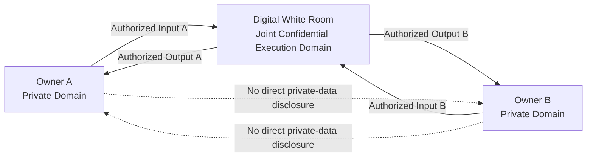
```mermaid
flowchart LR
    A["Owner A<br/>Private Domain"]
    B["Owner B<br/>Private Domain"]
    W["Digital White Room<br/>Joint Confidential Execution Domain"]

    A -->|"Authorized Input A"| W
    B -->|"Authorized Input B"| W
    W -->|"Authorized Output A"| A
    W -->|"Authorized Output B"| B

    A -. "No direct private-data disclosure" .-> B
    B -. "No direct private-data disclosure" .-> A
```

---

# 3. Architectural Principle

The platform distinguishes three execution cases.

## 3.1 Public computation

Public data and public code may execute anywhere allowed by ordinary application policy.

## 3.2 Owner-local private computation

Private data remains inside its owner's trust domain and the computation travels to the data.

## 3.3 Joint private computation

When a computation requires private data from multiple owners, the parties may jointly establish a DWR. Their private data may travel into the jointly authorized DWR but does not enter another participant's ordinary trust domain.

The resulting rule is:

> **Move computation to data whenever possible. When mutually private data must meet, move only the minimum required data into a mutually authorized ephemeral execution domain.**

---

# 4. Design Goals

## 4.1 Mutual authorization

No participant's protected input may enter a DWR until all required authorizations are satisfied.

## 4.2 Exact workload agreement

Participants must agree on the actual executable workload, not merely a product name or human-readable version label. A production contract should bind at least:

- executable artifact digest;
- executable signer;
- runtime and security profile;
- configuration digest;
- input schema and input capabilities;
- output schema and output capabilities;
- network policy;
- storage policy;
- execution limits;
- lease rules.

## 4.3 Verifiable execution environment

Participants must be able to determine whether the instantiated execution environment satisfies the Room Contract before releasing protected input.

## 4.4 Provider neutrality

The infrastructure provider hosting the room does not automatically become a trusted data participant.

## 4.5 Least disclosure

A room releases only outputs permitted by the signed contract and any subsequent explicit declassification grants.

## 4.6 Ephemerality

A room has a bounded lifetime. Keys and confidential runtime state are destroyed when the lease terminates.

## 4.7 Backend independence

The DWR API describes security semantics, not a mandatory processor technology.

## 4.8 Auditable authorization

Each participant should be able to retain evidence of what was authorized, by whom, for which workload, under which environment and lease, and which outputs were permitted.

## 4.9 Composability with decentralized agents

DWR creation should be available as a first-class operation to agents that discover cross-owner data dependencies during task execution.

---

# 5. Non-Goals

Version 0.1 does not attempt to solve:

1. correctness of arbitrary application algorithms;
2. malicious leakage through an output that participants explicitly authorized;
3. universal prevention of microarchitectural side channels;
4. compromise of participant endpoints before data enters the room;
5. permanent shared confidential storage;
6. distributed consensus;
7. cryptocurrency settlement;
8. anonymous computation;
9. protection against an unsafe policy knowingly signed by the participants;
10. arbitrary transparent resumability of terminated rooms.

Later profiles may address some of these concerns.

---

# 6. Terminology

## 6.1 Digital White Room (DWR)

The application-facing and API-level abstraction representing a temporary jointly authorized confidential computation.

## 6.2 Joint Confidential Execution Domain (JCED)

The security domain instantiated to implement a DWR.

## 6.3 Participant

A principal that contributes data, code, authorization, policy, or some combination thereof.

## 6.4 Required Participant

A participant whose authorization is required before the room may become executable.

## 6.5 Room Provider

The entity supplying physical or virtual compute resources on which the JCED executes. A Room Provider is not necessarily trusted with participant plaintext.

## 6.6 Workload

The executable computation authorized to run inside the room. A workload may consist of one executable, multiple cooperating modules, WASM components, native confidential-VM software, an AI agent, a model, policy engines, or combinations thereof.

## 6.7 Room Contract

The canonical, cryptographically signed description of the proposed DWR.

## 6.8 Lease

A bounded authorization for the existence and use of a particular DWR instance.

## 6.9 Evidence

Cryptographically protected claims about the instantiated execution environment.

## 6.10 Attestation

The process through which a participant determines whether the instantiated environment satisfies the Room Contract.

## 6.11 Input Grant

Authorization for a participant to release a specific class of protected data into a specific room instance.

## 6.12 Output Grant

Authorization permitting a particular class of information to leave the DWR.

## 6.13 Declassification

The transition of information from confidential room state into an explicitly permitted output class.

## 6.14 Room Identity

A cryptographic identity generated for a specific room instance and bound to the verified JCED.

---

# 7. High-Level Architecture

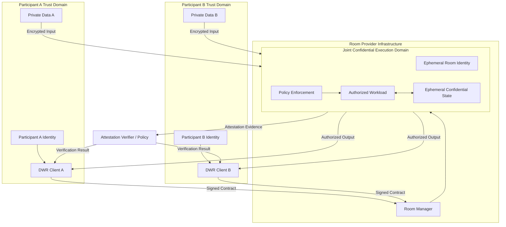
```mermaid
flowchart TB
    subgraph PA["Participant A Trust Domain"]
        AID["Participant A Identity"]
        AD["Private Data A"]
        AC["DWR Client A"]
    end

    subgraph PB["Participant B Trust Domain"]
        BID["Participant B Identity"]
        BD["Private Data B"]
        BC["DWR Client B"]
    end

    subgraph RP["Room Provider Infrastructure"]
        RM["Room Manager"]
        subgraph JCED["Joint Confidential Execution Domain"]
            RI["Ephemeral Room Identity"]
            PE["Policy Enforcement"]
            WL["Authorized Workload"]
            RS["Ephemeral Confidential State"]
        end
    end

    AV["Attestation Verifier / Policy"]

    AID --> AC
    BID --> BC
    AC -->|"Signed Contract"| RM
    BC -->|"Signed Contract"| RM
    RM --> JCED
    JCED -->|"Attestation Evidence"| AV
    AV -->|"Verification Result"| AC
    AV -->|"Verification Result"| BC
    AD -->|"Encrypted Input"| JCED
    BD -->|"Encrypted Input"| JCED
    PE --> WL
    WL <--> RS
    JCED -->|"Authorized Output"| AC
    JCED -->|"Authorized Output"| BC
```

---

# 8. Trust Domains

A DWR system distinguishes at least four trust-domain categories.

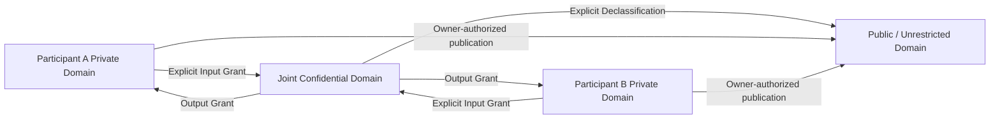
```mermaid
flowchart LR
    UA["Participant A Private Domain"]
    UB["Participant B Private Domain"]
    DWR["Joint Confidential Domain"]
    PUB["Public / Unrestricted Domain"]

    UA -->|"Explicit Input Grant"| DWR
    UB -->|"Explicit Input Grant"| DWR
    DWR -->|"Output Grant"| UA
    DWR -->|"Output Grant"| UB
    DWR -->|"Explicit Declassification"| PUB
    UA -->|"Owner-authorized publication"| PUB
    UB -->|"Owner-authorized publication"| PUB
```

A DWR is not part of any participant's ordinary private domain. It is a **delegated joint confidentiality domain**.

---

# 9. Data Classification

The surrounding decentralized platform should distinguish at least the following classes.

## 9.1 PUBLIC

Data may move across permitted mesh nodes without confidentiality restrictions imposed by ownership.

## 9.2 PRIVATE_LOCAL

Data must not leave the owner's private trust domain and therefore must not be submitted to a DWR.

## 9.3 PRIVATE_DELEGATABLE

Data normally remains in the owner's trust domain but may enter a mutually authorized DWR when an applicable Input Grant exists.

## 9.4 DWR_CONFIDENTIAL

Data currently inside a JCED. It remains inaccessible outside that domain except through permitted declassification.

## 9.5 DECLASSIFIED

A result that has satisfied the applicable output policy and is explicitly authorized to leave the room.

The distinction between `PRIVATE_LOCAL` and `PRIVATE_DELEGATABLE` is essential. Creation of a DWR is never implicit permission to move all private data into it.

---

# 10. Room Contract

The Room Contract is the core protocol object. All security-sensitive room behavior derives from a canonical Room Contract or from values cryptographically bound to it.

An illustrative contract is shown below.

```yaml
protocol: "dwr/0.1"

room:
  contract_id: "sha256:..."
  purpose: "drug-interaction-analysis"

participants:
  - id: "cert:patient:..."
    role: "patient"
    required: true
  - id: "cert:hospital:..."
    role: "hospital"
    required: true

provider_policy:
  allowed_provider_classes:
    - "approved-confidential-compute"

runtime:
  profile: "dwr-tee-1"
  architectures:
    - "amd-sev-snp"
    - "intel-tdx"
  minimum_security_version: "..."
  debugging: false

workload:
  artifact_digest: "sha256:..."
  signer: "cert:hospital-application:..."
  configuration_digest: "sha256:..."
  entrypoint: "diagnose"

inputs:
  patient:
    allowed:
      - "health/ecg"
      - "health/medications"
      - "health/lab-results"
  hospital:
    allowed:
      - "clinical/model"
      - "clinical/private-reference-data"

outputs:
  patient:
    allowed:
      - "diagnostic-report"
  hospital:
    allowed:
      - "risk-score"
      - "approved-supporting-evidence"

network:
  inbound: "participants-only"
  outbound: "deny"

storage:
  persistent: false
  external_write: false

resources:
  cpu_max: 8
  memory_max: "16GiB"
  wall_time_max: "10m"

lease:
  not_before: "2026-08-09T23:00:00Z"
  not_after: "2026-08-09T23:30:00Z"
  maximum_active_time: "10m"

authorization:
  threshold: "2-of-2"
```

The YAML form is illustrative. The wire representation must be canonical and deterministic.

---

# 11. Canonical Representation and Signatures

A production protocol requires deterministic serialization. A practical profile may use canonical CBOR for the contract and COSE for cryptographic signatures.

Conceptually:

```text
ContractDigest = HASH(CanonicalEncode(RoomContract))
```

Every required participant signs exactly the same `ContractDigest`. The room must never combine signatures over semantically similar but canonically different contracts.

Security-relevant references, such as executable artifacts, models, external policy bundles, or schemas, must themselves be content-addressed or otherwise cryptographically bound to the signed contract.

---

# 12. Contract Negotiation and Authorization

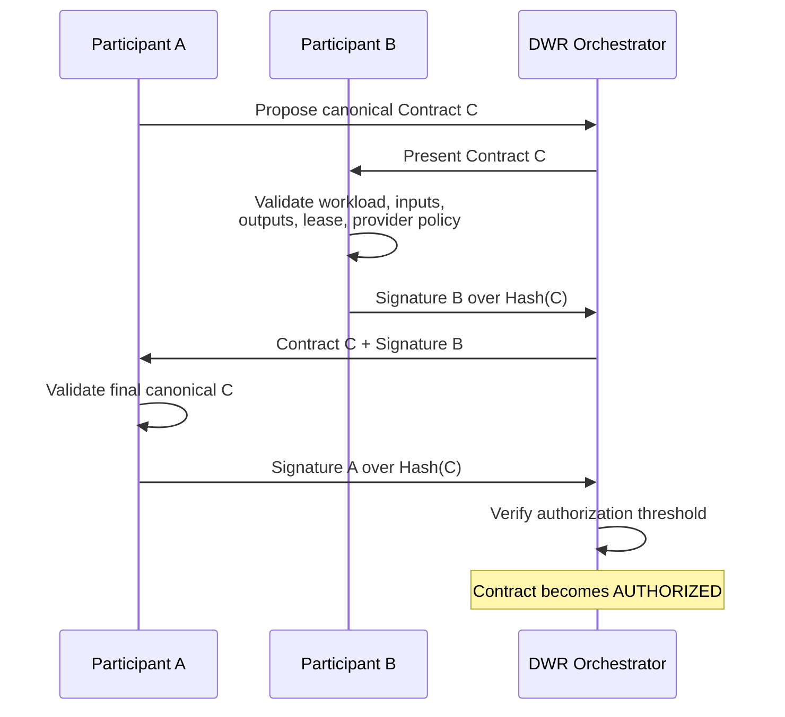
```mermaid
sequenceDiagram
    participant A as Participant A
    participant B as Participant B
    participant O as DWR Orchestrator

    A->>O: Propose canonical Contract C
    O->>B: Present Contract C
    B->>B: Validate workload, inputs,<br/>outputs, lease, provider policy
    B->>O: Signature B over Hash(C)
    O->>A: Contract C + Signature B
    A->>A: Validate final canonical C
    A->>O: Signature A over Hash(C)
    O->>O: Verify authorization threshold
    Note over O: Contract becomes AUTHORIZED
```

Contract negotiation should use metadata only. Private participant inputs need not be transmitted during negotiation.

Once the authorization threshold is reached, the contract becomes immutable for that authorization. Any security-relevant change creates a different contract digest and requires fresh authorization.

Examples of changes requiring a new authorization include:

- increasing lease duration;
- changing executable version;
- enabling network egress;
- adding an output;
- adding a participant;
- changing allowed input classes;
- changing runtime profile;
- enabling debugging;
- increasing persistence permissions.

---

# 13. Room Lifecycle

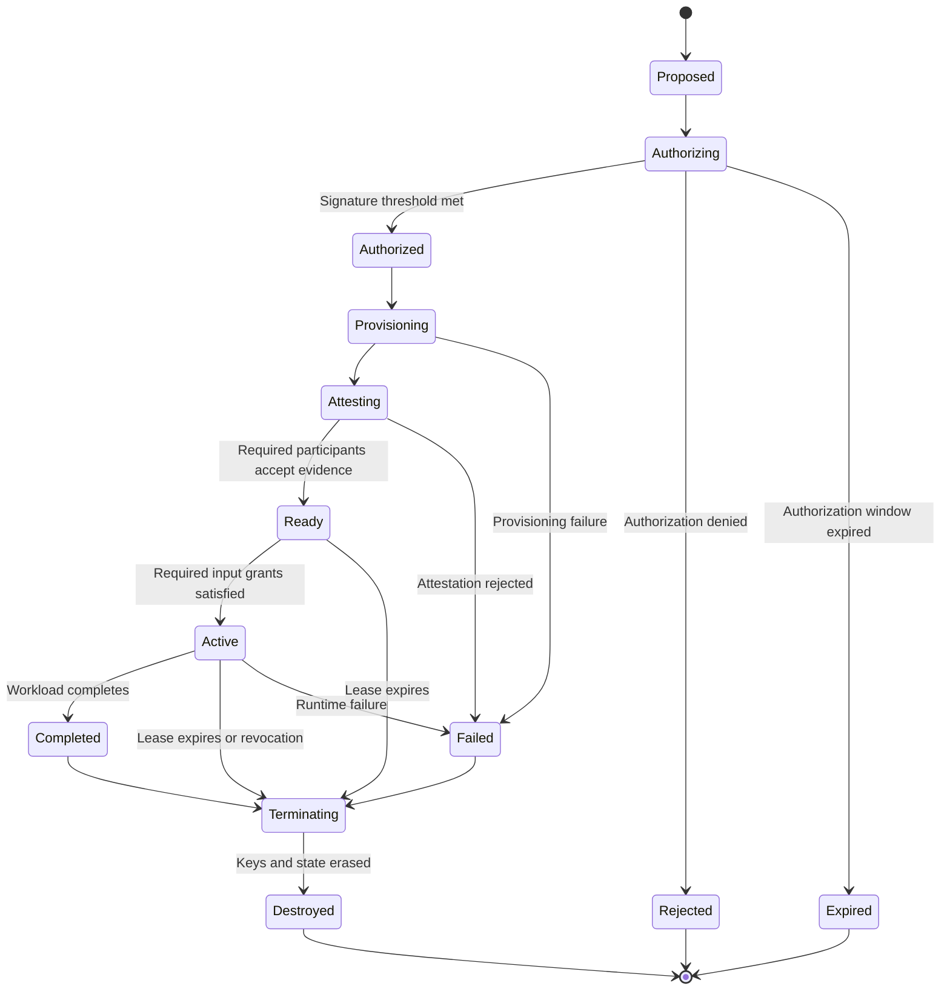
```mermaid
stateDiagram-v2
    [*] --> Proposed
    Proposed --> Authorizing
    Authorizing --> Authorized: Signature threshold met
    Authorizing --> Rejected: Authorization denied
    Authorizing --> Expired: Authorization window expired
    Authorized --> Provisioning
    Provisioning --> Attesting
    Provisioning --> Failed: Provisioning failure
    Attesting --> Ready: Required participants accept evidence
    Attesting --> Failed: Attestation rejected
    Ready --> Active: Required input grants satisfied
    Ready --> Terminating: Lease expires
    Active --> Completed: Workload completes
    Active --> Terminating: Lease expires or revocation
    Active --> Failed: Runtime failure
    Completed --> Terminating
    Failed --> Terminating
    Rejected --> [*]
    Expired --> [*]
    Terminating --> Destroyed: Keys and state erased
    Destroyed --> [*]
```

A room instance must have a unique lifecycle identity. Re-instantiating the same logical contract does not resurrect a previously destroyed JCED.

---

# 14. Provisioning and Provider Selection

After the contract becomes `AUTHORIZED`, an orchestrator may select infrastructure satisfying the contract. Provider selection may optimize for:

- latency;
- cost;
- jurisdiction;
- hardware profile;
- geographic region;
- accelerator availability;
- reputation;
- organizational policy;
- regulatory constraints.

Selection does not itself establish trust. Discovery chooses a candidate; attestation decides whether the candidate may receive secrets.

A provider must never substitute a weaker runtime than the signed contract permits.

---

# 15. Room Identity

The instantiated JCED must generate an ephemeral cryptographic Room Identity.

The corresponding private key must be generated inside the protected execution environment, or using another mechanism with equivalent confidentiality guarantees, and must not be exportable in plaintext.

The Room Identity should be unique to one room instance and must not be reused for later leases.

Attestation evidence must cryptographically bind at least:

- Room Public Key;
- Contract Digest;
- Runtime Measurement;
- freshness information.

This binding prevents a valid attestation for one environment from being reused to redirect participant inputs to a different key or room.

---

# 16. Attestation

Each participant should independently evaluate the instantiated environment before releasing protected input.

The attestation result should establish at least:

- processor or runtime security profile;
- software/runtime measurement;
- workload measurement or workload-loading mechanism;
- debugging state;
- security version;
- Room Public Key;
- Contract Digest;
- freshness.

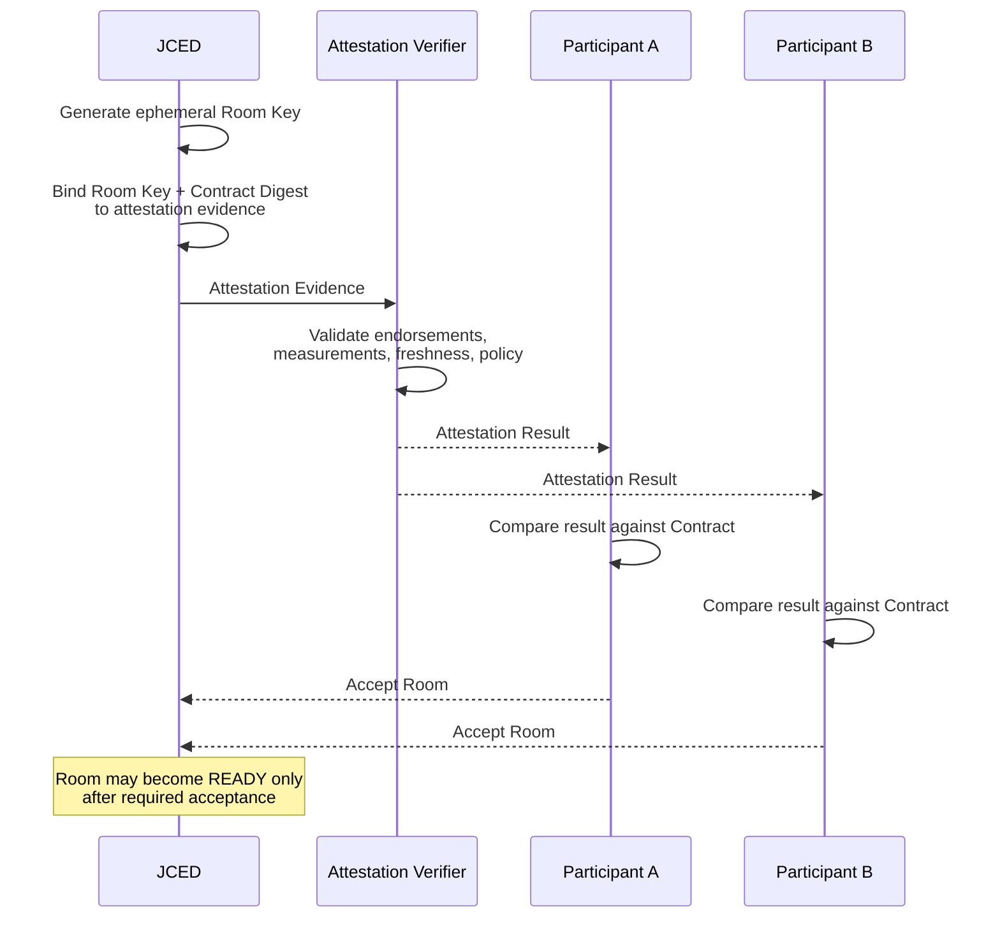
```mermaid
sequenceDiagram
    participant R as JCED
    participant V as Attestation Verifier
    participant A as Participant A
    participant B as Participant B

    R->>R: Generate ephemeral Room Key
    R->>R: Bind Room Key + Contract Digest<br/>to attestation evidence
    R->>V: Attestation Evidence
    V->>V: Validate endorsements,<br/>measurements, freshness, policy
    V-->>A: Attestation Result
    V-->>B: Attestation Result
    A->>A: Compare result against Contract
    B->>B: Compare result against Contract
    A-->>R: Accept Room
    B-->>R: Accept Room
    Note over R: Room may become READY only<br/>after required acceptance
```

A deployment may use different verifiers for different participants. Mutually distrustful organizations do not need to share one policy authority.

---

# 17. Input Grants

Attestation acceptance does not itself release data.

Each data owner issues an Input Grant bound to:

- Contract Digest;
- Room Identity;
- room instance identifier;
- data class;
- optional object identifiers or query constraints;
- expiration;
- optional maximum use count;
- optional byte or record limits.

An Input Grant must be signed by an authority permitted to release the corresponding data.

Example logical form:

```json
{
  "room": "urn:dwr:...",
  "contract": "sha256:...",
  "input_class": "health/ecg",
  "objects": ["ecg:2026-08-04"],
  "expires": "2026-08-09T23:30:00Z",
  "usage": "single"
}
```

---

# 18. Confidential Input Transport

Protected inputs must be encrypted such that plaintext is recoverable only inside the verified room.

Two primary approaches are expected.

## 18.1 Attested secure channel

A secure transport channel is established directly to a cryptographic identity bound to the attested room.

## 18.2 Object encryption

Each input object is encrypted directly to the ephemeral Room Public Key. Object encryption has an important architectural property: the transport path itself does not need plaintext access.

Encrypted objects may therefore travel through mesh peers, relays, queues, object stores, content-addressed storage, or ordinary provider infrastructure without turning those components into confidentiality principals.

---

# 19. Capability-Scoped Inputs

A workload must not automatically receive access to every object delivered to the room.

The runtime should expose inputs through capability-scoped handles derived from the signed contract.

```rust
let ecg = room
    .inputs()
    .require("patient")
    .open::<Ecg>("health/ecg")?;
```

A workload module lacking the corresponding capability must not be able to obtain the protected object merely because another module in the same room can access it.

This becomes especially important for multi-agent or multi-module rooms.

---

# 20. Runtime Isolation and Policy Enforcement

The DWR runtime must enforce the Room Contract independently of application code whenever technically possible. Application code is not the sole enforcement boundary.

At minimum, the runtime should independently control:

- network access;
- filesystem access;
- persistent storage;
- host calls;
- device access;
- inter-process or inter-module communication;
- output channels;
- resource consumption;
- runtime duration.

For WASM workloads, the host capability interface is a natural enforcement boundary because disallowed capabilities simply need not be exposed to the module.

---

# 21. Network Policy

Network behavior is security critical. The default policy should be **deny outbound access**.

A computation that receives private data and unrestricted Internet access can trivially exfiltrate that data. Network permissions must therefore be part of the signed Room Contract.

Example:

```yaml
network:
  outbound: deny
```

A more permissive contract may authorize communication only with cryptographically identified services or participants. Simple DNS names or hostname allowlists should not be treated as equivalent to service identity.

---

# 22. Output Control and Declassification

A workload does not acquire the right to transmit arbitrary bytes merely because it completed successfully.

A DWR should separate **computation logic** from **declassification logic**.

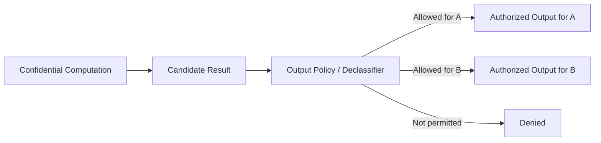
```mermaid
flowchart LR
    C["Confidential Computation"]
    R["Candidate Result"]
    P["Output Policy / Declassifier"]
    OA["Authorized Output for A"]
    OB["Authorized Output for B"]
    D["Denied"]

    C --> R
    R --> P
    P -->|"Allowed for A"| OA
    P -->|"Allowed for B"| OB
    P -->|"Not permitted"| D
```

The declassifier may constrain:

- recipient;
- output type;
- schema;
- maximum size;
- cardinality;
- aggregation level;
- frequency;
- numeric precision;
- allowed fields;
- cryptographic commitment;
- differential-privacy parameters;
- human approval requirement.

Example:

```yaml
outputs:
  hospital:
    risk-score:
      type: integer
      range: [0, 100]
      max_count: 1

    supporting-evidence:
      human_approval: true
```

Narrow outputs do not eliminate all covert channels, but they substantially reduce the exfiltration surface.

---

# 23. Interactive Declassification

Some computations require dynamic authorization after execution has begun. A room may emit an authorization request without releasing the protected content.

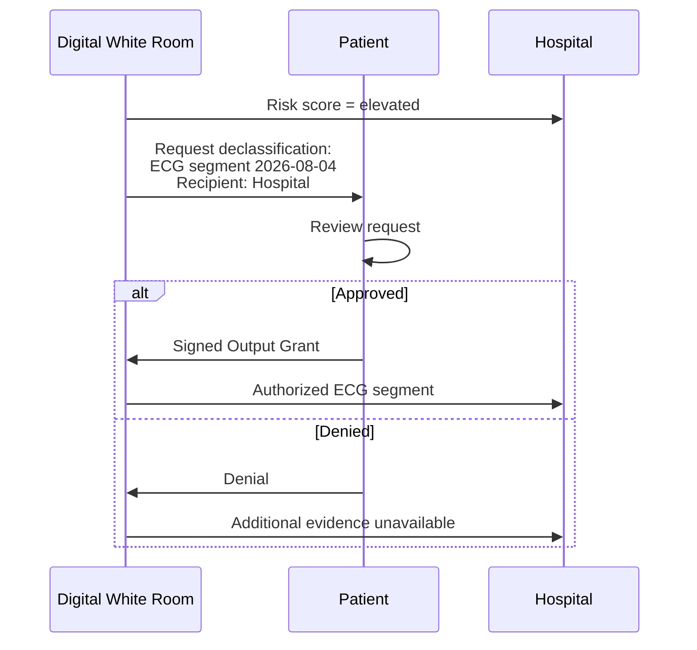
```mermaid
sequenceDiagram
    participant W as Digital White Room
    participant P as Patient
    participant H as Hospital

    W->>H: Risk score = elevated
    W->>P: Request declassification:<br/>ECG segment 2026-08-04<br/>Recipient: Hospital
    P->>P: Review request
    alt Approved
        P->>W: Signed Output Grant
        W->>H: Authorized ECG segment
    else Denied
        P->>W: Denial
        W->>H: Additional evidence unavailable
    end
```

The new Output Grant should remain bound to the existing room, contract, requested object, and intended recipient.

---

# 24. Lease Semantics

Every DWR must have a lease. The lease may include:

- absolute `not_before`;
- absolute `not_after`;
- maximum accumulated runtime;
- maximum idle period;
- maximum workload invocation count;
- maximum input volume;
- maximum output volume.

A lease must not be silently renewed. Renewal must produce a new authorization event unless the signed contract explicitly permits a bounded renewal mechanism.

The lease is not merely billing metadata. It is part of the room's security boundary.

---

# 25. Revocation

A participant may revoke its authorization according to the Room Contract.

Revocation should cause, as applicable:

1. rejection of new protected inputs from that participant;
2. cancellation of new workload invocations requiring that participant;
3. destruction of data whose retention is no longer authorized;
4. complete room termination if the required authorization threshold is no longer satisfied.

For high-sensitivity profiles, participant revocation should terminate the entire room.

---

# 26. Termination and Destruction

On termination, the JCED must render its confidential runtime state inaccessible.

At minimum:

- ephemeral room keys are destroyed;
- plaintext input buffers become inaccessible;
- temporary-storage encryption keys are destroyed;
- workload confidential state is discarded;
- future communication under the Room Identity ceases.

For encrypted ephemeral storage, cryptographic erasure by destruction of the only usable encryption key may satisfy the state-destruction requirement.

A DWR implementation must not claim guaranteed physical media overwriting unless the underlying platform actually provides that guarantee.

---

# 27. Restart and Resume Semantics

Version 0.1 should not transparently resume a terminated DWR.

Restarting the same logical computation creates:

- a new room instance;
- a new Room Identity;
- new attestation;
- a new input-encryption context.

A previously signed Room Contract may be reusable only if it explicitly authorizes multiple instantiations. Otherwise a new contract authorization is required.

---

# 28. Identity and Certificate Integration

The DWR protocol does not mandate a single global PKI. A deployment may use X.509, enterprise PKI, decentralized certificates, decentralized identifiers, application-specific certificate hierarchies, hardware-backed identities, or combinations thereof.

The surrounding decentralized cloud can naturally bind DWR participants and workloads into its certificate hierarchy.

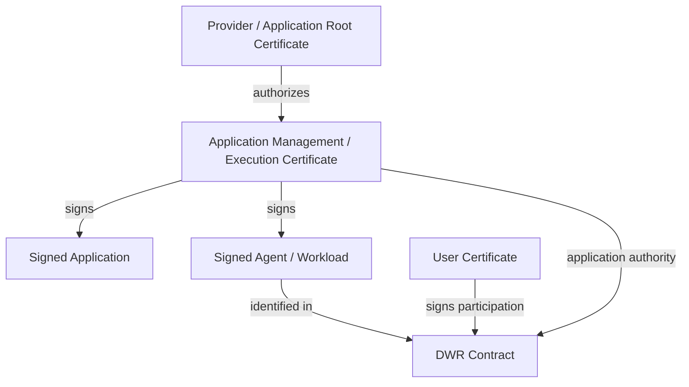
```mermaid
flowchart TB
    CR["Provider / Application Root Certificate"]
    CM["Application Management / Execution Certificate"]
    APP["Signed Application"]
    AG["Signed Agent / Workload"]
    USER["User Certificate"]
    DWR["DWR Contract"]

    CR -->|"authorizes"| CM
    CM -->|"signs"| APP
    CM -->|"signs"| AG
    AG -->|"identified in"| DWR
    USER -->|"signs participation"| DWR
    CM -->|"application authority"| DWR
```

A security decision ultimately depends on a verifiable authorization chain acceptable to the relying participant, not on a particular certificate syntax.

---

# 29. Workload Identity and Supply Chain

A workload must be identified cryptographically. Human-readable labels such as `Hospital Cardiology Model v5` are metadata only.

Security policies should reference immutable artifact digests and, where appropriate, signer identity.

This allows policies such as:

- execute exactly this artifact;
- execute artifacts signed by this application authority;
- execute an artifact whose provenance record satisfies specified requirements;
- execute only reproducibly built artifacts corresponding to a reviewed source revision.

A future profile may bind SBOMs, provenance attestations, formal-verification evidence, or reproducible-build metadata into the Room Contract.

---

# 30. Multi-Module Workloads

A DWR may contain multiple independently identified modules.

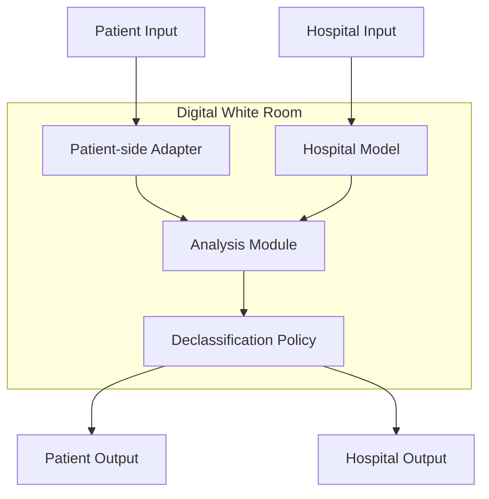
```mermaid
flowchart TB
    PI["Patient Input"]
    HI["Hospital Input"]

    subgraph W["Digital White Room"]
        PA["Patient-side Adapter"]
        HA["Hospital Model"]
        AN["Analysis Module"]
        DP["Declassification Policy"]
    end

    PO["Patient Output"]
    HO["Hospital Output"]

    PI --> PA
    HI --> HA
    PA --> AN
    HA --> AN
    AN --> DP
    DP --> PO
    DP --> HO
```

Each module should have its own digest and capability set. A future version should support stronger intra-room isolation so that one module may access only the inputs it requires.

---

# 31. Backend Abstraction

DWR is deliberately not synonymous with TEE.

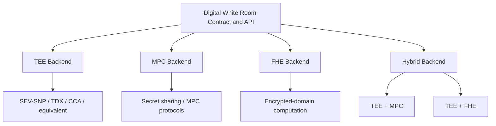
```mermaid
flowchart TB
    API["Digital White Room Contract and API"]
    API --> TEE["TEE Backend"]
    API --> MPC["MPC Backend"]
    API --> FHE["FHE Backend"]
    API --> HY["Hybrid Backend"]

    TEE --> T1["SEV-SNP / TDX / CCA / equivalent"]
    MPC --> M1["Secret sharing / MPC protocols"]
    FHE --> F1["Encrypted-domain computation"]
    HY --> H1["TEE + MPC"]
    HY --> H2["TEE + FHE"]
```

The contract defines required security semantics. The backend profile defines how those semantics are implemented.

---

# 32. Initial TEE Profile: `dwr-tee-1`

The first practical implementation should use a hardware-backed confidential execution environment.

The `dwr-tee-1` profile requires:

- remote attestation;
- protected memory;
- ephemeral Room Identity generation;
- contract-to-attestation binding;
- confidential input transport;
- deny-by-default network policy;
- controlled output paths;
- encrypted or non-persistent temporary storage;
- cryptographic termination semantics.

Concrete platform profiles may specialize this for AMD SEV-SNP, Intel TDX, Arm CCA, cloud confidential VMs, confidential containers, or equivalent technologies.

The TEE profile does not eliminate all trust. Hardware implementation, firmware, attestation authorities, cryptographic libraries, and relevant side-channel assumptions remain part of the Trusted Computing Base.

---

# 33. MPC Profile

An MPC-backed DWR changes the physical execution architecture without changing the logical contract. No single machine necessarily holds all participant plaintext.

The application-facing abstraction remains the same: participants authorize inputs, workload, policy, outputs, and lease; the selected backend executes under those semantics.

MPC should therefore be represented as another execution profile rather than as a separate application API.

---

# 34. FHE and Hybrid Profiles

Some workloads may benefit from FHE or hybrid designs.

Examples include:

- TEE orchestration plus MPC for a particularly sensitive join;
- TEE model execution plus FHE for one protected feature vector;
- multiple independently operated TEEs with threshold release;
- TEE plus differential privacy on output;
- FHE preprocessing followed by TEE postprocessing.

This is a major reason the DWR contract should describe security properties instead of overfitting to a processor instruction set.

---

# 35. Room Discovery and Marketplace

A decentralized cloud may advertise available Room Providers and their capabilities.

Example provider advertisement:

```yaml
provider:
  identity: "cert:..."
  profiles:
    - "dwr-tee-1"

hardware:
  - "amd-sev-snp"

regions:
  - "us-west"
  - "eu-central"

resources:
  max_memory: "128GiB"
  gpu_confidential_compute: true

pricing:
  cpu_second: "..."
  memory_gib_second: "..."

attestation:
  verifier_profiles:
    - "..."
```

Participants may specify constraints without naming a particular provider. This enables a marketplace for **neutral confidential computation** in which providers sell execution capacity rather than permission to inspect protected data.

---

# 36. Decentralized Discovery Flow

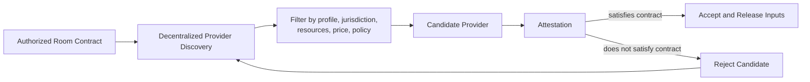
```mermaid
flowchart LR
    C["Authorized Room Contract"]
    D["Decentralized Provider Discovery"]
    F["Filter by profile, jurisdiction,<br/>resources, price, policy"]
    P["Candidate Provider"]
    A["Attestation"]
    R["Accept and Release Inputs"]
    X["Reject Candidate"]

    C --> D
    D --> F
    F --> P
    P --> A
    A -->|"satisfies contract"| R
    A -->|"does not satisfy contract"| X
    X --> D
```

Provider discovery is therefore a scheduling problem, while attestation is the final confidentiality gate.

---

# 37. Example: Patient and Hospital

A patient owns ECG history, medications, and laboratory results. A hospital owns a proprietary diagnostic model, private clinical reference data, and institution-specific risk rules.

Neither side wants to disclose its complete dataset.

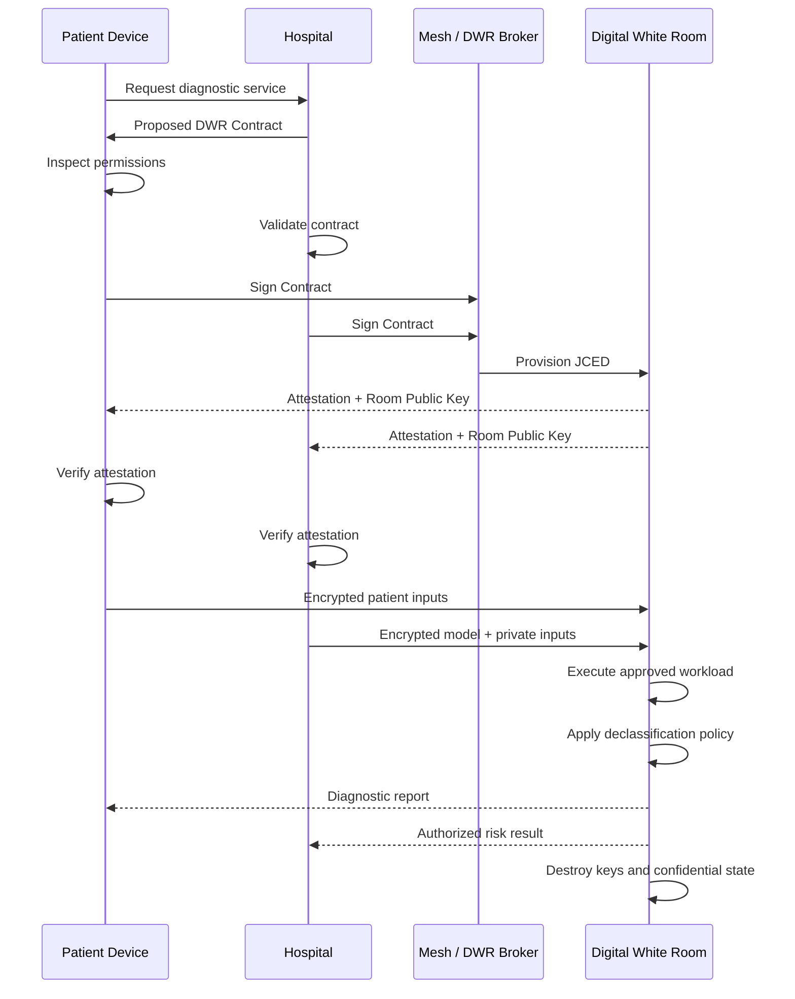
```mermaid
sequenceDiagram
    participant P as Patient Device
    participant H as Hospital
    participant M as Mesh / DWR Broker
    participant W as Digital White Room

    P->>H: Request diagnostic service
    H->>P: Proposed DWR Contract
    P->>P: Inspect permissions
    H->>H: Validate contract
    P->>M: Sign Contract
    H->>M: Sign Contract
    M->>W: Provision JCED
    W-->>P: Attestation + Room Public Key
    W-->>H: Attestation + Room Public Key
    P->>P: Verify attestation
    H->>H: Verify attestation
    P->>W: Encrypted patient inputs
    H->>W: Encrypted model + private inputs
    W->>W: Execute approved workload
    W->>W: Apply declassification policy
    W-->>P: Diagnostic report
    W-->>H: Authorized risk result
    W->>W: Destroy keys and confidential state
```

The hospital never receives the patient's complete record. The patient never receives the hospital's proprietary model or private clinical dataset. The infrastructure provider is not required to receive either plaintext.

---

# 38. Example: Financial Due Diligence

Company A wishes to acquire Company B. A needs to calculate metrics over B's private financial records. B does not want to disclose the underlying records before the transaction. A may also possess proprietary valuation models that it does not want to disclose to B.

A DWR can host the approved valuation workload and release only mutually authorized metrics.

The same pattern applies to:

- mergers and acquisitions;
- credit evaluation;
- insurance underwriting;
- supply-chain negotiation;
- inter-bank analysis;
- fraud detection;
- consortium risk analysis.

---

# 39. Example: Cross-Enterprise AI Agent

Two companies may authorize an AI agent to answer a narrowly scoped question requiring confidential information from both organizations.

For example:

> Can supplier A satisfy manufacturer B's next-quarter demand under the proposed contract?

The supplier contributes private capacity forecasts, inventory, and constraints. The manufacturer contributes private demand, launch schedule, and pricing assumptions.

The DWR may release a result such as feasibility, confidence range, and binding constraints without disclosing either organization's complete operational dataset.

---

# 40. Agent-Initiated White Rooms

DWRs are especially useful for decentralized AI agents because an agent may dynamically discover that a task crosses ownership boundaries.

Instead of requesting unrestricted access to another owner's data, the agent can construct a White Room proposal describing the minimum necessary joint computation.

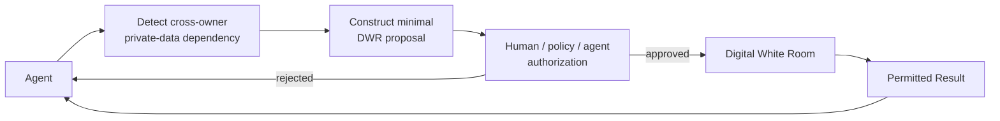
```mermaid
flowchart LR
    AG["Agent"]
    DET["Detect cross-owner<br/>private-data dependency"]
    PRO["Construct minimal<br/>DWR proposal"]
    AUTH["Human / policy / agent<br/>authorization"]
    WR["Digital White Room"]
    RES["Permitted Result"]

    AG --> DET
    DET --> PRO
    PRO --> AUTH
    AUTH -->|"approved"| WR
    AUTH -->|"rejected"| AG
    WR --> RES
    RES --> AG
```

This makes DWR creation a first-class **agent coordination primitive**.

---

# 41. High-Level API Model

A high-level SDK may expose semantics resembling the following:

```rust
let contract = WhiteRoom::proposal()
    .participant(patient)
    .participant(hospital)
    .workload(diagnostic_workload)
    .allow_input(patient, "health/ecg")
    .allow_input(patient, "health/medications")
    .allow_input(hospital, "clinical/private-model")
    .allow_output(patient, "diagnostic-report")
    .allow_output(hospital, "risk-score")
    .network(NetworkPolicy::Deny)
    .persistence(Persistence::None)
    .lease(Duration::minutes(10))
    .runtime(RuntimeProfile::Confidential)
    .build();

let authorization = contract.require_all_signatures().await?;
let room = authorization.instantiate().await?;

room.verify_attestation().await?;
room.submit(patient_ecg).await?;
room.submit(hospital_model).await?;

let result = room.execute().await?;
```

The application developer reasons primarily about ownership, capabilities, workload identity, outputs, and lease. Processor-specific attestation registers belong below this API.

---

# 42. Protocol Message Families

A minimal implementation needs the following logical message families.

## 42.1 Contract protocol

- `ROOM_PROPOSAL`
- `ROOM_COUNTERPROPOSAL`
- `ROOM_SIGNATURE`
- `ROOM_REJECTION`

## 42.2 Provisioning protocol

- `ROOM_PROVISION_REQUEST`
- `ROOM_INSTANCE`

## 42.3 Attestation protocol

- `ROOM_EVIDENCE`
- `ROOM_ATTESTATION_ACCEPT`
- `ROOM_ATTESTATION_REJECT`

## 42.4 Data protocol

- `INPUT_GRANT`
- `INPUT_OBJECT`
- `INPUT_REVOKE`

## 42.5 Execution protocol

- `EXECUTE`
- `EXECUTION_STATUS`
- `EXECUTION_ABORT`

## 42.6 Output protocol

- `OUTPUT_CANDIDATE`
- `OUTPUT_AUTH_REQUEST`
- `OUTPUT_GRANT`
- `OUTPUT_OBJECT`

## 42.7 Lifecycle protocol

- `LEASE_STATUS`
- `ROOM_REVOKE`
- `ROOM_TERMINATED`
- `DESTRUCTION_RECEIPT`

A concrete transport may combine or omit explicit messages where equivalent semantics are cryptographically established.

---

# 43. Audit Records

A participant should be able to retain a local audit record without retaining another participant's confidential inputs.

Example:

```yaml
contract_digest: "sha256:..."
room_instance: "urn:dwr:..."
participants:
  - "cert:patient:..."
  - "cert:hospital:..."
workload_digest: "sha256:..."
attestation_result_digest: "sha256:..."
started: "..."
terminated: "..."
inputs_released:
  - class: "health/ecg"
    object_digest: "sha256:..."
outputs_received:
  - class: "diagnostic-report"
    digest: "sha256:..."
termination_reason: "completed"
```

Audit metadata itself may be sensitive. The protocol must not assume audit records are public.

---

# 44. Destruction Receipts

After termination, the provider or attested runtime may issue a signed `DestructionReceipt` indicating that a particular room instance reached its termination protocol and that the runtime destroyed the relevant ephemeral keys according to its profile.

A Destruction Receipt cannot, by itself, mathematically prove that every conceivable physical trace vanished. Its claim must remain consistent with the guarantees of the backend profile.

---

# 45. Threat Model

The DWR should assume that any of the following may be malicious or compromised:

- another participant;
- the Room Provider control plane;
- Room Provider administrators;
- network relays;
- mesh peers;
- storage infrastructure;
- application infrastructure outside the JCED;
- external attackers;
- the workload itself.

Depending on the backend, the processor vendor, firmware chain, attestation authority, cryptographic implementation, or MPC assumptions may remain inside the Trusted Computing Base.

---

# 46. Threat: Contract Substitution

An attacker attempts to obtain authorization for one contract but execute a different workload or policy.

The mitigation is an end-to-end cryptographic binding from the canonical contract to participant signatures, attestation, Room Identity, and input encryption.

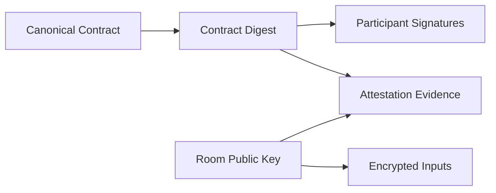
```mermaid
flowchart LR
    C["Canonical Contract"]
    D["Contract Digest"]
    S["Participant Signatures"]
    A["Attestation Evidence"]
    K["Room Public Key"]
    I["Encrypted Inputs"]

    C --> D
    D --> S
    D --> A
    K --> A
    K --> I
```

Any broken binding in this chain can create a substitution vulnerability.

---

# 47. Threat: Malicious Room Provider

The provider may attempt to read participant inputs or modify workload execution.

Mitigations in the TEE profile include:

- confidential execution;
- attestation before secret release;
- encryption to the attested Room Identity;
- encrypted temporary storage;
- minimal host interfaces;
- measurement of workload and policy components.

Residual risk depends on the selected hardware and software profile.

---

# 48. Threat: Malicious Participant

A malicious participant may attempt to:

- submit malformed inputs;
- exploit the workload;
- induce excessive computation;
- infer another participant's data from repeated outputs;
- abuse repeated queries;
- use chosen inputs to extract secrets from another participant's model.

Mitigations include schema validation, resource limits, workload isolation, rate limits, query budgets, constrained output schemas, aggregation thresholds, differential privacy where appropriate, and bounded leases.

---

# 49. Threat: Malicious Workload

A valid signature establishes provenance, not benevolence.

Runtime policy must remain independent of workload behavior. A workload prohibited from network access must not be able to open an external socket merely because its code requests one.

A room should treat every workload as potentially adversarial with respect to capabilities not explicitly granted by the contract.

---

# 50. Threat: Output Exfiltration

A malicious workload can attempt to encode private input into an otherwise permitted output.

This cannot be solved universally for arbitrary semantics. High-sensitivity workloads should use:

- narrow output schemas;
- bounded output size;
- aggregation;
- query limits;
- semantic validators;
- human approval;
- differential privacy;
- independently reviewed or verified declassifiers.

The DWR's job is to make output authority explicit and enforceable, not to claim that arbitrary information-flow control is automatically decidable.

---

# 51. Threat: Replay and Rollback

Old authorization, attestation, grants, or encrypted inputs may be replayed.

Protocol objects should therefore include sufficient context, such as:

- Contract Digest;
- room instance ID;
- nonce;
- expiration;
- lease ID;
- sequence number;
- verifier freshness evidence.

Version 0.1 minimizes rollback complexity by preferring ephemeral state. A future persistent-room profile must explicitly define rollback protection.

---

# 52. Threat: Side Channels

TEE-based implementations may remain exposed to timing, microarchitectural, resource-contention, speculative-execution, cache, memory-access, or implementation-specific side channels.

A DWR must not claim that a TEE provides perfect secrecy. Contracts may therefore require stronger runtime profiles for sensitive workloads or use MPC/FHE/hybrid backends.

---

# 53. Threat: Denial of Service

No cryptographic mechanism prevents a provider or participant from refusing service.

DWR guarantees should focus on confidentiality, integrity, authorization, and provenance, not universal availability.

The decentralized cloud can mitigate infrastructure failure by provisioning another compatible room. A replacement room requires fresh Room Identity and fresh attestation.

---

# 54. Confidentiality Is Not Correctness

A DWR determines **where** computation executes and **which rules surround it**. It does not automatically prove that the computation is medically, financially, or logically correct.

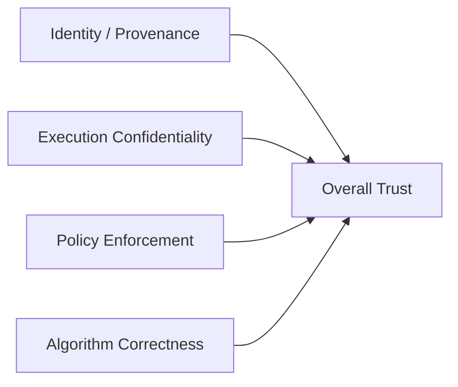
```mermaid
flowchart LR
    A["Identity / Provenance"]
    B["Execution Confidentiality"]
    C["Policy Enforcement"]
    D["Algorithm Correctness"]
    S["Overall Trust"]

    A --> S
    B --> S
    C --> S
    D --> S
```

Formal verification, deterministic workloads, reproducible builds, test evidence, regulatory approval, or model validation may independently establish algorithmic trust.

---

# 55. Reference Implementation Components

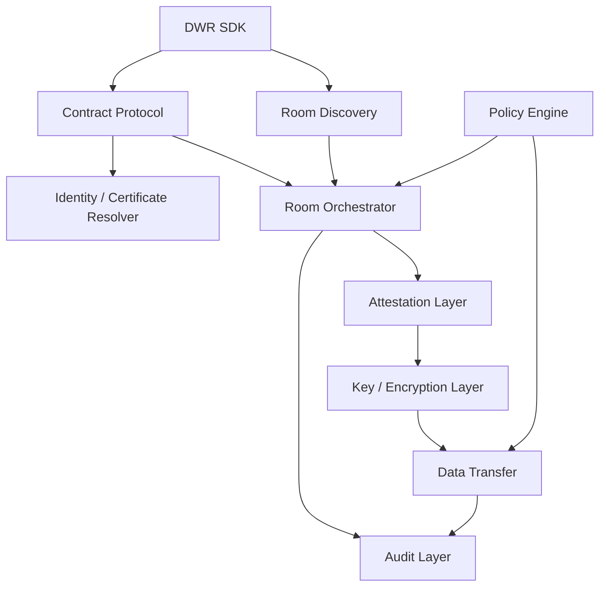
```mermaid
flowchart TB
    SDK["DWR SDK"]
    CP["Contract Protocol"]
    ID["Identity / Certificate Resolver"]
    DISC["Room Discovery"]
    ORCH["Room Orchestrator"]
    ATT["Attestation Layer"]
    CRYPTO["Key / Encryption Layer"]
    POLICY["Policy Engine"]
    DATA["Data Transfer"]
    AUDIT["Audit Layer"]

    SDK --> CP
    SDK --> DISC
    CP --> ID
    CP --> ORCH
    DISC --> ORCH
    ORCH --> ATT
    ATT --> CRYPTO
    CRYPTO --> DATA
    POLICY --> DATA
    POLICY --> ORCH
    ORCH --> AUDIT
    DATA --> AUDIT
```

---

# 56. Recommended First Runtime Stack

For a decentralized cloud where application workloads are already portable, WebAssembly is a strong application-level runtime inside the JCED.

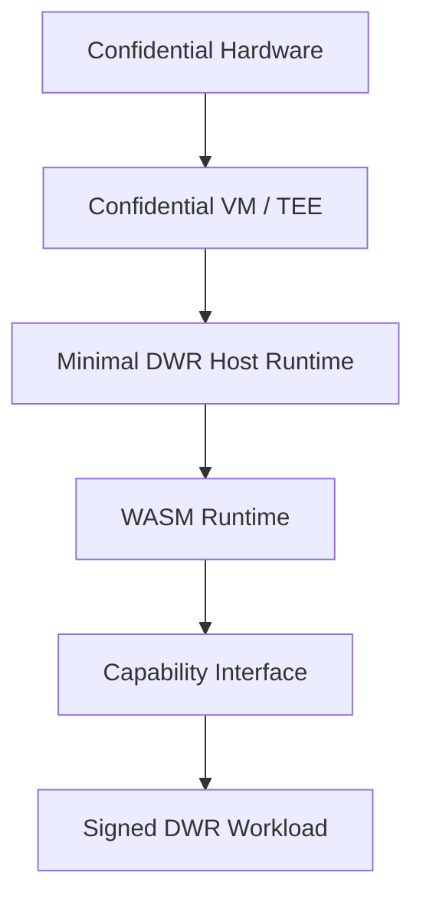
```mermaid
flowchart TB
    HW["Confidential Hardware"]
    CVM["Confidential VM / TEE"]
    HOST["Minimal DWR Host Runtime"]
    WASM["WASM Runtime"]
    CAP["Capability Interface"]
    APP["Signed DWR Workload"]

    HW --> CVM
    CVM --> HOST
    HOST --> WASM
    WASM --> CAP
    CAP --> APP
```

This stack provides two complementary isolation layers:

1. TEE isolation against the infrastructure provider;
2. capability isolation against the workload.

---

# 57. Vertical Slice 1: Two-Party TEE Room

The first implementation should intentionally avoid solving every future problem.

## Objective

Demonstrate a computation over private inputs from two owners without either participant receiving the other's input.

## Scope

- two participants;
- one workload;
- one TEE backend;
- 2-of-2 authorization;
- no persistence;
- no outbound network;
- one execution;
- fixed lease;
- fixed output schemas;
- manual provider selection.

## Success Criteria

1. Neither input can be decrypted outside the attested room.
2. Execution cannot begin until both participants authorize the same canonical contract.
3. Input release occurs only after each owner accepts attestation.
4. Only contract-authorized output leaves the room.
5. Room keys are destroyed at termination.

---

# 58. Vertical Slice 2: Decentralized Room Discovery

Add:

- multiple providers;
- capability advertisement;
- pricing;
- provider policy;
- decentralized discovery;
- automatic candidate selection.

The signed contract specifies requirements. The mesh discovers a compatible room. Attestation remains the final security gate.

---

# 59. Vertical Slice 3: Dynamic Declassification

Add:

- output authorization requests;
- user approval;
- signed Output Grants;
- selective release;
- audit evidence for each declassification.

This demonstrates that DWR authorization is not merely all-or-nothing.

---

# 60. Vertical Slice 4: Agent-Initiated Rooms

Allow an autonomous agent to detect that a computation requires foreign private data and construct a minimal room proposal.

The human or organizational policy engine may:

- approve automatically;
- reject automatically;
- require human approval;
- constrain the proposal;
- substitute a preferred provider profile;
- narrow the requested outputs.

This turns DWR from infrastructure into an agentic-computing primitive.

---

# 61. Vertical Slice 5: Alternative Backend

Implement the same DWR contract and API through one additional privacy backend, preferably MPC.

The purpose is architectural: prove that DWR semantics are not tied to one physical machine or one TEE vendor.

Applications should ideally require little or no modification.

---

# 62. Integration with the Decentralized Cloud

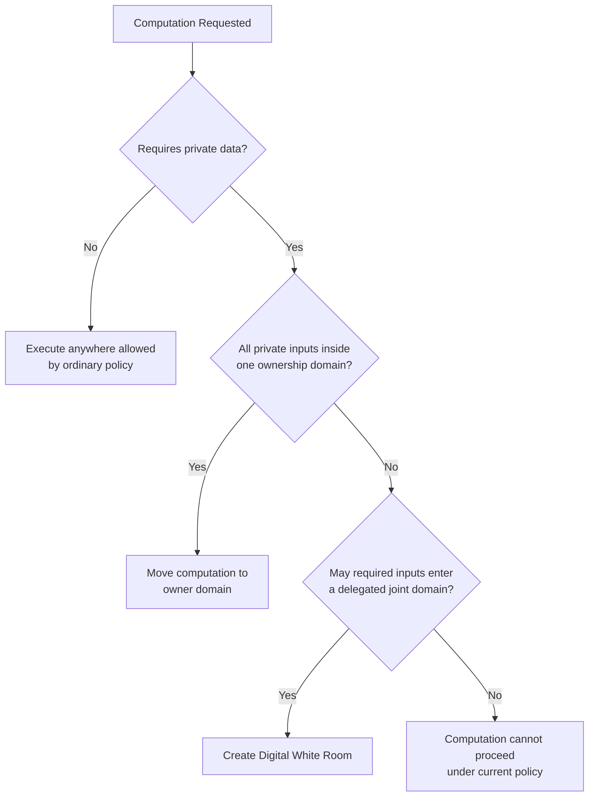
```mermaid
flowchart TD
    TASK["Computation Requested"]
    Q1{"Requires private data?"}
    PUB["Execute anywhere allowed<br/>by ordinary policy"]
    Q2{"All private inputs inside<br/>one ownership domain?"}
    LOCAL["Move computation to<br/>owner domain"]
    Q3{"May required inputs enter<br/>a delegated joint domain?"}
    DWR["Create Digital White Room"]
    DENY["Computation cannot proceed<br/>under current policy"]

    TASK --> Q1
    Q1 -->|"No"| PUB
    Q1 -->|"Yes"| Q2
    Q2 -->|"Yes"| LOCAL
    Q2 -->|"No"| Q3
    Q3 -->|"Yes"| DWR
    Q3 -->|"No"| DENY
```

This preserves a coherent platform-wide ownership model rather than treating confidential compute as a separate product silo.

---

# 63. Security Invariants

A conforming DWR implementation should maintain the following invariants.

## 63.1 No unilateral room

No participant can independently activate a jointly authorized room before the required signature threshold is satisfied.

## 63.2 No secrets before verification

Protected input is not released before the owner accepts the instantiated execution environment.

## 63.3 Contract binding

Workload, security policy, Room Identity, attestation, participant authorization, and input encryption all refer to the same contract and room instance.

## 63.4 Least output

Confidential state leaves the room only through an authorized declassification path.

## 63.5 Bounded existence

Every room has a finite lease.

## 63.6 No inherited trust

Hosting the room does not automatically grant the provider access to its protected contents.

## 63.7 Fresh room identity

Every newly instantiated room receives fresh cryptographic identity.

## 63.8 Explicit classification transition

Data does not silently become delegatable or public merely because a DWR exists.

---

# 64. Formal Conceptual Model

A Digital White Room can be modeled conceptually as the composition of:

```text
DWR = JointAuthorization
    + VerifiedExecutionEnvironment
    + WorkloadIdentity
    + InputPolicy
    + OutputPolicy
    + Lease
```

Execution is permitted only when the contract is authorized, the environment is verified against that contract, the lease is valid, and required input grants are satisfied.

An output may leave only when it was produced by an authorized execution and is permitted by the output policy and any required Output Grant.

---

# 65. Why "White Room"

The term **Digital White Room** intentionally differs from the established term **Data Clean Room**.

A Data Clean Room is commonly understood as infrastructure for controlled collaboration or analysis over datasets.

A Digital White Room is a broader computational primitive. It can host:

- general-purpose code;
- AI agents;
- application services;
- models;
- algorithms;
- private state;
- multiple cooperating modules.

Its defining object is not a shared dataset. Its defining object is a **jointly authorized computation**.

The formal term **Joint Confidential Execution Domain** describes the security semantics. **Digital White Room** provides the concise product and API abstraction.

---

# 66. Digital Jurisdiction Interpretation

A DWR may be viewed as a temporary digital jurisdiction.

For a bounded interval, the participants establish:

- who may participate;
- what information may enter;
- what code may execute;
- which resources the code may access;
- what information may leave;
- who may receive that information;
- when the jurisdiction ceases to exist.

The infrastructure provider supplies the territory. The jointly signed Room Contract supplies the law. The verified runtime supplies enforcement.

This interpretation is useful because it highlights that the DWR is neither merely a VM nor merely a data-sharing service. It is a **temporary jointly governed trust boundary**.

---

# 67. Open Questions

Future revisions should address at least the following topics.

## 67.1 Contract negotiation

Should negotiation be bilateral, multiparty, broker-mediated, or agent-mediated?

## 67.2 Multiparty thresholds

Generalize authorization beyond 2-of-2 to N-of-N, K-of-N, role-based thresholds, and veto roles.

## 67.3 Persistent collaborative domains

Are longer-lived rooms useful, and how should rollback, checkpointing, and key rotation work?

## 67.4 Composable White Rooms

May one DWR securely invoke another DWR, and how should transitive declassification be represented?

## 67.5 Agent delegation

May a participant authorize an agent to sign bounded classes of DWR contracts automatically?

## 67.6 Jurisdiction constraints

How should legal location, data residency, and provider ownership requirements be represented?

## 67.7 Billing

Should participants, providers, applications, or combinations thereof pay for the lease?

## 67.8 GPU confidential compute

How should accelerator attestation and DMA/IOMMU boundaries be incorporated into the contract?

## 67.9 Output provenance

Should every output carry cryptographically verifiable proof of room, workload, contract, and attested runtime?

## 67.10 Formal policy verification

Can Room Contracts and declassification rules themselves be statically or formally verified?

## 67.11 Privacy budget

Should repeated-output workloads have a contract-level privacy or query budget independent of lease time?

## 67.12 Economic policy

Can participants charge for certain classes of private computation without selling raw data?

---

# 68. References

1. S. Bradner, **Key words for use in RFCs to Indicate Requirement Levels**, RFC 2119.  
   https://www.rfc-editor.org/rfc/rfc2119

2. B. Leiba, **Ambiguity of Uppercase vs Lowercase in RFC 2119 Key Words**, RFC 8174.  
   https://www.rfc-editor.org/rfc/rfc8174

3. H. Birkholz et al., **Remote ATtestation procedureS (RATS) Architecture**, RFC 9334.  
   https://www.rfc-editor.org/rfc/rfc9334

4. C. Bormann and P. Hoffman, **Concise Binary Object Representation (CBOR)**, RFC 8949.  
   https://www.rfc-editor.org/rfc/rfc8949

5. J. Schaad, **CBOR Object Signing and Encryption (COSE): Structures and Process**, RFC 9052.  
   https://www.rfc-editor.org/rfc/rfc9052

6. R. Barnes et al., **Hybrid Public Key Encryption**, RFC 9180.  
   https://www.rfc-editor.org/rfc/rfc9180

7. E. Rescorla, **The Transport Layer Security (TLS) Protocol Version 1.3**, RFC 8446.  
   https://www.rfc-editor.org/rfc/rfc8446

8. Confidential Computing Consortium.  
   https://confidentialcomputing.io/

9. Google Cloud, **Confidential Space**.  
   https://cloud.google.com/confidential-computing/confidential-space/docs/confidential-space-overview

---

# 69. Summary

The Digital White Room extends compute-to-data architecture to computations involving mutually private data from multiple owners.

Instead of requiring one participant to trust another with raw private data, the system establishes a new temporary domain that both participants authorize and neither participant owns.

The resulting abstraction is a **leased, jointly authorized, attestable, ephemeral confidential execution domain**.

It provides a natural bridge between decentralized computing, data sovereignty, confidential computing, autonomous agents, privacy-preserving cross-organization collaboration, and future private-computation techniques such as MPC and FHE.

Its core architectural insight is simple:

> **When computation can travel to private data, move the computation.**

> **When mutually private data must meet, create a temporary place that neither owner owns.**
