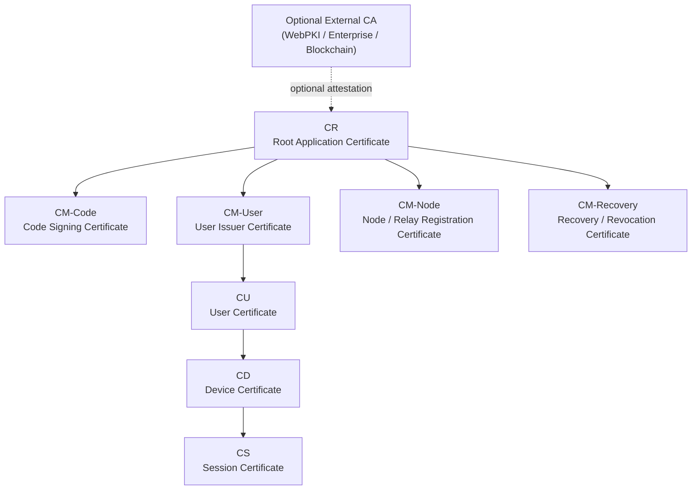
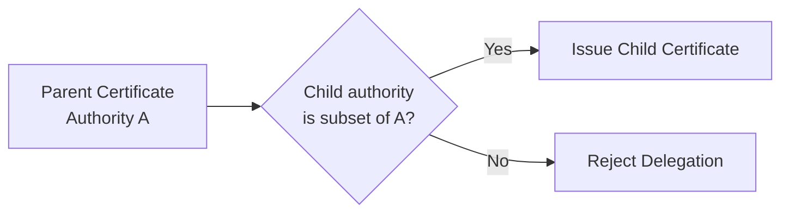
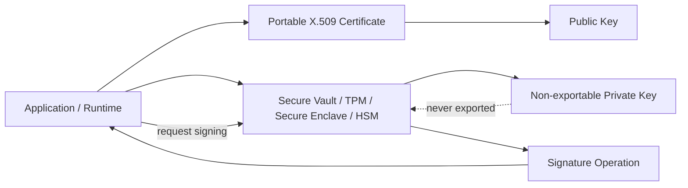
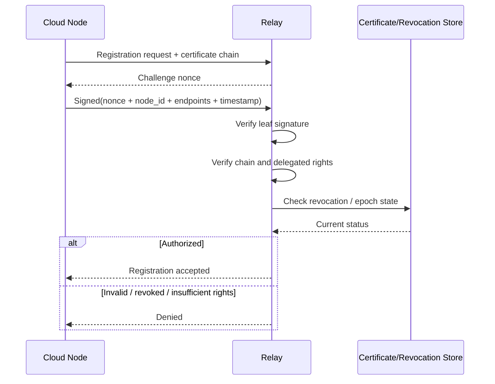
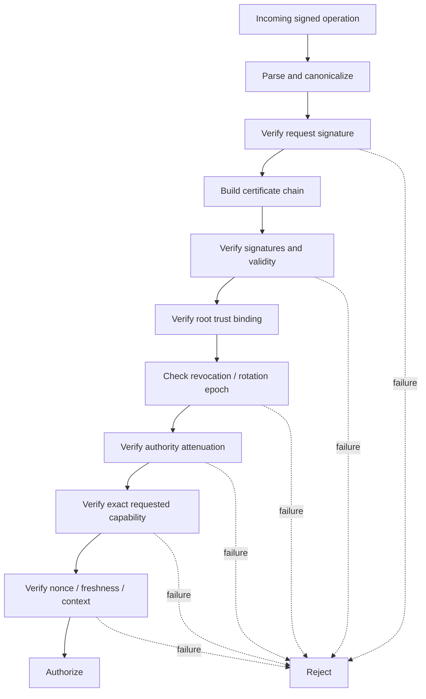
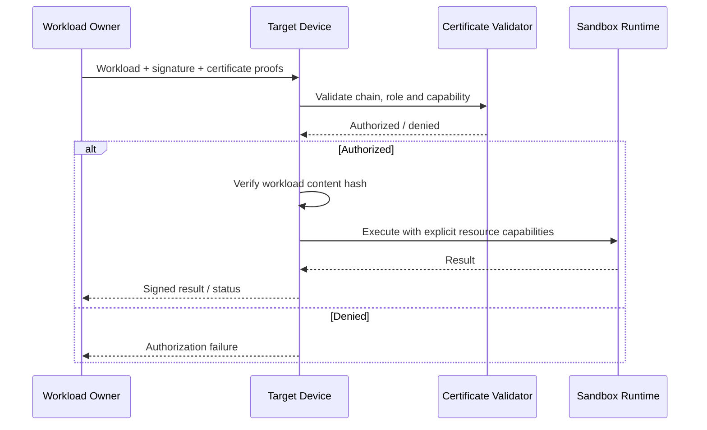

# RFC-0003: Decentralized Cloud Security Architecture

**Version:** 0.2 Draft  
**Status:** Design Specification

## Abstract

This document specifies the security architecture of the Decentralized Cloud platform. The system uses standard X.509 v3 certificates extended with application-specific critical extensions to represent application provenance, delegated authority, code-signing rights, user authority, device authority, and short-lived session authority.

The Root Application Certificate (CR) identifies an application within the provider ecosystem. Its identity guarantee is intentionally narrow: it proves that the application is associated with the provider controlling the CR private key. When the CR is additionally certified by an external certificate authority, the guarantees of that authority are inherited as an additional trust layer.

Authority is delegated through specialized certificates. Private keys are generated and retained inside secure key stores whenever the platform supports that property; certificates and public verification material are portable.

## 1. Core Principles

1. **CR identifies the application within the provider ecosystem.**
2. **Identity and authorization are distinct.** A valid identity does not imply broad authority.
3. **Authority is delegated through specialized certificates.**
4. **Delegation can only attenuate authority.** A child certificate may never grant rights that its parent does not possess.
5. **Private keys are non-exportable whenever the underlying platform allows it.**
6. **Certificates are rotatable and revocable.**
7. **Verification is local-first.** A node should be able to validate a presented chain without contacting a centralized authorization service except where freshness information such as revocation status is required.
8. **Code authorization is separate from runtime isolation.** A valid signature authorizes execution; it does not prove safety.

## 2. Trust Hierarchy



The CR is the application trust anchor. A self-signed CR provides stable cryptographic application provenance within the provider ecosystem. A CR certified by an external CA may additionally inherit domain, organizational, legal-entity, or other guarantees defined by that CA.

The system does not require a single global certificate authority.

## 3. Certificate Roles

### 3.1 Root Application Certificate (CR)

The CR identifies an application and anchors its internal certificate hierarchy. The CR private key should be used rarely and stored with the strongest available protection.

The CR may issue multiple management certificates with independent responsibilities.

### 3.2 Management Certificates (CM)

Management certificates separate authority by function. Typical roles include:

- `CM-Code`: code and release signing.
- `CM-User`: issuance of application user certificates.
- `CM-Node`: authorization of cloud nodes and relay registration.
- `CM-Recovery`: emergency rotation, recovery, and revocation operations.
- Additional application-specific management roles.

Compromise of one management certificate must not implicitly grant the rights of another management role.

### 3.3 User Certificate (CU)

A CU represents a user account inside an application security domain. It may delegate a subset of its authority to device certificates.

### 3.4 Device Certificate (CD)

A device certificate binds application authority to a key generated in a device security vault, TPM, Secure Enclave, HSM, or operating-system key store.

### 3.5 Session Certificate (CS)

A session certificate is short-lived and derived from device authority. It minimizes exposure of long-lived device keys and provides narrow temporal and contextual authorization.

## 4. X.509 Profile

The design uses X.509 v3 as the certificate envelope rather than inventing a new cryptographic container.

Standard X.509 fields provide:

- issuer and subject identity;
- public-key material;
- validity interval;
- serial number;
- signature algorithm;
- chain construction;
- Key Usage and Extended Key Usage;
- conventional revocation interoperability where appropriate.

Application semantics are encoded in custom X.509 extensions identified by private OIDs.

A conceptual extension payload is:

```asn1
DecentralizedCloudAuthority ::= SEQUENCE {
    applicationId           OCTET STRING,
    certificateRole         OBJECT IDENTIFIER,
    parentCertificateHash   OCTET STRING OPTIONAL,
    authority               SEQUENCE OF AuthorityRule,
    delegationDepth         INTEGER OPTIONAL,
    rotationEpoch           INTEGER,
    policyVersion           INTEGER,
    constraints             OCTET STRING OPTIONAL
}
```

Extensions that change authorization semantics MUST be marked `critical`, so a generic validator that does not understand the Decentralized Cloud profile cannot silently ignore those restrictions.

## 5. Authority Delegation



For every parent-to-child issuance:

- child resources MUST be a subset of parent resources;
- child actions MUST be a subset of parent actions;
- child validity MUST not extend beyond parent validity;
- child delegation depth MUST not exceed the remaining parent depth;
- child constraints MUST be equal to or stricter than parent constraints.

Conceptually:

`effective authority = intersection(authority of every certificate in the chain)`

## 6. Key Isolation and Non-Exportability



Certificates are intended to be portable verification objects. Private keys are not.

Preferred key storage includes:

- TPM;
- Secure Enclave;
- HSM;
- operating-system secure key vault;
- equivalent hardware-backed or process-isolated signing service.

Where supported, child keys should be generated directly inside the target vault and should never exist as exportable plaintext key material.

## 7. Certificate Rotation

Every certificate role rotates independently.

Rotation serves several purposes:

- limits the useful lifetime of leaked credentials;
- allows cryptographic algorithm migration;
- allows policy evolution;
- separates routine renewal from emergency recovery.

A certificate may contain a monotonic `rotationEpoch`. Verifiers may reject certificates derived from epochs older than the currently accepted epoch for the relevant authority branch.

Root rotation is a special operation because it changes the trust anchor. Root rollover should support a transition period in which the old CR cross-signs or otherwise authenticates the new CR.

## 8. Revocation

Revocation is separate from signature validity. A correctly signed certificate can still be invalid because its authority has been revoked.

The architecture can support several mechanisms simultaneously:

- short certificate lifetimes;
- signed revocation records;
- CRL or OCSP where conventional PKI integration is useful;
- signed epoch/status objects;
- DHT distribution;
- relay caching;
- gossip propagation.

A verifier MUST define a freshness policy for revocation data.

## 9. Relay Registration Protocol



The relay challenge binds authentication to a fresh request and prevents replay of static registration proofs.

The signed payload should include at least:

- relay challenge nonce;
- node identifier;
- advertised endpoints;
- application identifier;
- timestamp or bounded freshness marker;
- protocol version;
- relevant registration attributes.

A relay MUST avoid allocating expensive long-lived state before inexpensive validation and rate-limit checks have completed.

## 10. Request Validation



The validator must reject on ambiguity. Unknown critical extensions, malformed chains, unsupported policy versions, expired credentials, stale epochs, or non-attenuating delegation must fail closed.

## 11. Code Signing and Workload Execution



Code signatures establish provenance and authorization to request execution. They do not establish that the workload is safe.

A target device should therefore enforce both:

1. **authorization** - the certificate chain permits this exact operation; and
2. **isolation** - the runtime limits the workload to explicitly granted resources.

WASM is a natural execution substrate because it can combine portable code with explicit capability-oriented sandboxing, although the certificate model is not limited to WASM.

## 12. Suggested Custom Extension Registry

A private enterprise OID arc should be allocated for the project. Under that arc, the following extension families are suggested:

- Application Identifier
- Certificate Role
- Authority / Capability Set
- Delegation Constraints
- Parent Certificate Hash
- Rotation Epoch
- Policy Version
- Workload Binding
- Namespace Binding
- Runtime Restrictions
- Recovery Metadata

Exact binary schemas should be versioned independently of the enclosing X.509 profile.

## 13. Parent Binding

Standard X.509 chain construction identifies issuers primarily by issuer identity and key identifiers. For this architecture it is useful to additionally identify the exact parent certificate that delegated the authority.

A child certificate can therefore carry:

`parentCertificateHash = SHA-256(parent DER certificate)`

This prevents ambiguity when the same issuer key has produced multiple certificates carrying different delegated rights.

## 14. Threat Model

The design explicitly considers:

- stolen management keys;
- stolen device keys;
- malicious or compromised relays;
- replay of signed registration messages;
- man-in-the-middle attacks;
- substitution of application code;
- privilege escalation through malformed delegation;
- downgrade to older policy versions;
- stale revocation information;
- denial-of-service against relays and validators;
- compromised application code with valid signatures.

The design does not claim that a valid certificate makes an issuer trustworthy or that signed software is free of malicious behavior.

## 15. Security Invariants

The implementation should preserve the following invariants:

- A child certificate cannot increase authority.
- A certificate cannot outlive the authority chain that issued it.
- A verifier rejects unknown critical policy extensions.
- A private key is never intentionally transferred between principals.
- A signed request is bound to its execution context.
- Revoked or stale authority cannot be revived by replaying an older valid chain.
- Code execution requires both authorization and runtime isolation.
- Compromise of one specialized CM does not grant unrelated CM authority.

## 16. Certificate Philosophy

A certificate in Decentralized Cloud is more than an identity label. It is a portable, cryptographically verifiable security object that binds:

- a public key;
- an application security domain;
- a certificate role;
- delegated authority;
- delegation constraints;
- validity;
- rotation state;
- application-specific security policy.

The term **certificate** is intentional. It communicates that the object is verifiable, signed, scoped, time-bounded, and suitable for integration with existing security infrastructure.

The central operational rule is:

**Certificates may travel. Private keys do not.**

## 17. Open Design Questions

The following items require protocol-level specification before implementation is considered stable:

- exact private OID allocation;
- canonical ASN.1 schemas;
- choice of signature algorithms and minimum key sizes;
- root rollover protocol;
- revocation freshness guarantees;
- certificate discovery and caching;
- certificate transparency requirements;
- user recovery and multi-device enrollment;
- encrypted data-key distribution;
- relay privacy and metadata minimization;
- policy-version negotiation;
- post-quantum migration strategy.

## 18. Future Extensions

Potential extensions include:

- threshold-signed root certificates;
- multi-party recovery;
- certificate transparency;
- hardware attestation;
- confidential-computing attestations;
- selective disclosure;
- anonymous credentials;
- post-quantum signatures;
- signed reproducible-build attestations.
