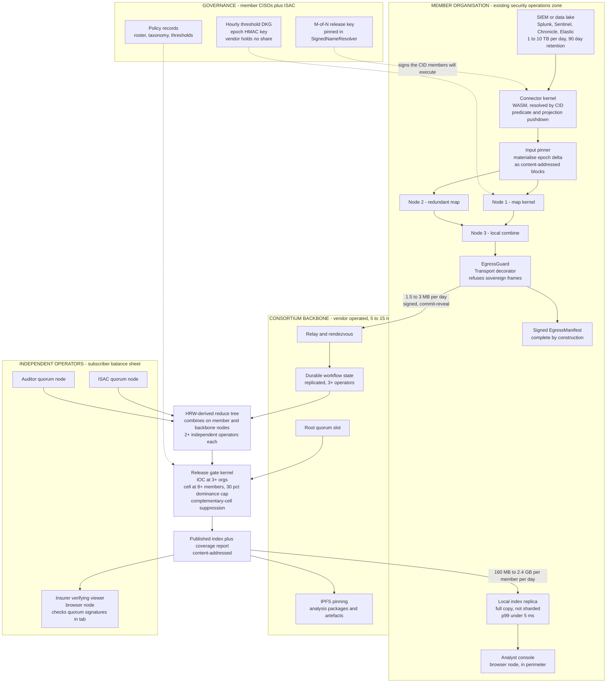
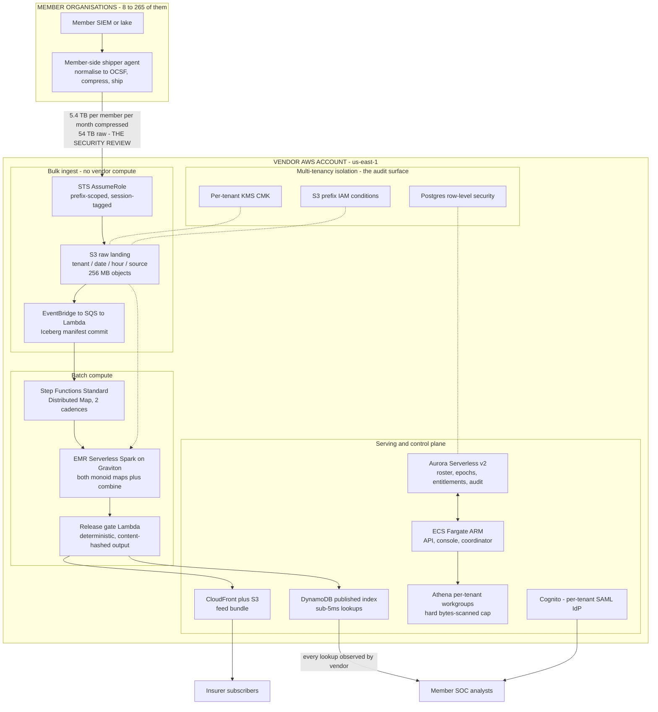
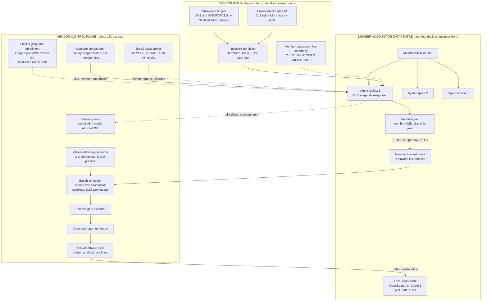

# Building on a P2P Cloud vs. Building on AWS

## A costed architecture and business study, using one real product as the test case

**Product under test:** Detection-Efficacy & Sighting Consortium — cross-enterprise security telemetry that never leaves the enterprise.
**Paths compared:** o2 P2P cloud [on-premises](#glossary) · AWS multi-tenant SaaS · AWS [BYOC](#glossary).
**All prices observed 2026-08-01.** Currency USD. US-domiciled startup, 2–4 engineers at founding.
**Method:** eight independent research tracks, one consolidated financial model, two adversarial reviews, one arithmetic audit. Where researchers disagreed, both figures are shown and the choice is defended.

---

## Contents

- [1. Verdict](#1-verdict)
- [2. The product, and why it was chosen](#2-the-product-and-why-it-was-chosen)
  - [2.1 What it is](#21-what-it-is)
  - [2.2 Why this product and not another](#22-why-this-product-and-not-another)
  - [2.3 Why the on-premises topology is load-bearing rather than decorative](#23-why-the-on-premises-topology-is-load-bearing-rather-than-decorative)
  - [2.4 Runners-up, and why they lost](#24-runners-up-and-why-they-lost)
- [3. The shared workload spec](#3-the-shared-workload-spec)
  - [3.1 Scale points](#31-scale-points)
  - [3.2 The compute job](#32-the-compute-job)
  - [3.3 The assumptions that drive everything](#33-the-assumptions-that-drive-everything)
- [4. Architecture A — o2 P2P cloud, on-premises primary](#4-architecture-a--o2-p2p-cloud-on-premises-primary)
  - [4.1 In one sentence](#41-in-one-sentence)
  - [4.2 Diagram](#42-diagram)
  - [4.3 The three load-bearing moves](#43-the-three-load-bearing-moves)
  - [4.4 Where the browser tier fits, and where it does not](#44-where-the-browser-tier-fits-and-where-it-does-not)
  - [4.5 The honest weaknesses, carried not hidden](#45-the-honest-weaknesses-carried-not-hidden)
- [5. Architecture B — AWS multi-tenant SaaS](#5-architecture-b--aws-multi-tenant-saas)
  - [5.1 The shape](#51-the-shape)
  - [5.2 Diagram](#52-diagram)
  - [5.3 The arithmetic that surprised every researcher](#53-the-arithmetic-that-surprised-every-researcher)
  - [5.4 The finding, stated plainly](#54-the-finding-stated-plainly)
  - [5.5 Four latent cost cliffs, each larger than the entire correct bill](#55-four-latent-cost-cliffs-each-larger-than-the-entire-correct-bill)
- [6. Architecture C — AWS BYOC](#6-architecture-c--aws-byoc)
  - [6.1 Two schools, and only one is admissible](#61-two-schools-and-only-one-is-admissible)
  - [6.2 Diagram](#62-diagram)
  - [6.3 Where BYOC equals o2 and where it only approximates](#63-where-byoc-equals-o2-and-where-it-only-approximates)
  - [6.4 The sharpest gap, and it is worth $77k/yr plus a DPO](#64-the-sharpest-gap-and-it-is-worth-77kyr-plus-a-dpo)
  - [6.5 Why multi-cloud is forced, not chosen](#65-why-multi-cloud-is-forced-not-chosen)
- [7. Side-by-side comparison](#7-side-by-side-comparison)
- [8. Costs](#8-costs)
  - [8.1 Build cost to a sellable v1 — one-time, VENDOR](#81-build-cost-to-a-sellable-v1--one-time-vendor)
  - [8.2 Monthly run-rate — VENDOR](#82-monthly-run-rate--vendor)
  - [8.3 Monthly run-rate — CUSTOMER (per member) and END USER](#83-monthly-run-rate--customer-per-member-and-end-user)
  - [8.4 Three-year TCO](#84-three-year-tco)
  - [8.5 Gross margin](#85-gross-margin)
  - [8.6 Vendor marginal cost to serve the Nth member](#86-vendor-marginal-cost-to-serve-the-nth-member)
  - [8.7 Crossover](#87-crossover)
  - [8.8 Sensitivity](#88-sensitivity)
- [9. Non-infrastructure costs](#9-non-infrastructure-costs)
  - [9.1 Development](#91-development)
  - [9.2 Compliance — the largest architectural cost difference, and it runs opposite to infrastructure](#92-compliance--the-largest-architectural-cost-difference-and-it-runs-opposite-to-infrastructure)
  - [9.3 Go-to-market](#93-go-to-market)
  - [9.4 Support](#94-support)
- [10. Commercial risk, and the strategic-fit verdict](#10-commercial-risk-and-the-strategic-fit-verdict)
  - [10.1 Risks that apply to the product regardless of path](#101-risks-that-apply-to-the-product-regardless-of-path)
  - [10.2 Path-specific risk](#102-path-specific-risk)
  - [10.3 Strategic fit — durable advantage or temporary feature?](#103-strategic-fit--durable-advantage-or-temporary-feature)
- [11. Decision framework](#11-decision-framework)
  - [11.1 Gate 0 — the product gate, which outranks the architecture question](#111-gate-0--the-product-gate-which-outranks-the-architecture-question)
  - [11.2 Gate 1 — choose o2 if ALL of these hold](#112-gate-1--choose-o2-if-all-of-these-hold)
  - [11.3 Gate 2 — choose AWS BYOC instead if ANY of these hold](#113-gate-2--choose-aws-byoc-instead-if-any-of-these-hold)
  - [11.4 Gate 3 — choose AWS multi-tenant SaaS if](#114-gate-3--choose-aws-multi-tenant-saas-if)
  - [11.5 Kill conditions after funding](#115-kill-conditions-after-funding)
- [12. What this means for o2 as a business](#12-what-this-means-for-o2-as-a-business)
  - [12.1 o2's real customer is not who the pitch implies](#121-o2s-real-customer-is-not-who-the-pitch-implies)
  - [12.2 Does free-for-OSS plus low-for-commercial sustain it? Not as currently anchored.](#122-does-free-for-oss-plus-low-for-commercial-sustain-it-not-as-currently-anchored)
  - [12.3 The supplier posture that will block deals](#123-the-supplier-posture-that-will-block-deals)
  - [12.4 The positioning sentence](#124-the-positioning-sentence)
- [13. Open questions, and what would close them](#13-open-questions-and-what-would-close-them)
  - [13.1 The three that could change the conclusion](#131-the-three-that-could-change-the-conclusion)
  - [13.2 The five that move numbers but not the conclusion](#132-the-five-that-move-numbers-but-not-the-conclusion)
  - [13.3 Model errors this study inherits and reports rather than hides](#133-model-errors-this-study-inherits-and-reports-rather-than-hides)
- [Appendix — principal sources](#appendix--principal-sources)
- [Glossary](#glossary)

---

## 1. Verdict

**Build on o2 — but not for the reason the platform's own marketing would give you, and not on the numbers you would expect.** The o2 path does not win on gross margin: at commercial scale it runs 85.6% against the centralised AWS SaaS path's 88.5%. It does not win on marginal cost to serve the next customer: $19,872 against centralised AWS's $15,130. It barely wins on infrastructure — AWS BYOC's [control plane](#glossary) is cheaper than o2's backbone-plus-licence at every scale. What o2 wins is **time and legal status**. It reaches a sellable v1 for $470,500 against $822,833 (AWS SaaS) and $634,167 (BYOC); it reaches first invoice in month 8–9 against month 15–24 and month 12–18; it breaks even at 46 members against 61; and because the vendor holds no personal data, it removes roughly **$972,000/yr of compliance cost** at year-3 scale — 88% of the total cost gap against the centralised path. Over three years at equal scale and with sales cost included, vendor [TCO](#glossary) is **$11.7M (o2) vs. $14.0M (BYOC) vs. $19.7M (AWS SaaS)**. Over three years on each path's own realistic customer ramp, all three spend roughly the same ($12.1M / $12.9M / $12.6M) and book wildly different revenue: **$5.31M / $3.00M / $1.02M**. That 5.2× revenue divergence on near-identical spend is the whole study.

**Here is when each alternative wins, concretely.** Choose **AWS BYOC** if you are already funded at $30M+ with 20 or more engineers — then the 41 engineer-months and $1.4M to consortium v1 are absorbable, the forced multi-cloud tax becomes day-one Sentinel and Chronicle coverage rather than a schedule risk, and a single [SOC 2](#glossary)'d control plane is genuinely easier for an insurance underwriter to diligence than a distributed [quorum](#glossary). Also choose BYOC if diligence shows the o2 platform's four "provided" services — decentralized database, durable workflow engine, decentralized DNS, certificates — have materially rougher authoring ergonomics than Aurora, Step Functions, Route 53 and ACM; that would add up to 14 engineer-months and cut the o2 head start from 15 months to about 6. Choose **AWS multi-tenant SaaS** for this product at no valuation and under no conditions: it asks eight CISOs to open a bulk outbound feed of credentials, internal topology and defensive posture to a pre-revenue three-person company, which voids their [CISA 2015](#glossary) safe harbour, makes the vendor a GDPR [processor](#glossary) of half a million employees' monitoring data, and triggers a [DORA](#glossary) Article 30 audit-and-inspection clause a three-person company cannot satisfy. Its contribution margin at pilot scale is *negative* after compliance, and even at double the assumed win rate it is $2.2M underwater in year three. It has the best unit economics in this study and the worst business, because its margin is conditional on a sale that does not close.

**And here is the condition that outranks the architecture question entirely.** Every path sells the same product to the same buyer, and the demand for that product is unproven in one specific place: the model's whole time-to-revenue advantage rests on a single-member [ATT&CK](#glossary) coverage assessment being worth $40–90k, when Microsoft Sentinel, Splunk Security Essentials and Elastic Security all ship an ATT&CK coverage view **free, inside the tool the buyer already administers**. Nobody in eight research tracks tested that assumption. Choosing o2 changes the failure mode from *"we could not sell it"* to *"we could sell it and still could not sell it"* — a real improvement, and not sufficient. **Do not fund on the architecture thesis. Fund on one arm's-length, cash-paid, $40k-or-better single-player contract closed before the round, from a buyer with no prior relationship to the founder.** An LOI is not evidence. If that contract closes, o2 is clearly the right substrate and the head start is worth spending on members in thin sectors rather than on engineering. If it does not close, this study is a well-executed answer to a question that turned out not to be the binding constraint.

---

## 2. The product, and why it was chosen

### 2.1 What it is

A member-governed cooperative. Each enterprise runs a small cluster of nodes against the [SIEM](#glossary)/[EDR](#glossary) data lake it already pays for, maps 1–10 TB/day of raw security telemetry **locally** into two [associative monoids](#glossary), and ships roughly **3 MB per member per day** of [k-anonymised](#glossary) partials to a verified cross-owner reduce. The reduce publishes two things members cannot get anywhere else:

- **Sector-relative detection-coverage percentiles** — "you detect T1566.002 at the 22nd percentile of your sector."
- **A ">=3 independent organisations sighted this" [IOC](#glossary) feed** — a confidence signal no single-vendor feed can produce.

Buyers: member CISOs at $40–250k/yr by headcount band, and roughly 40 cyber carriers and reinsurers at $250k–1.0M/yr who need sector control-efficacy and [dwell-time](#glossary) distributions to price their book.

### 2.2 Why this product and not another

Five criteria were applied to a field of eleven candidates.

**1. Neither path is a strawman.** The o2 path is on-premises clusters inside each member's existing security zone. The AWS path is the hand-built per-member-agent architecture or a vendor-run centralised lake — both deployed today by real vendors. AWS Clean Rooms is explicitly *not* the comparator; it is a bounded sub-case, and the reason is sharper than usually stated. The widely-quoted "5 members per collaboration" cap **is adjustable** ([AWS Clean Rooms quotas](https://docs.aws.amazon.com/clean-rooms/latest/userguide/clean-rooms-quotas.html), observed 2026-08-01). What is **not** adjustable is *"Concurrent ongoing job per membership: 1"* and *"Concurrent ongoing queries per membership: 5."* An hourly reduce across 40–265 memberships is what those forbid.

**2. It exercises the platform hardest of any on-premises candidate.** Data decomposes per owner perfectly. The buyer's SKU *is* the verified cross-owner aggregate — a sentence that cannot exist without verified aggregation, where a member holding another member's raw logs would be a liability rather than a benefit. At year-3 scale the consortium scans ~72 TB/day on hardware members already own.

**3. It is the cleanest fit with the platform's hardest constraint — no incentive market.** A member runs a node because the node gives them their **own** MITRE ATT&CK coverage assessment with zero peers. Every other consortium candidate had to manufacture a reason to participate.

**4. The AWS side is richly and publicly priced.** Ingest, storage and [egress](#glossary) are the most precisely published lines in cloud pricing.

**5. Commercially real.** Named buyers with real budgets on both sides, and sector [ISACs](#glossary) as a distribution channel that delivers the second side in one contract.

### 2.3 Why the on-premises topology is load-bearing rather than decorative

Two independent forces point the same way, which is what makes the comparison honest rather than rigged.

**Legally:** raw security telemetry contains credentials in process command lines, internal hostnames, a complete map of defensive posture, and [PII](#glossary) embedded in logs. CISA 2015's protections cover threat **indicators**, not bulk telemetry — verified at [6 U.S.C. § 1503(d)(2)](https://www.law.cornell.edu/uscode/text/6/1503), which conditions the shield on removing personal information *or* implementing "a technical capability configured to remove" it. The [sovereign map](#glossary) **is** that technical capability. A bulk raw feed definitionally is not.

**Physically:** a 20,000-seat enterprise generates 1–10 TB/day. Pooling raw telemetry has always failed on economics before it failed on law.

This is the rare candidate where "we do not centralise" is the only affordable design under *either* architecture.

### 2.4 Runners-up, and why they lost

| Candidate | Why it lost |
|---|---|
| **Federated Real-World Evidence / SovereignCohort** (clinical RWE) | Architecturally excellent; the pooled hazard ratio with a [coverage report](#glossary) is exactly the right shape. But the site incentive collides head-on with the no-payment-market constraint — TriNetX gives sites free access across 220+ organisations and Truveta gave them equity, and o2 offers neither. Regulatory-grade output needs a quality-management system and validated computations before the first submission-grade deliverable: 6–9 months and funded headcount, not 2–4 engineers. And the party that pays (pharma) is not the party sovereignty protects (the health system's privacy officer), making it a two-sided 9–15 month sale. **Would have won if criterion 3 were relaxed.** |
| **MuleNet** (cross-bank mule-account cooperative) | Nearly the same architecture as the winner, and prices against losses avoided rather than compute substituted — a better revenue shape. Lost on two existential legal gates: if a member declines an account on the score, the output can be argued to be a consumer report and the operator a consumer reporting agency under [FCRA](#glossary); and the antitrust posture worsened when the FTC and DOJ withdrew the Statement 6 safety zone in February 2023. Add that Early Warning Services is owned by seven of the banks you must sell to, and bank third-party-risk review pushes first consortium revenue past 12 months. The security-telemetry version carries none of these gates. |
| **Cryptographic compensation benchmarking** (EU pay transparency) | The best pure go-to-market candidate in the field — dated statutory forcing function with first reports due 7 June 2027, single-department discretionary buyer, 10–14 week build, realistic $250–600k ARR by month 12. It fails criterion 2, which is the question actually asked: 5 MB per employer, under 5 GB across a 500-employer network, the market-wide regression running in seconds on a laptop. An architecture-and-economics comparison would compare a t3.medium to a t3.medium and produce no signal. |

Rejected outright, with reasons: federated medical imaging AI (free incumbent in NVIDIA FLARE, and a legitimate substitute is winning — vendors simply buy de-identified studies); plan-sponsor benefits analytics (a hard 14–20 month plan-year floor no engineering removes); Sovereign Genome (the funding revenue line arrives 18–30 months after the revenue line that must fund the company); Panel-of-Everyone (a panelist has no workload of their own, so rewards become the dominant cost line — direct conflict with the no-incentive-market constraint); Sovereign Media Vault (no cross-owner aggregate at all, and one OS release erases the differentiation); Sovereign Money (bank-data aggregation at ~$24/user/yr is third-party-controlled COGS the vendor cannot remove); Open Shelf (the "cannot centralise" premise is a commercial "will not," and architecture does not dissolve commercial incentives).

---

## 3. The shared workload spec

Every path was costed against this identical specification. It was fixed before any architecture was designed.

### 3.1 Scale points

| | **[S1](#glossary)** — beachhead pilot, month 6–12 | **S2** — single-sector consortium, year 3 | **S3** — multi-sector network, year 5 |
|---|---:|---:|---:|
| Monitored workforce seats ("end users") | 32,000 | 480,000 | 2,250,000 |
| Paying tenants | 8 | 46 | 265 |
| — contributing members | 8 | 40 | 250 |
| — insurer/reinsurer subscribers | 0 | 6 | 15 |
| Data per seat per month | 4,500 MB | 4,500 MB | 4,500 MB |
| Data per tenant | 54,000 GB | 162,000 GB | 121,500 GB |
| Monthly writes | 48e9 | 720e9 | 3,375e9 |
| Monthly reads | 240e9 | 3,600e9 | 16,875e9 |
| Storage retained | 432 TB | 6,480 TB | 30,375 TB |
| Monthly architectural egress | 0.04 TB | 1 TB | 18 TB |

Note S3's *lower* per-tenant data than S2. That is not an error: the blended member falls from ~12,000 seats to ~9,000 as the network goes multi-sector and down-market.

### 3.2 The compute job

**Two associative monoids on two cadences, plus a [release gate](#glossary). No shuffle, no cross-owner join over raw records anywhere.**

**(A) Efficacy monoid — nightly, published by 09:00 member-local.**
Map, inside the boundary: emit `(attack_technique_id, control_class, sector_code, platform)` → `{true_positive_count, false_positive_count, alert_count, sum_dwell_seconds, n_dwell, hosts_covered, dwell_tdigest, contributing_orgs:HLL(p=10)}`.
Combine: element-wise integer addition, [t-digest](#glossary) merge, [HLL](#glossary) union.
Reduce: hierarchical tree, O(N log N) links. **Ratios are computed at the root only** — mean dwell is sum/n at the top, never in the map. Percentiles come from the merged t-digest, so a member's exact position in the sector distribution is computable without anyone shipping a raw latency.

**(B) Sighting monoid — hourly, published within 90 minutes of [epoch](#glossary) close.**
Map: `blinded_ioc = HMAC(consortium_epoch_key, normalize(ioc))` → `{first_seen_epoch, sighting_count, distinct_orgs:HLL(p=10), sector_bitmap:uint64}`.
Combine: `min()` on first_seen, integer add, HLL union, bitwise OR on the bitmap. **Bitwise OR is associative, commutative AND [idempotent](#glossary)** — a retried or duplicated partial cannot corrupt the result. This property must be preserved in any AWS re-implementation; it is why at-least-once delivery equals exactly-once here.

**(C) Release gate, executed at the root, mechanically, never by committee.**
- Publish an IOC only when `HLL(distinct_orgs) >= 3`.
- Publish an efficacy cell only at `>= 8` contributing members **and** no single contributor exceeding 30% of the cell statistic, with [complementary-cell suppression](#glossary).
- Per-consumer per-epoch query budget, to block period-over-period differencing.
- Attach a coverage report naming exactly who was live and who was offline.
- Every published artefact is [content-addressed](#glossary).

**(D) Redistribution:** the reduced index is pushed back into every member's own cluster, so hunting lookups are local, sub-millisecond, and never leave the perimeter.

**(E) [Single-player mode](#glossary):** the identical map with N=1 produces a member's own ATT&CK coverage assessment with zero peers. **This is the only workload present at month 6 and the only thing that wins the first invoice.**

### 3.3 The assumptions that drive everything

**Telemetry intensity — the single most load-bearing number.** 150 MB per monitored seat per day. **ESTIMATE.** Derivation: ~50,000 events/seat/day at ~3 KB uncompressed. Cross-check: reproduces the commonly-quoted 3 TB/day for a 20,000-seat enterprise. Sensitivity band every cost model must run: **50 to 500 MB/seat/day**.

**"End users" are monitored workforce seats** — employees and contractors whose devices generate telemetry. They pay nothing, install nothing, and are the party sovereignty protects. They are **not** the product's users. SOC seats are separate and tiny: 4 named users per member at S1, 9 at S2, 7 blended at S3, plus 3 per insurer. **Price per-seat comparables against SOC seats, never against endUsers.**

**Retention:** 90 days hot in the member's own lake. This is the member's own SOC requirement and exists with or without the consortium.

**The attribution rule that decides the study.** `storageRetainedTB` (432 / 6,480 / 30,375 TB) is the **member's** retention. It appears on **no vendor balance sheet on any path.** Loading it onto the vendor inflates the AWS path roughly 30× and is the single easiest way to rig this comparison.

**Egress means cross-boundary bytes required by the architecture itself,** and it is deliberately tiny: ~1.5–3 MB/member/day up, ~160 MB to 2.4 GB/member/day of index coming back down. The centralised comparator must **additionally** model raw ingest transfer: 2,160 TB/month at S2, 10,125 TB/month at S3. That is the comparison.

**Node sizing on the member's balance sheet — identical on o2 and BYOC.** 3 nodes at S1 (16 vCPU / 64 GiB / 2 TB NVMe); 4–6 at S2; 8–12 for >50,000-seat members at S3. **At least 2 nodes must sit in the same network zone as the lake.** A node reading the lake across a WAN re-introduces exactly the transfer cost the architecture exists to avoid and would silently invert the comparison. Cost treatment: ~$0 incremental on already-owned SOC hardware, or $2,000–6,000/month/member if the lake is cloud-resident. **State which you assumed.**

---

## 4. Architecture A — o2 P2P cloud, on-premises primary

### 4.1 In one sentence

Each member runs a 3–12 node cluster inside its existing security-operations zone; the analysis package travels to that cluster as a content-addressed [WASM](#glossary) artifact whose [CID](#glossary) is signed by an [M-of-N](#glossary) quorum of **member CISOs** rather than by the vendor; two monoids are mapped entirely inside each member's boundary; ~3 MB/member/day crosses under [commit-reveal](#glossary) into a rendezvous-hash-derived [reduce tree](#glossary) whose every combine runs on ≥2 independent operators; a release-gate kernel at the root suppresses and publishes; and the index is replicated back into every member's cluster so hunt lookups are local and unobserved.

### 4.2 Diagram



### 4.3 The three load-bearing moves

**1. The vendor is not the release authority.** `packages/core/src/naming.ts` refuses to execute a bare CID; it resolves `o2://consortium/analysis@stable` → CID only against keys pinned in advance. Pin the **governance release key**, held M-of-N across member CISOs plus the sector ISAC. The vendor proposes a CID; members sign it. *"We provably cannot ship a map that exfiltrates, and provably cannot override the release gate"* stops being a promise and becomes the shape of the code path.

**2. Sovereignty is the absence of a branch, not the presence of a check.** `packages/core/src/sovereignty.ts` filters candidates to the owner's own nodes *before* load is consulted; there is no fallback clause and no threshold at which the rule relaxes. A sovereign shard with no live owner node returns `unplaceable` — a stalled job, which is a much better outcome than a quiet leak. Underneath, `packages/net/src/egress.ts` is a `Transport` **decorator**, so recording is part of sending and bypassing the record means bypassing the network. A frame carrying registered sovereign bytes is **refused**, not annotated.

**3. Two agreement claims, two columns, never summed.** `packages/core/src/quorum.ts` defines `AttestationStrength` as a three-value union — `owner-attested` / `owner-domain` / `independent`. `packages/core/src/coverage.ts` defines `CoveredAggregate<T>` with **no accessor that yields the number without its coverage report**. Because a member always runs ≥3 nodes, the per-member map is `owner-domain` rather than `owner-attested`; the cross-owner aggregation is separately `independent`. A published statistic carries both and neither ever raises the other:

```
Epoch 2026-08-01 · efficacy · package CID bafy…3k2 · taxonomy v7

AGGREGATION      independent
                 root quorum: 3 operators — Member-A, ISAC-X, Auditor-Y

CONTRIBUTIONS    41 expected · 38 contributed · 3 missing
                 of the 38 —
                   31  owner-domain    2+ of the member's own nodes agreed
                    7  owner-attested  a single node ran it; the member's word
```

For an underwriter this distinction is directly priceable — a sector cell at 90% [owner-domain](#glossary) supports a different loading than the same cell at 40%. No competitor can offer that column, because no competitor knows how each contribution was produced.

### 4.4 Where the browser tier fits, and where it does not

**There is no browser compute tier in this product, at any scale.** The map must run beside the lake, which is a server, and the monitored employees who generate the telemetry are not the product's users and supply no useful marginal compute. **The platform's headline "capacity grows super-linearly with the user base" property does not operate here at all.** Capacity grows linearly with *member* count; only the *value* of the aggregate grows super-linearly. Any cost model that blurs those two has mis-stated the platform's economics in this product's favour.

The browser is used for three things that are not compute:
- **The analyst console as an in-perimeter node** — so query text never leaves the member, including to the vendor. A conventional SaaS console leaks every hunt query to the vendor by construction.
- **The insurer's verifying viewer** — quorum signatures checked in-tab rather than trusted from a web server. This is the demo that closes an underwriting deal.
- **A zero-install trial from the identical kernel CID** — a prospect drops a sample [OCSF](#glossary) export into a tab and gets a real coverage report with the data never leaving their laptop. No procurement, no security review. This is the only free top-of-funnel the category has, and it exists only because the kernel is one CID that runs identically in a tab, in Node.js, and embedded.

### 4.5 The honest weaknesses, carried not hidden

- **Cross-owner joins over raw records are architecturally impossible**, including ones customers will ask for: *"show me every host that contacted this C2 across all members."* Design around it; the incapability is the thing being sold.
- **The v1 does not hide a member's counters from a combiner.** It hides them from a *stable* observer — [HRW](#glossary) rotation plus commit-reveal plus the ≥2-operator rule. Additive masking of the counter fields ships in v2. The mergeable sketches (t-digest, HLL, min, bitwise-OR) are **not** additively maskable and travel in the clear; the residual is bounded and nameable — an HLL reveals cardinality and never membership.
- **The [HMAC](#glossary)-blinded IOC space is dictionary-attackable by any member holding the epoch key**, because IOC space is low-entropy. A member learns "was X sighted" — which is exactly what they bought — and never "who sighted X."
- **Owner-domain redundancy requires the epoch input to be pinned before the second node runs.** Without it, "they disagreed" means "the lake moved," and the entire redundancy signal is noise. Cheap, and the easiest requirement here to omit.
- **Two documented PKI gaps:** `verifyCertificate` cannot check the `ownerProof` binding because the proof is not carried inside the certificate; and `possessionChallenge` carries no nonce or validity window, so a captured enrollment tuple stays replayable. Both are closable, both should close before a Type II observation window opens, and neither affects the map/reduce design.
- **Support engineering is more expensive here.** You cannot debug by reading your own logs. This is a genuine cost the architecture creates and it is on the vendor's balance sheet.

---

## 5. Architecture B — AWS multi-tenant SaaS

### 5.1 The shape

Members ship OCSF-normalised, Zstd-compressed [Parquet](#glossary) **directly** into per-tenant S3 prefixes in the vendor's account using STS-vended, prefix-scoped, session-tagged credentials. There is deliberately **no vendor ingest compute in the bulk path**, because every byte touching a vendor process is metered twice. S3 events drive [Iceberg](#glossary) manifest commits; two Step Functions state machines fan out over EMR Serverless Spark on Graviton; the release gate is a deterministic Lambda; the published index lands in DynamoDB and CloudFront. Bridge-model tenancy: pooled compute, per-tenant KMS CMK, per-tenant S3 prefix, per-tenant Athena workgroup with a hard bytes-scanned cap, Postgres row-level security.

### 5.2 Diagram



### 5.3 The arithmetic that surprised every researcher

**Compute is not the cost of this workload on AWS.** At S2 — 480,000 seats, 72 TB/day raw — the entire monoid map and reduce is 2,884–8,651 vCPU-hours/month on EMR Serverless ARM: **$175–$524/month**. The vendor's whole AWS bill is **$1,052 / $7,486 / $32,977 per month** at S1/S2/S3, i.e. $12.6k / $89.8k / $396k per year. Against ~$6.6M of dues at S2 that is **1.4% of revenue** — a ~98.6% infrastructure gross margin.

**The AWS path is cheap.** Anyone modelling this as a multi-million-dollar AWS bill has either double-counted the member's pre-existing 90-day retention onto the vendor, or failed to apply columnar projection and compression. Both are errors.

Storage, not compute, is the driver: **63–66% of the bill above S1.** And S3 Standard is optimal — every "cheaper" class is worse, because the weekly full 30-day rescan [the spec](#3-the-shared-workload-spec) mandates pushes bytes-retrieved-per-byte-stored to 1.10, above both the Standard-IA break-even (0.95) and the Glacier IR break-even (0.60).

### 5.4 The finding, stated plainly

**This architecture cannot be sold to this buyer.** Not "is a harder sell" — cannot.

The blocker is not price and not latency. It is that a pre-revenue 2–4 person company is asking 40 CISOs to establish a bulk outbound feed of raw EDR, identity, DNS and cloud-control-plane telemetry — data containing credentials in process command lines, complete internal topology, and a full map of each member's defensive posture — into a single third-party account that thereby becomes the highest-value single target in the sector.

Individually sufficient secondary blockers:
- **CISA 2015 safe harbour is voided.** It covers indicators, not bulk telemetry, so centralising removes the members' own legal cover for participating.
- **GDPR.** The vendor becomes an Art. 28 processor of employee-monitoring data for every member, arguably a **[controller](#glossary)** of the aggregate (it determines the purposes and means of a statistic no member instructed), needs a transfer impact assessment per member, and triggers works-council consultation in several EU states.
- **DORA**, for a financial-sector consortium: Art. 30 requires *"unrestricted rights of access, inspection and audit… that cannot be restricted by other contractual terms."* Forty banks each holding an unrestricted inspection right against a 15-person startup is not a clause; it is a headcount plan.
- **The local-lookup [SLO](#glossary) cannot be met.** The spec's Tier-1 target — 99.99%, p99 <5 ms, surviving total backbone loss — is defined as an in-perimeter lookup with no network hop. On AWS it is a TLS round trip: 15–40 ms for a US member, 90–150 ms for a European one, and zero survivability. **Mark this row NOT COMPARABLE, never "met."**
- **Centralised serving creates an unpriceable disclosure channel.** Every IOC lookup goes to the vendor, so the vendor holds a real-time record of what each member is hunting and which incidents are live before they are public. It costs $2.50/month in DynamoDB reads and cannot be engineered away inside a centralised design.

And a structural irony worth carrying: **GDPR does not price the centralised design out of the market — it argues the centralised design into becoming the decentralised one.** Keeping EU raw telemetry in-region forces a per-region map with only gated aggregates crossing the boundary. That is a two-level hierarchical reduce over regional partials, i.e. precisely the o2 topology, rebuilt on AWS at roughly 2× fixed cost, arriving the slow way.

### 5.5 Four latent cost cliffs, each larger than the entire correct bill

Each is a single Terraform attribute or one flush-size constant. **None fails loudly.**

| Cliff | S2/month | vs. the correct S2 bill of $7,486 |
|---|---:|---:|
| Bulk traffic over NAT Gateway instead of the free S3 Gateway Endpoint | $97,200 | 13× |
| Per-event 3 KB S3 PUTs instead of 256 MB objects | $3,600,000 | **481×** |
| SSE-KMS without S3 Bucket Keys, at per-event objects | $2,160,000 | 289× |
| Security Lake registered as an AWS-native source at $0.035/GB | $75,600 | 10× |

Two corrections to earlier analysis, both material: the per-event PUT cliff was **understated 10×** (S2 `monthlyWrites` is 720 billion, not 72 billion, so it is $3.6M/month not $360k), and the Security Lake cliff was **overstated 1000×** (it is $75,600/month, not the "$77.4 million" quoted elsewhere — still worth avoiding by registering telemetry as a *custom* source, but a model carrying $77M will be visibly wrong to any reviewer who checks).

On the o2 and BYOC paths these are not *cheaper* — they are **unreachable**, because the vendor operates no [data plane](#glossary) in which to make the mistake. For a 2–4 person team, removing a $3.6M/month failure mode from the blast radius is worth more than the infrastructure saving.

---

## 6. Architecture C — AWS BYOC

### 6.1 Two schools, and only one is admissible

**[School A](#glossary) — agentless / metadata-plane** (WarpStream, now Confluent). The customer deploys a stateless agent into their own VPC with their own tooling. The vendor holds **no IAM role in the customer's account**. Only metadata crosses. WarpStream's published claim is the sharpest version of the argument: *"no raw data ever leaves your environment,"* and *"there is no way for WarpStream Cloud to access your data, even if WarpStream's cloud account was breached… or WarpStream was compelled by a government agency."* ([WarpStream BYOC security](https://www.warpstream.com/blog/secure-by-default-how-warpstreams-byoc-deployment-model-secures-the-most-sensitive-workloads), observed 2026-08-01.)

**School B — vendor-operated data plane in the customer's account** (ClickHouse BYOC, Databricks classic compute plane). ClickHouse creates and operates, inside the customer's account, an EKS cluster, VPC, S3 buckets, IAM roles, ingress controllers, DNS and a full observability stack, via **cross-account IAM permissions** to *"provision VPCs, subnets and security groups; deploy and maintain EKS clusters and node groups."* ([ClickHouse BYOC](https://clickhouse.com/docs/cloud/reference/byoc), observed 2026-08-01.)

**School B is disqualifying for this product.** A cross-account role that lets the vendor provision EKS node groups inside a bank's security-operations zone is a **standing capability to run arbitrary code adjacent to the SIEM** — a larger privilege than the one the product exists to avoid granting. A CISO security review will say so in week two, and the whole sales posture dies. Everything below is School A.

### 6.2 Diagram



### 6.3 Where BYOC equals o2 and where it only approximates

| Claim | BYOC-A | o2 |
|---|---|---|
| Raw telemetry never crosses the boundary | **MATCH** | **MATCH** |
| Vendor has no standing right to run code in the estate | **MATCH** | **MATCH** |
| Vendor cannot change what runs without member action | **PARTIAL** — digest pinned by the member, but **auto-update is the default and most members enable it** | **MATCH** — a new CID requires member action |
| Member can verify what will run before it runs | **PARTIAL** — reproducible builds plus cosign attestation are achievable; you must build and maintain them | **MATCH** — content-addressed, determinism settled at publish |
| Vendor never holds member-derived plaintext | **FAIL** — the aggregation account holds every member's partials in the clear, permanently | **PARTIAL** — hierarchical tree plus non-vendor quorum slots remove the *single* holder; v2 masking closes it for counters |
| The IOC blinding key is unavailable to the vendor | **FAIL by default** — see below | **MATCH** — threshold [DKG](#glossary), vendor holds no share |
| Rollback of a bad release | N coordinated member upgrades | Repoint the CID |

### 6.4 The sharpest gap, and it is worth $77k/yr plus a DPO

`blinded_ioc = HMAC(consortium_epoch_key, normalize(ioc))` is only blinded against a party that lacks the key, and IOC space is enumerable — IPv4 is 2³², domains come from zone files, hashes from public corpora. **On BYOC-A there is no natural home for a member-only key ceremony**, because the vendor's control plane is the only thing all members talk to. So the default implementation is *"the vendor distributes the epoch key and promises not to use it"* — a promise with no legal effect whatsoever under GDPR Art. 4(5).

If the vendor holds the key, the sighting partials are **pseudonymised personal data in the vendor's hands** and the vendor is a processor again, with all forty DPAs, a likely mandatory [DPO](#glossary), breach-notification duty, and the SOC 2 Privacy category.

| | BYOC-A, vendor holds key | BYOC-A, member-only ceremony |
|---|---|---|
| Vendor GDPR role | Processor | **Neither controller nor processor** |
| Art. 28 DPAs required | 40 (S2) / 250 (S3) | **0** |
| Art. 37 DPO | Likely mandatory | Not triggered |
| SOC 2 Privacy TSC | Auditor will include | Excluded |
| **Annual compliance cost at S2** | **~$126,000** | **~$49,000** |
| One-time build | $0 | **2–3 engineer-months ≈ $52,000** |

**Payback about eight months, recurring forever.** Move the threshold DKG from the security backlog to the compliance critical path. This is the cleanest example in the whole study of BYOC *approximating* a guarantee o2 obtains structurally.

Worth also naming the leak nobody diagrams: **support bundles.** A SIEM-connector bundle carries field names, sample values, error strings with record fragments, and stack traces with internal hostnames. This is the most common way plaintext actually reaches a BYOC vendor. It must be member-generated, member-reviewed, member-uploaded with a printed manifest — never an automatic upload — and the redaction must be *tested* in CI against a corpus of deliberately dirty telemetry, forever.

### 6.5 Why multi-cloud is forced, not chosen

The spec names **Microsoft Sentinel** (Azure) and **Google SecOps/Chronicle** (GCP), and [the placement constraint](#33-the-assumptions-that-drive-everything) requires ≥2 nodes in the same network zone as the lake. So the vendor must ship AKS and GKE deployment targets, Azure Workload Identity and GCP Workload Identity Federation, and Private Link Service and Private Service Connect variants — **from day one, not as a year-3 expansion.** This roughly doubles the installer, identity, private-connectivity and CI-matrix line items, and is the single largest reason the estimate is 41 engineer-months rather than about 22.

By contrast the o2 node agent is one TypeScript+WASM build that runs unmodified in a browser tab, in Node.js, or embedded. **The multi-cloud tax is a BYOC tax specifically.**

---

## 7. Side-by-side comparison

| Dimension | **o2 on-premises** | **AWS multi-tenant SaaS** | **AWS BYOC-A** |
|---|---|---|---|
| **Scalability — what scales with what** | Two decoupled axes. Telemetry volume drives only the member's local scan; the efficacy partial is bounded by **cell space, not event count** — 2,000–8,000 non-empty cells whether the member ingests 0.6 or 7.5 TB/day. Member count drives the tree, roster and index. **Vendor cost is flat in the variable that dominates every competitor's price.** | Scales linearly in bytes read, sublinearly in members. EMR Serverless absorbs it; the weekly 30-day rescan at S3 is ~202 TB of projected read as a single job whose failure costs an epoch — split per tenant and checkpoint. The 5.5× skew from the largest member will straggle; salt the group-by. | Same decoupling as o2. What scales linearly is **the number of distinct customer environments** — CI matrix, support load, and superlinearly, incident response. |
| **Real ceiling** | Not compute — combine capacity is 3N member nodes at N members. The ceiling is the **[release gate's contributor thresholds](#32-the-compute-job)**: publishable cell coverage is a function of how members distribute across *sectors*, not how many there are. A recruiting problem, not an engineering one. | The ≥8-contributor gate, identically — plus the fact that each of the first eight must clear a bulk-outbound review. | The gate, plus the environment matrix, which saturates around 20–30 members. |
| **Availability, Tier 1 — local lookup** (target 99.99%, p99 <5 ms, survives backbone loss) | **MET.** Full local replica, no network hop, no vendor dependency. Serves yesterday's index indefinitely through total backbone loss. | **NOT COMPARABLE.** A TLS round trip: 15–40 ms US, 90–150 ms EU, zero survivability. Meeting the letter of the spec requires an in-estate replica, which is the hybrid, not this architecture. | **MET.** Local index store inside the member's VPC. |
| **Availability, Tier 2 — backbone** (99.5%, SLO-expressed) | Met. Publication SLOs, not uptime. Members' local workflow instances keep producing and queueing partials through total backbone loss ⇒ **[RPO](#glossary) = 1 epoch by construction, not by backup policy.** | Comfortably met; the batch tier has hours of slack. Budget a 3-attempt retry and the SLO is met without redundancy spend. | Met. Agent buffers partials locally ≥72 hours — about 9 MB of disk. |
| **Degradation semantics** | Identical on all three, and it is a gift from the workload's algebra: a member offline for an epoch is **excluded and named in the coverage report**, not an outage. Late partials merge into the next epoch without restatement. **No cross-member transaction to abort, no consistency window to defend.** Score equally on all paths. | same | same |
| **Sharding — the shard key** | **Owner, and it never changes.** Sovereignty fixes it before anyone opens an editor. No rebalancing, no hot-shard migration, no consistent-hash ring over data. Skew across owners is real and must **not** be modelled away — the fix is parallelism inside the large member's own cluster. | Tenant prefix in S3, tenant_id with Postgres RLS, one EMR application shared. Per-tenant Athena workgroups are both the isolation boundary and the cost blast-radius control. | Owner, identically. One member = one deployment = one shard = one blast radius. |
| **Sharding — the reduce tree** | **Derived, not assigned.** A pure function of the sorted `(contributor, partialCID)` list; HRW ranks every candidate for every combine. Member 41 joining changes the tree for everyone **with zero coordination messages**, and HRW moves ~1/N of combines — the theoretical minimum. The remainder of each ranking *is* the fallback list. | Spark does it. No equivalent operational property needed, because there is one environment. | Coordinator-assigned. Member 41 is a new account, a new agent deployment, a new topology change, a re-test — **repeated 250 times.** |
| **Sharding — the index** | **Deliberately NOT sharded.** Replicated whole to every member; partitioned by time only. Sharding it would mean a hunt lookup sometimes leaves the perimeter, destroying the property that the consortium learns nothing about what any member hunts for. Caps how large the index may grow — a product constraint on how many IOCs may be published. | Central. The leak is the design. | Unsharded local replica, same as o2. |
| **Consistency required** | **No cross-organisation transaction anywhere.** Both monoids associative; sightings idempotent; roster snapshotted per epoch; policy a monotonic M-of-N-signed record; epoch ledger a G-Set [CRDT](#glossary). A strongly-consistent database would buy nothing usable. The one genuinely hard requirement is the **per-consumer query budget** — solve as per-replica sub-budgets summing to the total, reconciled at epoch close, never a global lock. | Aurora gives you transactions you do not need. Same query-budget problem, enforced by Athena workgroup caps. | Same as o2. Stateless coordinator; retries free. **Any design reaching for exactly-once semantics has misread the workload.** |
| **Deployment** | **Drop a directory into IPFS. The CID is the release.** No CI/CD to the estate, no registry, no orchestrator, no blue/green, no per-customer pipeline. Execution never touches a bare CID — `SignedNameResolver` maps `@stable` → CID under the **governance** M-of-N signature. | One environment. Terraform plus GitHub Actions with OIDC. Genuinely the easiest deployment story of the three. | **The 16.5-engineer-month line item.** Installers per idiom × 3 clouds, upgrade orchestrator, environment-matrix CI. |
| **Rollback** | **Sign a name record at the previous CID.** The old bytes were never deleted — content addressing does not delete. One governance signing round plus one epoch, across all 265 estates at once. Build **asymmetric authority** in v1: advancing `@stable` needs full M-of-N, reverting needs only 2-of-N. Easy to roll back, hard to roll forward. | One deploy. | **N coordinated member downgrades.** At 40 members a bad release is 40 contacts, 40 change windows, and up to 40 differently-pinned variants of the bug — a 2–3 day all-hands event. |
| **Release propagation across estates** | Governance signs `@canary` at V+1 → canary cohort runs V and V+1 in **shadow mode over identical pinned input CIDs** → soak → sign `@stable`. Shadow mode is nearly free: inputs are content-addressed and the map is a pure deterministic function, so it is a second call to the same function. **Every release diffable against production on real member data, without that data moving or the vendor seeing it.** | N/A — one environment. | Canary → 10% → 50% → 100%, auto-hold on error rate, per-member pinning honoured. WarpStream runs 24 control-plane regions across 3 clouds with no DevOps team — evidence the **control plane** is tractable, and emphatically **not** evidence the customer-environment matrix is. |
| **[Version skew](#glossary)** | **A correctness hazard, solved structurally.** The analysis-package CID *is* the version; an epoch is computed entirely at one version, and a member still on V when the epoch opened at V+1 is **excluded and named**. Normal upgrade lag costs coverage, so release cadence must be set with that in mind. | None. | **A permanent 15–25% drag on all feature velocity.** Enterprises pin — for quarter-close, for an audit, for an incident — so N-2 is contractual and N-3 is reality, and every wire-format change is a two-phase migration with an up-converter maintained forever. |
| **Observability** | Signed health records the members publish: liveness, epoch participation, map duration, refusal counts, kernel version, engine feature set. **No data, no schema contents, no query text.** The coverage report doubles as the primary on-call signal. Every refusal names the failing link by index — a support strategy, not a code-style preference. | Full CloudWatch on your own systems. **The one place AWS is operationally cheaper and it should be conceded.** | Same as o2, plus a **compiled-in metric allowlist** with bounded label cardinality — a *security* control, not a cost control. Labelling a metric with `attack_technique_id` leaks a member's coverage profile outside the release gate. |
| **Data residency** | **The twentieth country costs the same as the first: nothing.** No transfer, no TIA, no works-council consultation for raw records. | Single-region until the first EU member; then a duplicate stack (+$1,000–2,000/month fixed) **and** a per-region map with only gated aggregates crossing — which is the o2 topology rebuilt at 2× cost. Region becomes a first-class dimension in every table, IAM policy and Terraform module. | Same as o2 for raw data; the aggregation account is still a transfer point for partials. |
| **Disaster recovery** | [RTO](#glossary) 4 h, RPO 1 epoch, both by construction. A combine is a pure function of content-addressed inputs, so **repair is not recovery** — losing an aggregator means calling the same function elsewhere with the same CIDs, and the presumed-dead node's late result carries the same CID and dedupes into nothing. Published artefacts replicated across ≥3 independent member clusters. | Unusually forgiving and it should be acknowledged: **the vendor holds nothing irreplaceable** — every raw input can be re-requested from the member's own 90-day lake. Pilot-light DR under $200/month. Do **not** cross-region-replicate the 216 TB landing zone. | Trivially met: stateless coordinator, every partial re-sendable and idempotent. |
| **Vendor risk / continuity** | **The product survives the vendor.** Members hold the package CID, the roster and each other's certificates; certificate verification is offline; the tree is derived rather than assigned; **any three members compose a root quorum and publish.** Governance can revoke the vendor's intermediate CA without re-enrolling a node. A procurement answer a SaaS competitor structurally cannot give — and, from **12 January 2027**, one the [EU Data Act](#glossary) actively rewards, since switching charges are prohibited entirely from that date and *"the compliance focus shifts from contractual terms to demonstrable capability."* | Contractual deletion undertaking plus data export. The vendor holds everything. The 216 TB working set makes "functional equivalence" a real engineering exercise inside the Data Act's 30-day switching window. | Uninstall the agent; request partial deletion from the vendor's aggregation account. Contractual assurance only. |
| **Who operates what** | **Member:** 3–12 nodes, ~0.1 FTE (0.25 for large S3 members), one read-only lake service account, one outbound firewall rule. **Vendor:** 5/9/15 backbone nodes, enrollment authority, build pipeline, opt-in collector, back office. **Subscriber:** optional quorum nodes, on their own balance sheet. **Vendor does NOT run:** any data plane, lake, ingest, per-member agent fleet, per-estate orchestrator, or cross-account deployment role. | **Member:** a shipper agent. **Vendor:** everything else, including the isolation boundary an auditor will test. | **Member:** the same 3–12 nodes as o2 — *the BYOC agent replicas ARE those nodes.* **Vendor:** control plane, upgrade orchestration, [break-glass](#glossary), and a support model into estates it cannot log into. |

---

## 8. Costs

Every figure traces to a named research track. Estimates are flagged. Tables split vendor cost from customer cost. The end user pays **$0** on every path at every scale and is shown as zero rather than dropped.

### 8.1 Build cost to a sellable v1 — one-time, VENDOR

The sellable v1 is [**single-player mode**](#32-the-compute-job) — a connector, a map, a report reading an existing SIEM. It is the only workload present at month 6.

| | **o2** | **AWS SaaS** | **AWS BYOC** |
|---|---:|---:|---:|
| Engineer-months to sellable v1 | **15.0** | 25.0 | 23.0 |
| × $20,833/[EM](#glossary) *(= $250k fully loaded ÷ 12)* | **$312,500** | $520,833 | $479,167 |
| Pre-revenue compliance gate | $140,000 | $302,000 | $155,000 |
| One-time security fixes *(o2 PKI gaps)* | $18,000 | $0 | $0 |
| **TOTAL to sellable v1** | **$470,500** | **$822,833** | **$634,167** |
| Engineer-months to consortium v1 | 32.75 | 45.25 | **59.75** |
| **TOTAL to consortium v1** | **$840,292** | $1,244,708 | **$1,399,792** |
| **Calendar to first invoice** | **month 8–9** | **month 15–24** | month 12–18 |
| **Cash burn before first invoice** | **~$563k** | $1.17–1.75M | ~$875k |

The **$250,000 fully-loaded** rate is not adopted, it is derived and verified: $200,000 cash base plus employer OASDI at 6.2% on the [SSA 2026 wage base of $184,500](https://www.ssa.gov/oact/cola/cbb.html), Medicare 1.45% uncapped, health at the [BLS ECEC March 2026](https://www.bls.gov/news.release/ecec.nr0.htm) 90th-percentile rate, 401(k), payroll admin, equipment and amortised recruiting = $246,581, i.e. a 1.233× multiplier.

**Where the o2 build saving comes from — and it is *not* "o2 gives you a database."** Against AWS SaaS the 10 EM are: multi-tenancy isolation 3.5 EM, the ingest→Iceberg→Spark chain 8.0 EM, and the member-side shipper 3.5 EM — none of which o2 needs *because the data never moves*. AWS provides genuinely excellent equivalents of all five headline o2 platform capabilities; that provision advantage is worth about 4–6 EM, not 26. Against BYOC the 27 EM at consortium v1 are: installers per idiom 7.5, cross-cloud identity 3.5, egress-restricted and air-gapped variants 6.0, upgrade orchestration 4.5, environment-matrix CI 4.5.

**The line that decides the business:** BYOC's $1.40M to consortium v1 **exceeds S1 annual revenue of $520k.** o2's $840k does not.

> **Researcher disagreement, resolved.** The BYOC architecture document estimated the o2-side packaging at "2–4 EM (~$42–83k)." That compares only *distribution and packaging* and omits the o2 architecture's own 25 BUILT items — six workflow definitions, a threshold DKG, a determinism CI gate, governance records, two browser surfaces. **The correct o2 figure is 14 EM.** The same document estimated BYOC at 26–40 EM while omitting the control plane proper (fleet registry, enrollment, mTLS PKI, coordinator, reconciler); **the correct BYOC figure is 41 EM.** The two corrections partly offset, which is why that document's directional conclusion survives even though both endpoints were wrong. **Effect: the headline o2-vs-BYOC one-time delta narrows from a claimed $500–750k to a defensible $563k.**

### 8.2 Monthly run-rate — VENDOR

| S1 · 8 members · revenue $520,000/yr | **o2** | **AWS SaaS** | **AWS BYOC** |
|---|---:|---:|---:|
| Infrastructure | $504 | $1,052 | $700 |
| o2 platform licence | $580 | — | — |
| SaaS stack | $260 | $153 | $455 |
| Support & CS | $10,400 | $7,587 | $14,007 |
| Onboarding, unamortised | $2,000 | $1,333 | $2,933 |
| Engineering | $72,917 | $93,750 | $104,167 |
| Compliance | $11,417 | $39,583 | $15,083 |
| **TOTAL** | **$98,078** | **$143,458** | **$137,345** |
| per paying tenant | $12,260 | $17,932 | $17,168 |
| per end user | $3.06 | $4.48 | $4.29 |

| S2 · 40 members + 6 insurers · revenue $6,600,000/yr | **o2** | **AWS SaaS** | **AWS BYOC** |
|---|---:|---:|---:|
| Infrastructure | $881 | **$7,486** | $1,400 |
| o2 platform licence | **$4,300** | — | — |
| SaaS stack | $1,846 | $1,071 | $3,231 |
| Support & CS | $62,000 | $47,933 | **$80,033** |
| Onboarding | $10,000 | $6,667 | $14,667 |
| Engineering | $191,667 | $218,750 | $232,292 |
| Compliance | $31,958 | **$112,958** | $46,250 |
| **TOTAL** | **$302,652** | **$394,866** | **$377,873** |
| per paying tenant | **$6,579** | $8,584 | $8,215 |
| per end user | **$0.63** | $0.82 | $0.79 |

| S3 · 250 members + 15 insurers · revenue $30,250,000/yr | **o2** | **AWS SaaS** | **AWS BYOC** |
|---|---:|---:|---:|
| Infrastructure | $1,505 | **$32,977** | $6,700 |
| o2 platform licence | **$23,600** | — | — |
| SaaS stack | $3,657 | $3,476 | $4,383 |
| Support & CS | $350,000 | $262,083 | **$462,708** |
| Onboarding | $62,500 | $41,667 | $91,667 |
| Engineering | $302,083 | $364,583 | $406,250 |
| Compliance | $65,083 | **$237,250** | $93,333 |
| **TOTAL** | **$808,428** | **$942,036** | **$1,065,041** |
| per paying tenant | **$3,051** | $3,555 | $4,019 |
| per end user | **$0.359** | $0.419 | $0.473 |

**Read the composition, not the totals. At S2, infrastructure is 0.3%–1.9% of the vendor's monthly run-rate on every path. Engineering plus support plus compliance is 94–98% of it.** Any study concluding on the infrastructure line has answered a question nobody is asking.

### 8.3 Monthly run-rate — CUSTOMER (per member) and END USER

| S2, per member per month | **o2** | **AWS SaaS** | **AWS BYOC** |
|---|---:|---:|---:|
| Nodes + 0.1 FTE ops *(owned SOC hardware)* | $1,287 | $0 | $1,287 |
| Raw telemetry egress *(5,400 GB compressed 10×)* | $0 | **$498** | $0 |
| Compliance, recurring | $750 | **$3,167** | $1,125 |
| **TOTAL per member** | **$2,037** | **$3,665** | **$2,412** |
| × 40 members | $81,467 | $146,587 | $96,467 |
| **END USER — all 480,000 of them** | **$0** | **$0** | **$0** |

Member node cost is charged [**identically on o2 and BYOC**](#33-the-assumptions-that-drive-everything) because the BYOC agent replicas *are* the o2 nodes — same machines, same operator, same balance sheet. Neither path may claim the saving. This is the most common way a study of this kind cheats, and it is worth checking any competing model for it.

**Verified member-side egress, S2:** shipping raw is 55,296 GB/member/month = **$4,690/member/month** at AWS internet-egress list tiers; shipping compressed at 10× is 5,530 GB = **$497.70/member/month**. The honest conclusion nobody should duck: **at 10× compression the raw-ingest transfer bill is not the dealbreaker people assume** — ~$500/member/month is inside the noise of a $90k membership. The dealbreaker is legal and organisational.

### 8.4 Three-year TCO

**Equal-scale — the pure architecture comparison.** Identical ramp forced on all three (Y1 at S1, Y2 midpoint, Y3 at S2) so the only variable is architecture.

| VENDOR, 3-year | as published | **corrected** *(see note)* |
|---|---:|---:|
| **o2** | $8,101,432 | **$11,701,540** |
| **AWS BYOC** | $10,744,111 | **$13,997,719** |
| **AWS SaaS** | $10,966,536 | **$19,697,828** |
| o2-vs-SaaS gap | $2,865,104 (+35%) | **$7,996,288 (+68%)** |
| o2-vs-BYOC gap | $2,642,680 (+33%) | **$2,296,179 (+20%)** |
| Cost per member-year delivered | 112,520 / 152,313 / 149,224 | **162,521 / 273,581 / 194,413** |

> **Audit correction, and it runs *against* o2 in the published version.** The model's "total vendor cost" tables omitted **sales and marketing entirely** — the single largest cost in the ramp P&L, and one that differs 2.3× by path because [CAC](#glossary) does. Adding S&M at each path's own verified CAC, and removing two double counts (build engineer-months charged on top of full-year engineering salaries, and the pre-revenue gate overlapping the S1 compliance line), produces the corrected column. **The published "+35% AWS SaaS premium" is really +68%.** Both double counts were largest on BYOC and smallest on o2, so removing them costs o2 about $577k of its apparent advantage over BYOC; adding S&M gives it back $5.1M against AWS SaaS. Net: the correction is strongly favourable to o2 and the published model was the conservative one.

**CUSTOMER, consortium-wide, 3-year, same ramp:** o2 **$2,747,680** · BYOC $3,535,680 · AWS SaaS **$8,010,016**.

**TOTAL SYSTEM COST (vendor + all members), 3-year:** o2 **$10,849,112** · BYOC $14,279,791 · AWS SaaS **$18,976,552**.

The centralised path is the only one where moving cost off the vendor is *not* what happens — it moves cost **onto** the member, because raw egress and a 9–18 month internal risk assessment land there.

**Realistic ramp — the comparison that decides the business.** Ramps are **ESTIMATE**, derived from verified win rates (30% / 28% / 12%), cycle lengths (4–6 / 5–7 / 12–24 months) and time-to-first-invoice.

| 3-year totals | **o2** | **AWS BYOC** | **AWS SaaS** |
|---|---:|---:|---:|
| Members by year 3 | **40** | 30 | 12 |
| **Revenue** | **$5,307,500** | $3,000,000 | **$1,022,500** |
| Total cost | $12,066,932 | $12,887,042 | $12,638,981 |
| **Cumulative net, as published** | −$6,759,432 | −$9,887,042 | −$11,616,481 |
| **Cumulative net, corrected** | **−$5,937,140** | **−$8,487,250** | **−$10,371,773** |
| Year 5 net | **+$1,715,179** | −$3,150,868 | −$10,253,164 |

**The three cost totals are within 7% of each other. The three revenue totals differ by 5.2×.** Same product, same market, same team. The funding requirement over three years is **$5.9M / $8.5M / $10.4M**, and only o2 crosses into profit inside five years.

### 8.5 Gross margin

Revenue minus COGS, where COGS = infrastructure + platform licence + SaaS stack + support/CS + onboarding. Excludes R&D, S&M and compliance.

| | **o2** | **AWS SaaS** | **AWS BYOC** |
|---|---:|---:|---:|
| **S1** *(yr-1 unamortised onboarding)* | 59.1% | **70.5%** | 44.7% |
| **S2** | 85.6% | **88.5%** | 81.9% |
| **S3** | 82.5% | **86.5%** | 77.6% |
| *SaaS Capital 2026 implied median, N=1,000+* | *83%* | *83%* | *83%* |

**Contribution after compliance** — the line a security-software P&L should actually carry, because compliance here is a precondition of sale rather than overhead:

| | **o2** | **AWS SaaS** | **AWS BYOC** |
|---|---:|---:|---:|
| S1 | **32.7%** | **−20.9%** | 9.9% |
| S2 | **79.8%** | 68.0% | 73.5% |
| S3 | **79.9%** | 77.1% | 73.9% |

**The ordering inverts once compliance is included, and it inverts hardest at pilot scale**, where the centralised path's contribution is *negative*: SOC 2 plus ISO 27001 plus a mandatory DPO plus $115k of aggregation-loaded cyber liability cost more than eight pilot members pay in total.

Nobody has SaaS-like gross margin at 8 customers on any path. A study showing 85% at S1 has amortised onboarding it has not performed.

### 8.6 Vendor marginal cost to serve the Nth member

| | **o2** | **AWS SaaS** | **AWS BYOC** |
|---|---:|---:|---:|
| Vendor infrastructure | $72 | **$1,750** | $420 |
| o2 platform licence *(5 nodes × $20 × 12)* | **$1,200** | — | — |
| Support & CS | $15,600 | $11,380 | **$21,010** |
| Onboarding, 1/3 amortised | $3,000 | $2,000 | $4,400 |
| **TOTAL** | **$19,872** | **$15,130** | **$25,830** |
| as % of $90k [ACV](#glossary) | 22.1% | **16.8%** | 28.7% |
| **Contribution margin** | 77.9% | **83.2%** | 71.3% |

**This is the number the framing expects to distinguish the paths, and it does not.** The spread is $10,700 on a $90,000 ACV, and the **centralised path is cheapest**. Where the paths diverge is that o2's $19,872 buys a customer who signs in 5 months at a 30% win rate, and AWS SaaS's $15,130 buys a customer who signs in 18 months at 12%.

> **Researcher disagreement, kept visible.** The GTM track produced two support figures: a percentage-of-ACV heuristic (o2 $10,800) and a bottom-up derivation (escalations/yr × hours × $110/hr loaded + CSM + annual re-review = o2 $15,600). **The model takes the bottom-up figure**, because it is the only one with a derivation. Consequence: the gross margins here land 2–4 points *below* the GTM track's headline and marginal cost lands $4–6k higher. Same ordering, more conservative.

**Step costs, not in the per-member line but real:**

| Event | o2 | AWS SaaS | AWS BYOC |
|---|---|---|---|
| New SIEM (Splunk→Chronicle) | **$60–120k one-time — a wash on all paths** | same | same |
| New cloud (member's lake in Azure/GCP) | **$0** — one TS+WASM build | $0 | **$60–150k** |
| New k8s distro (OpenShift, Rancher) | $0 | $0 | **$15–40k** + a permanent CI axis |
| Buyer demands silo tenancy | n/a — isolated by construction | **$3,000–6,200/tenant/yr forever** | n/a |
| Member joins the reduce | **$0, zero messages** | new prefix + CMK + workgroup + IdP | new account, agent, topology change, re-test |

### 8.7 Crossover

**On total vendor cost there is no crossover. o2 is cheaper at every scale from the first customer, and the gap widens.**

| | **o2** | **AWS SaaS** | **AWS BYOC** |
|---|---:|---:|---:|
| S1 total $/yr | **$1,176,930** | $1,721,496 | $1,648,136 |
| S2 total $/yr | **$3,631,830** | $4,738,389 | $4,534,477 |
| S3 total $/yr | **$9,701,141** | $11,304,433 | $12,780,493 |

Decomposing the $1.11M S2 gap between o2 and AWS SaaS:

| Driver | Delta | Share |
|---|---:|---:|
| **Compliance** | **$972,000** | **88%** |
| Engineering FTE (1.3 fewer) | $325,000 | 29% |
| Vendor infrastructure | $79,260 | 7% |
| o2 platform licence | −$51,600 | −5% |
| SaaS stack | −$9,301 | −1% |
| **Support & CS — o2 is *more* expensive** | **−$168,800** | **−15%** |
| Onboarding | −$40,000 | −4% |

**On infrastructure alone there IS a crossover, and o2 loses it.** BYOC's control plane is cheapest at every scale ($11,760 / $33,600 / $185,400 per year vs. o2's $13,584 / $65,052 / $319,260), and **the entire o2 disadvantage is the platform licence.** Strip the fee and o2 infrastructure is the cheapest by an order of magnitude. This is the one honest place the o2 path loses a line, and it is a commercial term rather than an architectural property.

**Break-even.** Steady state, S2 cost structure, members only — because insurers cannot buy before members exist (at 8 members no sector percentile publishes, so there is nothing for an underwriter to purchase).

| | **o2** | **AWS SaaS** | **AWS BYOC** |
|---|---:|---:|---:|
| Fixed opex $/yr | $3,236,950 | $4,533,189 | $3,901,277 |
| Contribution per member | $70,128 | $74,870 | $64,170 |
| **BREAK-EVEN, members** | **46.2** | **60.5** | **60.8** |
| Members reached by year 3 | **40** | 12 | 30 |
| Members reached by year 5 | **250** | 75 | 200 |
| **Year break-even is crossed** | **Year 4** | **never within 5 years** | Year 4–5 |

All three break even between 46 and 61 members — **the cost structures are more alike than different.** o2's 14-member advantage comes **entirely from fixed cost** ($1.30M less than AWS SaaS, of which compliance is $972k), not from marginal cost, where o2 is the middle of three.

### 8.8 Sensitivity

**(a) Support intensity — moves gross margin 9–13 points.** The 1.45× blind-debug multiplier behind the on-premises figures is cross-checked twice (Red Hat prices business-hours support at 2.3× self-support and 24×7 at +62.6% over that, per [redhat.com/en/store](https://www.redhat.com/en/store/red-hat-enterprise-linux-server); AWS Enterprise Support has a $15,000/month floor per account) but both cross-checks price **support tiers**, not **debugging without log access**, which is a different phenomenon.

| S2 gross margin | **o2** | **AWS SaaS** | **AWS BYOC** |
|---|---:|---:|---:|
| 0.5× support | 90.4% | 92.0% | 88.3% |
| base | 85.6% | 88.5% | 81.9% |
| 2.0× support | **76.2%** | 81.6% | **69.2%** |

At 0.5× the centralised path's margin advantage shrinks to 1.6 points — **the entire margin advantage of centralisation is the support premium of running blind, and nothing else.** o2 still wins total cost at every multiplier because compliance and engineering dominate.

**(b) The o2 platform licence — the largest unforced cost, and it is negotiable.** No published o2 rate card exists. The per-node band tested is $10–30/node/month.

| Scenario | S2 total vendor cost | Marginal/member |
|---|---:|---:|
| **OSS tier applies → $0** | $3,580,230 | $18,672 |
| $20/node/mo (base) | $3,631,830 | $19,872 |
| $30/node/mo | $3,657,630 | $20,472 |

Small at S2 (±$26k), **large at S3 ($283,200/yr), and structurally decisive on the infrastructure line.** The o2 architecture already requires the analysis package to be publicly readable. **Whether o2's free-for-OSS tier keys on the licence of the workload or of the deployment is unresolved** — if it keys on the workload, the licensed fleet collapses from 215 nodes to 15 and the fee falls 93%. Settle this at contract time.

**(c) The commercial ramp — moves cumulative net by millions, and the ordering never changes.**

| 3-yr cumulative net | 0.5× ramp | base | 2× ramp |
|---|---:|---:|---:|
| **o2** | −$6.73M @20 members | −$6.76M @40 | −$6.48M @80 |
| **AWS BYOC** | −$9.36M @15 | −$9.89M @30 | −$10.86M @60 |
| **AWS SaaS** | −$10.70M @6 | −$11.62M @12 | −$13.40M @24 |

Faster growth deepens the 3-year hole on every path — CAC is paid up front — and pays back by year 5. **The ordering is invariant across the whole range: o2 growing at half speed beats BYOC growing at double speed on 3-year net.**

**(d) The centralised win rate — the model's weakest input, priced directly.**

| Win rate | Members by yr 3 | Revenue | Net |
|---|---:|---:|---:|
| 6% | 6 | $540,000 | −$3,547,112 |
| **12% (base)** | 12 | $1,080,000 | −$3,100,867 |
| 24% | 24 | $2,160,000 | **−$2,208,376** |

**Even at double the assumed win rate the centralised path is $2.2M underwater in year 3** and has not reached the ≥8-contributor gate with suppression headroom for more than one sector. Doubling the assumption does not rescue it. But note the honest caveat: at 24%, AWS SaaS year-3 net (−$2.21M) is *better than o2's* (−$2.27M) in that single year, because o2 is paying to acquire 40 members while SaaS acquires 24. The three-year and five-year totals still favour o2 decisively.

**(e) Member cost treatment — the largest number on the customer balance sheet, and identical on o2 and BYOC.**

| | Owned SOC hardware | Dedicated cloud | Consortium-wide delta |
|---|---:|---:|---:|
| S2, per member/yr | $15,440 | $76,300 | **$2,434,400** |
| S3, per member/yr | $17,500 | $90,000 | **$18,125,000** |

Headline uses owned hardware — the cluster is idle **93–96% of the time** by design (3.5% [duty cycle](#glossary) at S1, 4.2% at S2, 6.5% at S3-large), because it is sized for the placement constraint, the redundancy constraint and the 09:00 deadline, never for total work. That is exactly why "the security cluster exists and idles overnight" is the correct treatment. A member whose lake is Sentinel or Chronicle has no on-premises hardware and pays the cloud figure.

**(f) Two AWS-only escalations the buyer, not the vendor, triggers.**
- **Silo tenancy** (one AWS account per tenant, which is what a security review actually asks for): $3,000–6,200/tenant/yr of pure isolation overhead producing zero product value. At S3 that is $795k–$1,643k/yr and **erases the centralised path's entire margin advantage over o2** — S3 gross margin falls from 86.5% to 81.1% against o2's 82.5%.
- **Vendor-managed hybrid** (BYOC [School B](#61-two-schools-and-only-one-is-admissible), the default outcome of failing to choose deliberately): EKS Hybrid Nodes at $6,190/$46,024/$192,274 per month — **5.6× the entire centralised vendor bill at S2.** Gross margin falls to 76.1%, marginal cost to serve rises to ~$33,363/member. The worst option in the study.

**Estimates flagged, ranked by how much they move the answer:**

| Estimate | Confidence | Effect if wrong by 2× |
|---|---|---|
| Centralised win rate 12% / cycle 18 mo | **LOW — no third-party source** | 2× revenue; ordering unchanged |
| Compliance delta $972k/yr | **LOW on magnitude, MEDIUM on direction** | **Can flip total cost — see [§13](#13-open-questions-and-what-would-close-them)** |
| Support intensity multiplier 1.45× | LOW-MEDIUM | ±9–13 margin points; ordering invariant |
| Path-specific ramps | LOW | ±$0.9–1.8M of 3-yr net; ordering invariant |
| Member cost treatment | MEDIUM — both real | $2.4M/yr at S2, customer side, identical o2/BYOC |
| o2 platform fee $20/node/mo | **LOW — no rate card exists** | ±$142k at S3; decides the infrastructure line |
| Engineering FTE at S1 and S3 | **LOW at S1 — invented; the source published only S2** | ±$125k/yr at S1, ±$0.8–1.2M/yr at S3 |
| o2 platform capability *ergonomics* | LOW | +14 EM still leaves o2 first to consortium v1 |
| Employee [DSR](#glossary) request rate | **LOW — no verified source** | $23k–$461k/yr at S2, centralised only |

**Not verified anywhere and excluded from totals:** cyber-liability [rate-on-line](#glossary) for a security-data vendor (all premiums are derived from small-business anchors times stated loadings — and insurance is $62k–$210k/yr at S2, so this is material); Snowflake and BigQuery warehouse rates; Hetzner dedicated list prices (JS-rendered, five endpoint attempts failed); published colocation rates (quote-only at all six providers tried); AWS Activate allowance expiry for the Activate programme specifically.

---

## 9. Non-infrastructure costs

### 9.1 Development

Covered in [§8.1](#81-build-cost-to-a-sellable-v1--one-time-vendor). Two things bear repeating because they are counter-intuitive.

**The steady-state engineering difference between o2 and AWS SaaS is 1.3 FTE — noise.** At S2 the totals are 10.7 / 11.0 / 14.15 FTE, or $2.68M / $2.75M / $3.54M per year, all landing near the spec's independent "~$3M/yr at S2." **o2's advantage is entirely front-loaded.** It is a time-to-revenue and one-time-cost advantage, not an ongoing-headcount advantage. Against BYOC the ongoing gap is real and large: +$860k/yr.

**Connector and OCSF normalisation is ~40% of vendor engineering, forever, at every scale, and is identical on all three architectures.** Report it as a wash. Neither side may claim the advantage. It is also — uncomfortably — the vendor's only durable revenue justification, because it is work no consortium wants to staff. Price and staff accordingly: the treadmill is the product.

**Hiring difficulty differs and it is not priced in dollars.** The AWS SaaS stack is the modal résumé within 1.69M US software developers, effectively unconstrained at $200–250k. The o2 stack — libp2p, Helia/IPFS, WASM determinism, content addressing, CRDTs, threshold crypto — has **no meaningful hiring market**; you hire on distributed-systems generalist signal and accept an 8–12 week ramp instead of 3–4. Cost of the ramp delta is ~$31k per hire, roughly offset by the polyglot tax the AWS paths carry (PySpark/Scala + TypeScript + HCL + SQL + frontend ≈ 10% velocity drag). **The real o2 hiring risk is bus factor, not cost:** the fabric primitives are sole-authored and the project accepts no contributions, so *"what happens if your one distributed-systems engineer leaves?"* is a procurement question with no good answer at three engineers. Budget one backfill hire with a three-month overlap (~$63k) and treat it as a sales cost.

One genuine inversion worth naming: **libp2p/IPFS/WASM talent density is materially higher in Eastern Europe than in the US market**, where the same engineers are outbid by AI infrastructure roles. The path with the worst US hiring market has the best nearshore market, and a 2-US-plus-2-nearshore blend cuts the effective rate 24–28%.

### 9.2 Compliance — the largest architectural cost difference, and it runs opposite to infrastructure

| VENDOR annual | **o2** | **AWS BYOC-A** | **AWS SaaS** |
|---|---:|---:|---:|
| **S1** | **$137,000** | $181,000 | **$475,000** |
| as % of ~$520k S1 revenue | 26% | 35% | **91%** |
| **S2** | **$383,500** | $555,000 | **$1,355,500** |
| as % of $6.6M | 5.8% | 8.4% | **20.5%** |
| **S3** | **$781,000** | $1,120,000 | **$2,847,000** |

**The mechanism is categorical, not a matter of degree.** On the centralised path the vendor is a GDPR **processor** of 480,000–2,250,000 employees' monitoring data and arguably a **controller** of the aggregate. On the sovereign paths — *[with member-only epoch-key custody](#64-the-sharpest-gap-and-it-is-worth-77kyr-plus-a-dpo)* — the vendor processes **no personal data at all.** That single status removes 40–265 Art. 28 DPAs, the Art. 37 DPO, Art. 27 EU representation, Art. 33/34 breach-notification duty, per-member transfer impact assessments, works-council consultation, HIPAA business-associate status, and the SOC 2 Privacy Trust Services Category.

**Audit scope, quantified.** SOC 2 effort scales with categories selected, systems in the description, and sampled population sizes:

| | **o2** | **BYOC-A** | **AWS SaaS** | Ratio |
|---|---:|---:|---:|---:|
| Trust Services Categories | 4 | 4 | **5** (Privacy unavoidable) | 1.25× |
| In-scope systems | **5** | 13 | 17 + per-tenant isolation | 3.4× |
| Controls in the description | ~95 | ~135 | ~230 | **2.4×** |
| Auditor hours | ~130 | ~190 | ~360 | **2.8×** |
| Pentest, S2 | $40,000 | $75,000 | **$150,000** | 3.8× |
| **Audit + assurance subtotal, S2** | **$116,000** | $164,000 | **$325,000** | **2.8×** |

The single largest line in the centralised column is **cross-tenant isolation testing ($32,000)** — a test that does not exist on the other two paths, because there is no shared tenancy of member data to escape from. Population zero, not "well controlled."

**GDPR erasure is a non-event on the sovereign paths, and the mechanism is retention, not deletion.** Raw telemetry never leaves the member, who is the controller and already runs a DSR process for the SIEM it owns. Published aggregates are gated at ≥3 orgs / ≥8 members with 30% dominance suppression — anonymous under [Recital 26](https://gdpr-info.eu/recitals/no-26/). The blinded IOC index is time-partitioned at 7 days and its HMAC key is **rotated hourly and destroyed at epoch close**, making every historical blinded value irreversibly anonymous to every party. **Hourly key destruction is the erasure mechanism, and it costs $0 in engineering.** On the centralised path the same right costs an **ESTIMATE $23k–$461k/yr at S2** against a 216 TB Iceberg lake — you cannot subtract one contributor from an HLL, so the aggregate cannot be restated, and the defence is that it is anonymised under Recital 26, which depends on the gates actually holding.

**CISA 2015 is 60 days from expiring, again.** Verified: [6 U.S.C. § 1510](https://www.law.cornell.edu/uscode/text/6/1510) now reads *"the period beginning on December 18, 2015 and ending on September 30, 2026,"* extended from September 30, 2025 by **Public Law 119-75 (February 3, 2026)** — the Act lapsed for roughly four months. Budget **$40,000–$80,000 one-time** to write contractual equivalents of the § 1504(d) protections into the member agreement. **That is a wash across all three paths.** What is not a wash is that § 1505's shield never attached to the centralised path in the first place, because bulk telemetry is not a scrubbed indicator under § 1503(d)(2).

> **Researcher disagreement, and it matters.** The BYOC architecture document called compliance *"substantially a wash between architectures with a ~20% BYOC premium."* The dedicated compliance track found **3.5×**. The BYOC document priced the *audit fee alone* and omitted insurance, DPO, DSR handling, DORA and questionnaire labour — which together dominate. **The compliance track is chosen, and its magnitude is the study's weakest load-bearing number.** See [§13](#13-open-questions-and-what-would-close-them).

### 9.3 Go-to-market

**Benchmarks.** B2B SaaS median sales cycle is **84 days, lengthened 22% since 2022** ([Optifai, N=939, Q2 2025–Q1 2026 CRM data](https://optif.ai/learn/questions/sales-cycle-length-benchmark/)), and Optifai names the two drivers explicitly: buying committees at 6.8 stakeholders, and **"increased security due diligence."** Cybersecurity enterprise cycles run **7–14 months**. CAC payback ratings: <12 months best-in-class, 12–18 healthy, 18–24 stretched, **>24 critical**.

| | **o2** | **AWS BYOC** | **AWS SaaS** |
|---|---:|---:|---:|
| Security review | 4–8 weeks | 6–10 weeks | **9–18 months** |
| Total cycle | **4–6 months** | 5–7 months | **12–24 months** |
| Win rate from qualified opp | 30% | 28% | **12%** |
| Logos/yr per [AE](#glossary) + 0.5 SE unit | **7.2** | 6.7 | 2.9 |
| **CAC per member** | **$79,400** | $84,800 | **$186,500** |
| **CAC payback** | **12.1 mo** | 13.2 mo | **27.8 mo — CRITICAL** |
| **[LTV:CAC](#glossary)** (7-yr life) | **6.9×** | 6.4× | **3.0× — at the floor** |

**Honest caveat on the cycle delta:** it is an ESTIMATE. **No rigorous third-party study quantifies the BYOC/self-hosted sales-cycle advantage.** Practitioner claims (WarpStream, Northflank, Twingate, Nuon, Redpanda) all point the same direction and are vendor-authored. Replicated's [State of Self-Hosted 2025](https://www.replicated.com/blog/introducing-the-state-of-self-hosted-survey-2025) establishes demand — **82% of vendors already support self-hosted** — but publishes no cycle or ACV comparison. Model 4–7 months against the 7–14 month cybersecurity benchmark and label it ESTIMATE.

**A finding that contradicts common belief: in-estate deployment commands no per-unit price premium.** [GitLab](https://about.gitlab.com/pricing/) prices self-managed **identically** to SaaS — Premium $29/user/mo on both. Elastic sells self-managed support only at Platinum/Enterprise (tier gating). ClickHouse BYOC *"requires customers to sign a committed contract"* (minimum commit). WarpStream prices BYOC **lower**. **The ACV uplift arrives as deal access and floor-setting, not as a higher unit price.** Anyone modelling a 20–30% BYOC premium is modelling something the market does not pay. The correct lever the architecture *does* unlock is a minimum-commitment floor with a multi-year term.

**The dues schedule should be benchmarked against threat-intelligence platforms, not against compute.** The brief's 10–25%-of-AWS anchor is meaningless here: 10–25% of a $17k–$98k AWS-equivalent bill is $2.5k–$25k/yr against $6.6M of dues. Member dues at $40k/$90k/$250k sit at the **low end** of the [TIP](#glossary) band (Recorded Future $50–500k+, Mandiant $60–550k+, Anomali $40–400k+, per [Vendr](https://www.vendr.com/marketplace/recorded-future)) — correct positioning for a cooperative.

**The channel that works is ISAC partnership, and paid search is not it.** Cybersecurity non-brand CPC is ~$18.00; at 2% landing conversion, 15% MQL→SQL and 25% SQL→win that is $24,000 per customer — affordable but wrong, because the entire S3 network is 265 named accounts, not a search-volume market. An ISAC referral raises win rate to 45% and cuts cycle to 3.5 months: **CAC falls to $55,300 and payback to 8.4 months, worth ~$1.0M of CAC avoidance across a 40-member network.** And the ISAC is simultaneously the natural home for a governance quorum slot — the channel partner and the trust anchor are the same organisation. One caution: ISAC dues norms run $250–$49,950/yr ([NYDFS IL 2014-02-06](https://www.dfs.ny.gov/industry_guidance/industry_letters/il20140206_fs_isac_participation)) to $1,800–$3,150 (REN-ISAC). **Position as "a product sold through the ISAC," never as "an ISAC benefit,"** or the first conversation anchors you at $10k.

**The insurer side has the best economics in the business** — CAC $184,400, payback **5.0 months**, LTV:CAC **16.7×** — and it is architecture-dependent revenue, because it requires a verified cross-owner aggregate that a single vendor cannot produce by definition.

### 9.4 Support

| Per member per year | **o2** | **AWS SaaS** | **AWS BYOC** |
|---|---:|---:|---:|
| Escalations/yr | 8 | 6 | 11 |
| Hours per escalation | 6 | 3 | 7 |
| Escalation cost @ $110/hr | $5,280 | $1,980 | $8,470 |
| CSM allocation | $9,000 | $7,200 | $9,000 |
| Annual security re-review | $1,320 | $2,200 | $1,540 |
| Release coordination | $0 | $0 | **$2,000** |
| **Run-rate** | **$15,600** | **$11,380** | **$21,010** |
| Support FTE at S2 | 3.2 | 2.4 | **4.3** |

**The one place AWS is operationally cheaper, and it should be conceded without spin.** On the centralised path the vendor operates one environment, sees every failure in its own CloudWatch, deploys a fix in minutes, and reproduces any bug against real data. On o2 and BYOC a failure surfaces as a missing partial in a coverage report and the diagnostic loop runs through the member's SOC on their schedule.

**The o2 answer is architectural rather than procedural, and must ship in v1:** in-boundary diagnostic kernels published as CIDs subject to the same egress guard and the same [capability chain](#glossary), so **running a vendor diagnostic requires no new trust decision**; reproduction on CIDs and shapes against synthetic data, because the map is a pure deterministic function; and member-reviewed support bundles carrying their own [egress manifest](#glossary). Retrofitting this means asking for an exception at exactly the moment a customer is already unhappy.

**The BYOC support delta is not $5,410/member — it is a two-headcount step function arriving around member 25–30.** You cannot run a credible on-call rotation for 40 independently-owned production environments with three people. At $220k loaded that is $440k/yr appearing as a cliff, not a slope.

**Support tooling is a wash** at $840 / $7,152 / $14,280 per year on all paths (Plain at $35–99/seat is Slack-native, which is where enterprise security teams live; reject Intercom's Fin — a $0.99-per-outcome AI agent against a customer whose data you architecturally cannot see produces a $0.99 charge followed by an escalation).

**[SLA](#glossary) structure — the solved problem, transferred.** Self-hosted vendors do not sell uptime SLAs. They sell **first-response-time SLAs by severity, identical across SaaS and self-managed.** GitLab's schedule is literally the same document for GitLab.com and self-managed: **30 minutes Emergency (24×7) / 4 hours Highly Degraded / 8 hours Medium / 24 hours Low.** Adopt it verbatim, and sell the **SLO**, not the uptime: *"the daily efficacy aggregate publishes by 09:00 member-local on ≥99% of days"* and *"the hourly sighting feed publishes within 90 minutes of epoch close on ≥99% of epochs."* A SOC schedules around a 09:00 artefact; nobody schedules around a nines figure. **Write the degradation clause into the agreement before the first missed epoch:** a member offline for an epoch is excluded and named in the coverage report, not an outage, no service rebate owed.

---

## 10. Commercial risk, and the strategic-fit verdict

### 10.1 Risks that apply to the product regardless of path

**FATAL — The saleable wedge is a commodity and the differentiated asset is a weak budget line.**
Single-player mode is "read your SIEM, map detections to ATT&CK, produce a coverage report." **Microsoft Sentinel ships an ATT&CK coverage blade. Splunk Security Essentials maps content to ATT&CK. Elastic Security has a coverage view. All free, all already deployed, all inside the tool the buyer already administers.** The honest differentiators — cross-vendor breadth and *efficacy* rather than *presence* — position the product between a free feature below and [breach-and-attack-simulation](#glossary) vendors above (AttackIQ, SafeBreach, Cymulate, Picus) who validate controls empirically at $50–150k and own the budget line. That is a squeeze, not a wedge.

And the differentiated asset is weak: a sector percentile is a conversation starter, not a work item. The closest commercial analogue is security ratings — **BitSight and SecurityScorecard both discovered that the market for *rate yourself against peers* is small and the market for *rate my vendors* is large, and both pivoted to third-party risk.** This product is architecturally incapable of that pivot, because it cannot rate a company that is not a contributing member. The escape route the analogue companies took is closed by design.

*Defusal, and it is the only diligence item that matters:* ten CISO interviews asking one question — *"you already have the native ATT&CK coverage view; what would you pay for ours, and out of which budget line?"* — plus one signed, cash-paid, arm's-length $40k+ contract before the round.

**SERIOUS — Incumbent commoditization is cheap for them and unanswerable for you.** CrowdStrike, Microsoft, SentinelOne and Google/Mandiant hold a cross-organisation telemetry pool by construction and can ship "your coverage vs your sector" as a platform feature in 6–9 months, bundled free. **They do not need to be better; they need to make the category free.** The defence — cross-vendor breadth plus member-governed thresholds — holds for heterogeneous estates and weakens every year as security buying consolidates. Note Microsoft is the most dangerous: Sentinel already runs in the customer's own Azure tenant on the customer's compute with no data movement, so a Microsoft benchmark neutralises sovereignty **and** distribution simultaneously.

**SERIOUS — 45% of year-3 revenue is insurer money arriving before the product can be actuarially credible.** An underwriter cannot use a statistic not validated against loss experience, and correlating sector control-efficacy with claims requires multiple years of paired data. At 40 members in year 3 you cannot demonstrate it; what you can sell is a research subscription, which prices at a fraction of $500k. The seat is also occupied — Cyentia with Advisen loss data, Coalition and At-Bay and Corvus underwriting off their own telemetry.

**SERIOUS — The [cold start](#glossary) is per-sector, not per-network.** The ≥8-contributor gate applies **per cell**. With ~697 real ATT&CK techniques (verified: 222 techniques + 475 sub-techniques at [attack.mitre.org](https://attack.mitre.org/techniques/enterprise/), against the spec's "~2,000") across six control classes and four platforms, and a member-size distribution where one large member trips the 30% dominance rule, meaningful publishable coverage plausibly needs **15–20 members in a single sector**, not eight in total. The commercial consequence nobody costed: **you cannot take the first eight logos that say yes.** A founder-led motion cannot afford to decline a willing buyer in the wrong sector, and if it does, effective conversion roughly halves.

**SERIOUS — Member-governed cooperative is a structural downward price ratchet.** The governance M-of-N key is the product's strongest security property and its weakest commercial one: you have handed the buyers a formal collective decision-making body in a category where they already have one. *Defusal: fix pricing authority to the vendor in the founding member agreement — governance controls release thresholds, taxonomy and the package; it does not control dues. Do this in month one; it is unwinnable later.*

**SERIOUS — Flat-rate pricing, no expansion vector.** No seat expansion (4–9 SOC users), no consumption expansion, no module expansion. Flat-rate benchmarks at 95–105% [NRR](#glossary) against the model's assumed 106–112%. Every dollar of growth is a new logo through a five-month cycle constrained by the sector-cohort rule — the slowest growth engine available.

**SERIOUS — Concentration and cascade churn at pilot scale.** Eight members carry $520k, and two are almost certainly recruited through a single relationship. Churn here is correlated by construction: a member leaving a thin sector drops that sector below the gate, and the remaining members' product silently degrades. **A cliff, not a slope, and no SaaS churn benchmark captures it.**

**SERIOUS — Founder-market-fit is load-bearing and unpriced.** Closing 4–6 enterprise security deals in year one at 30% win rate is achievable for a founder with standing in the security community and close to zero for anyone else. The ISAC partnership worth ~$24k of CAC per member is a relationship, not a channel you can buy.

**MANAGEABLE — CISO turnover sets a churn floor.** Tenure runs 18–26 months; new CISOs cut discretionary tools. That implies a structural [GRR](#glossary) floor nearer 85–90% than the model's 93–95%. At 85%, o2's LTV:CAC falls 6.9× → ~4.5× (fine) and the centralised path falls 3.0× → ~1.9× (uninvestable).

**MANAGEABLE — Clean-room and Native App convergence.** The disqualifying Clean Rooms constraints are non-adjustable *quotas*, and quotas are software. More immediately: **Snowflake's Native App Framework is architecturally close to the o2 pitch** — ship code into the consumer's account, provider visibility redacted (*"The query text is hidden from the QUERY_HISTORY view"*) — and it already has incumbent distribution. Treat the quota advantage as a head start, not a moat.

### 10.2 Path-specific risk

| | **o2** | **AWS BYOC** | **AWS SaaS** |
|---|---|---|---|
| Overall | **SERIOUS** | **SERIOUS** | **FATAL** |
| Distinctive risk | **Single-supplier dependency on a pre-commercial platform** — no published rate card (a 34× band on a core input), no SLA, no second source, no contributions accepted, sole-authored codebase. *"Your platform vendor is one person"* will surface in the same security review the architecture exists to shorten. | **Wrong stage, not wrong architecture.** $1.4M and 41 EM to consortium v1 against $520k of pilot revenue; [forced multi-cloud](#65-why-multi-cloud-is-forced-not-chosen); permanent 15–25% version-skew drag; on-call across 40 estates forces the 5th and 6th hire around member 25. A three-person team building BYOC ships an installer and no product. | **The sale does not close.** Voids members' CISA cover, makes the vendor a GDPR processor of 480,000 employees' data, triggers a DORA Art. 30 clause a 3-person company cannot satisfy, and asks for a bulk outbound feed from a pre-revenue startup. Negative contribution at S1. Even at 24% win rate, $2.2M underwater in year 3. |
| Defusal | Written commercial terms before committing: rate card, multi-year price cap, source escrow, change-of-control assignment protection, and a **[written determination of whether the free-for-OSS tier keys on the workload or the deployment](#88-sensitivity)** (a 93% swing on the fee). Non-negotiable pre-investment. | Only viable at 15+ engineers and $30M+ funding. | None. Do not spend further diligence. |

### 10.3 Strategic fit — durable advantage or temporary feature?

Sorted honestly, because most of what gets sold as a moat is not one.

| Property | Durable? | Half-life vs. a funded competitor |
|---|---|---|
| Raw telemetry never crosses the boundary | **No — table stakes by 2027** | already matched by BYOC-A |
| Vendor has no standing code-execution right | **No** — a design discipline, not an architecture | already matched, though most vendors ship School B |
| Near-zero marginal cost to serve | **No — it is not even true** ($19,872 vs. centralised $15,130) | n/a |
| 27 engineer-months off the critical path | **No — one-time** | 12–18 months |
| **Verifiable non-custody of the epoch key** | **Yes, narrowly** | 18–24 months, and only if the competitor chooses to give up the key |
| **Member-held release authority** | **Yes, strongly** | **not neutralizable by an incumbent at any price** |
| **Vendor holds no personal data → legal status** | **Yes** — copyable only by making the same architectural commitment | permanent for anyone who does not |
| **Free tier / sub-$40k price floor** | **Yes, and it is the underrated one** | structural |
| **The consortium network itself** | **This is the actual moat** | permanent once closed, per sector |

**The asymmetry worth naming.** For every neutralization move an incumbent can make except one, the cost is measured in engineering months. For **member-held release authority** it is measured in something the incumbent cannot give up: Microsoft and CrowdStrike would have to hand release authority over a product surface inside their own customers' estates to a committee of customer CISOs. That is not a budget line; that is a business-model concession. **That is what a structural advantage means — the neutralization cost is not payable in money.**

**The uncomfortable corollary.** The same property that closes the deal — *"any three members compose a root quorum and keep publishing; governance can revoke your intermediate CA"* — is a written instruction manual for disintermediating you. The architecture maximises closeability and minimises lock-in at the same time, deliberately. Your retained leverage is therefore **not** infrastructure and **not** governance; it is the ~40% connector treadmill that no consortium wants to staff.

**Three affordances the low fixed-cost structure buys that a conventional competitor cannot afford:**

1. **A genuinely free tier, and it is a product prerequisite rather than charity.** Cost of a free small member: **~$2,800/yr on o2** vs. ~$16,000/yr on centralised (plus their egress and 350 hours of their internal review — *you cannot give away something that costs the recipient 350 hours*). Ten free members to clear a thin sector costs $28,000/yr against $3.6M of revenue. **o2 is the only path on which the cold-start problem has an affordable solution.**
2. **Pricing headroom measured on the member's all-in cost.** All-in per member per year: o2 $114,444 · BYOC $118,944 · centralised $133,980. That is **$19,536/member/yr of headroom** — a ~22% dues increase available while still being cheaper to the member than a centralised competitor. At 40 members, $781k/yr a centralised competitor structurally cannot match. Against BYOC the headroom is only ~$4,500, so this is a weapon against centralised, not against a funded BYOC rival.
3. **Geographies where the marginal country costs zero.** The twentieth country costs the same as the first. For a network business where value is super-linear in member count, cheap geographic expansion is the most compounding affordance on the list.

**And one strategic re-ordering the research implies but never states: the product's competitive defensibility is inverted relative to its technical elegance.** The sighting monoid is the prettier artifact — idempotent, hourly, no dedupe table anywhere — and the commercially *weaker* half, because the EDR incumbents already have native multi-org sighting counts. The efficacy benchmark is the defensible half. The insurer SKU is the most defensible of all, because it requires *independently verified* aggregation, which a single vendor cannot produce by definition. **Sequence the roadmap on defensibility, not on elegance.**

---

## 11. Decision framework

Checkable conditions, not vibes. Each is answerable before a term sheet.

### 11.1 Gate 0 — the product gate, which outranks the architecture question

| Test | Pass | Fail |
|---|---|---|
| **One arm's-length, cash-paid single-player contract at ≥$40k, from a buyer with no prior founder relationship, closed before the round.** An LOI does not count. | Proceed to [Gate 1](#112-gate-1--choose-o2-if-all-of-these-hold) | **Stop.** The architecture comparison is answering the wrong question. |
| Ten CISO interviews: *"you already have the native ATT&CK coverage view; what would you pay for ours and from which budget line?"* Pass = ≥6 name a specific line and a number ≥$40k | Proceed | Reposition or stop |
| One signed insurer contract with **written** renewal criteria naming required N and loss-correlation | Keep $3M of year-3 insurer revenue | **Strike $3M from the year-3 plan**, rebuild on dues alone, accept break-even past 60 members and profitability past year 5 |

### 11.2 Gate 1 — choose o2 if ALL of these hold

1. **Sovereignty is a precondition of sale, not a preference.** Test: does at least one named prospect state in writing that a bulk outbound raw-data path would be rejected by their security review? If not, the entire architectural premise is weaker than assumed and centralised is worth re-scoring.
2. **The team is 2–6 engineers and must invoice inside 12 months.** Test: is cumulative pre-revenue burn capacity below $1.0M? If yes, BYOC's $875k-to-first-invoice and AWS SaaS's $1.17–1.75M are both out of range.
3. **The o2 platform's four "provided" services have workable authoring ergonomics.** Test: build one throwaway workflow definition, one signed policy record, one name-resolution flow and one certificate issuance against the platform, and time it. **Pass if ≤6 engineer-weeks.** If it exceeds 12, add up to 14 EM to the o2 estimate — o2 still reaches consortium v1 first, but the head start falls from ~15 months to ~6 and the case narrows to compliance alone.
4. **Written o2 commercial terms exist.** Rate card, multi-year price cap, source escrow, change-of-control assignment. Plus a written answer to: *does the free-for-OSS tier key on the workload's licence or the deployment's?* A workload-keyed answer cuts the fee 93%.
5. **Bus-factor mitigation is funded.** One backfill hire with a three-month overlap, budgeted as a sales cost, before signing any multi-year member agreement.
6. **A sector cohort of ≥12 is recruitable.** Test: recompute publishable cell coverage under the actual gate against real ATT&CK cardinality (697 techniques, not 2,000) and a modelled member-size distribution. **Publish the true minimum viable sector cohort.** If it is 20, say 20 and rebuild the ramp.

### 11.3 Gate 2 — choose AWS BYOC instead if ANY of these hold

1. **Already funded at $30M+ with ≥20 engineers.** Then 41 EM is absorbable, forced multi-cloud becomes day-one Sentinel and Chronicle coverage, and a single SOC 2'd control plane is easier for an underwriter to diligence than a distributed quorum.
2. **[Gate 1](#112-gate-1--choose-o2-if-all-of-these-hold) test 3 fails badly** (>12 engineer-weeks on the platform-ergonomics probe).
3. **Gate 1 test 4 or 5 cannot be satisfied** — no commercial terms, or bus factor unmitigable.
4. **Buyers demand a named commercial platform vendor** with a support contract behind the substrate. Test: does any prospect's third-party-risk questionnaire require the *sub-processor* to carry SOC 2? If yes, o2's supplier posture is a live objection.

If choosing BYOC: **ship School A, never School B**, and move the **member-only epoch-key threshold DKG onto the compliance critical path** — 2–3 EM buying ~$77k/yr plus a DPO, payback about eight months.

### 11.4 Gate 3 — choose AWS multi-tenant SaaS if

**The product is not this one.** Specifically, if the data being aggregated is not legally hazardous to hold, if no member's participation depends on a safe harbour that centralising voids, and if the vendor can plausibly indemnify the aggregate exposure. For a benchmark over *non-sensitive* operational data with the same monoid shape, centralised AWS is the correct and cheapest answer — its unit economics are the best in this study. **For this product, at no valuation.**

### 11.5 Kill conditions after funding

Any of these means the thesis was wrong; act rather than extend.

- **Month 24: fewer than 12 members in a single sector.** The head start has been spent without closing a gate; a funded BYOC competitor is at parity and you are in a feature war you cannot win.
- **An incumbent ships a free cross-vendor coverage benchmark.** Re-score immediately against the two remaining defences (self-neutrality, member-held release authority) and be willing to conclude they are insufficient.
- **The first insurer renewal fails on actuarial grounds.** Remove insurer revenue from the plan permanently rather than re-forecasting it.
- **Sector-correlated churn drops any sector below 8 contributors.** This is a cliff. Have the signed grace-window policy record in place *before* it happens — an epoch-count threshold, never a hardcoded constant and never a support ticket, because a member losing the feed during their own major incident is the worst possible churn trigger.

---

## 12. What this means for o2 as a business

This study was commissioned to compare architectures for a product. It also produces evidence about the platform itself, and that evidence is mixed in a specific and useful way.

### 12.1 o2's real customer is not who the pitch implies

The platform's headline value proposition — *"usable capacity grows super-linearly with the user base, without any raw data leaving its owner's device"* — did **not** operate in the winning product at all. [There is no browser compute tier](#44-where-the-browser-tier-fits-and-where-it-does-not); capacity grows linearly with member count; the monitored employees supply nothing. **The winning product bought none of the platform's headline properties and all of its unglamorous ones**: sovereign placement with no fallback branch, an egress guard that is the transport, offline-verifiable certificates, a derived reduce tree, a typed coverage report, and content-addressed releases.

That is worth taking seriously as positioning. **o2's real customer is a small team selling regulated, high-sensitivity software into enterprise estates it cannot log into** — not a team that wants free compute from visitors. The properties that closed this deal were legal-status properties and deployment properties, not capacity properties.

And the buyer within that team is specific: **not the CTO evaluating a compute substrate, but the founder counting months to first invoice.** The measurable value delivered was $352k of avoided build, 6–15 months of avoided calendar, and $972k/yr of avoided compliance. None of those appear on an infrastructure comparison sheet.

### 12.2 Does free-for-OSS plus low-for-commercial sustain it? Not as currently anchored.

**The brief's 10–25%-of-equivalent-AWS anchor breaks on this product, and the break is itself a finding.** The AWS-equivalent vendor bill is near zero on every non-strawman AWS architecture: $17k/yr for a BYOC control plane, $89.8k/yr centralised. Ten to twenty-five percent of that is **$140–$350 per month at S2** — against a $6.6M consortium. That is not a platform business; it is a rounding error.

Worse, the anchor is *unstable*. Whether the AWS comparator uses member-operated or vendor-managed agents is a deployment preference, not a product difference, and it swings the anchor from $350 to $11,856/month at S2 — **a 34× move.** A platform fee indexed to displaced AWS spend is indexed to a customer's arbitrary deployment choice. That is not a pricing structure; it is an accident.

**The per-node structure is the only stable one tested.** At $20/node/month the fee is $6,960 / $51,600 / $283,200 per year at S1/S2/S3 — 2.4–13× the o2 infrastructure it accompanies, under 1% of dues, and the only line in the o2 cost sheet worth negotiating hard. It also produces a coherent answer to "what am I paying for": nodes running the fabric, which is what actually scales.

**Two consequences for how o2 should price:**

1. **Price against displaced *engineering*, not displaced *compute*.** What o2 sold here was 27 engineer-months off the critical path ($563k) and a legal status ($972k/yr). Both are worth 10–100× the compute it replaced. A platform that charges a percentage of a bill that was already small cannot capture what it actually delivers.
2. **Resolve the OSS tier's keying, publicly, before it is asked in a negotiation.** If free-for-OSS keys on the *deployment*, a customer whose members each run their own nodes will argue every member node is out of scope, and the licensed fleet collapses from 215 to 15. If it keys on the *workload's licence*, this product's publicly-readable analysis package plausibly qualifies — which would be commercially generous and should be a deliberate choice rather than a discovered ambiguity.

### 12.3 The supplier posture that will block deals

Three things surfaced in this study that a security-software buyer's third-party-risk questionnaire will find:

- **No published rate card**, producing a 34× band on a core cost input in a study that otherwise cites primary sources.
- **Sole authorship with contributions refused.** Commercially rational for the licence track; a procurement finding for anyone selling multi-year agreements to banks.
- **Four capabilities described as platform-provided** — decentralized database, durable workflow engine, decentralized DNS, certificates — that carry **no file reference** in the build-vs-buy inventory, unlike the primitives (`sovereignty.ts`, `quorum.ts`, `coverage.ts`, `reduce.ts`, `enrollment.ts`, `capability.ts`, `naming.ts`, `egress.ts`) which were verified as real, tested files. Per this study's ground rule those capabilities work; **the open question is their authoring ergonomics, and it is the largest single uncertainty in the o2 engineering estimate.**

None of these is fatal. All three are cheap to fix and expensive to leave: a rate card, a documented ergonomics benchmark for the four platform services, and a written escrow-and-continuity position would remove the entire o2-specific risk column from this study.

### 12.4 The positioning sentence

**o2's pitch should not be "cheaper cloud" and should not be "the vendor never holds your data" — the first is false at the margin and the second is matched by AWS BYOC-A for roughly 80% of buyers.** It should be:

> *For teams shipping regulated software into estates they cannot log into: o2 removes the deployment, naming, certificate and version-skew engineering that costs 27 engineer-months on AWS BYOC, and removes the vendor's status as a data processor entirely — which is a legal status, not a feature, and is worth more than the infrastructure it replaces.*

That is a smaller claim than the current one, more expensive for a competitor to copy, and — on the evidence of this study — the one that is actually true.

---

## 13. Open questions, and what would close them

Ranked by how much each moves the answer.

### 13.1 The three that could change the conclusion

**Q1 — Is the compliance delta real at $972,000/yr?**
This is **[88% of the entire S2 cost gap](#87-crossover)** and the least-sourced number in the study. The *direction* rests on primary statute (GDPR Arts. 4/28/37, 45 CFR 160.103) and is sound. The *magnitude* does not: within that $972k, cyber liability (~$148k) has **no verified 2026 rate-on-line table** and is derived from small-business anchors times invented loadings; DPO cost (~$118k) has **no verified price list**; DSR handling has **no verified employee-request rate** and a self-declared 20× band. **Roughly $400–500k of the $972k is unsourced estimate.** One researcher independently concluded compliance was "substantially a wash."

**Stress test, and it is the study's one genuine reversal.** Set compliance to a wash *and* raise on-premises support to 1.5×:

| S2 total vendor cost | **o2** | **AWS SaaS** | **AWS BYOC** |
|---|---:|---:|---:|
| as published | $3,631,830 | $4,738,389 | $4,534,477 |
| compliance a wash | $3,631,830 | $3,766,389 | $4,362,977 |
| **+ o2/BYOC support at 1.5×** | **$4,003,830** | **$3,766,389** | $4,843,177 |

**o2 becomes roughly $180,000–$240,000 *more expensive* than centralised AWS SaaS.** The entire total-cost conclusion rests on one under-evidenced line.

*To close it:* three broker quotes for a $5M and $10M cyber tower for a security-data vendor holding third-party telemetry, with and without the aggregation exposure; two quotes for outsourced DPO service; and one employment-law opinion on employee Art. 15/17 request rates for security-monitoring data in DE, FR and NL. Cost: perhaps $15k. It de-risks the study's largest claim.
*Note the conclusion survives the reversal anyway,* because the reversal is on **total cost**, and cost is not what decides this — revenue is ($5.31M vs. $1.02M over three years). But the study should not lead with a number that can flip.

**Q2 — Does in-estate deployment actually shorten the security review, and by how much?**
Every practitioner claim points the same way and **not one is rigorous.** The supporting citations are vendor-authored (WarpStream, Northflank, Nuon, Twingate, Redpanda); Replicated's surveys establish demand but publish no cycle or ACV comparison; Optifai's finding that "increased security due diligence" drives the 22% cycle lengthening is indirect corroboration, not measurement. **If the delta is zero, the entire architectural GTM argument collapses to a cost-to-serve argument, which o2 loses to centralised AWS by 2.9 margin points.**
*To close it:* twenty structured interviews with enterprise security reviewers who have processed both a bulk-data-feed vendor and an in-estate vendor in the last 18 months, asking for elapsed calendar days and internal hours on each. This is the highest-value primary research in the entire study.

**Q3 — Is the 12% centralised win rate right?**
It has **no third-party source** and drives the 5.2× revenue divergence carrying the "o2 is the only viable business" claim. The sensitivity is more fragile than the model's own reporting suggests: at 24%, AWS SaaS's year-3 net (−$2.21M) is marginally *better* than o2's (−$2.27M), because o2 is paying to acquire 40 members while SaaS acquires 24. Three- and five-year totals still favour o2 decisively, but the single-year crossover exists and should be stated.
*To close it:* the same twenty interviews as Q2, plus a direct question — *"would your organisation approve a bulk outbound telemetry feed to a pre-revenue three-person vendor under any conditions?"*

### 13.2 The five that move numbers but not the conclusion

**Q4 — What is the true minimum viable sector cohort?** The ≥8-contributor gate with 30% dominance and complementary-cell suppression, applied per cell against **697 real ATT&CK techniques** (not the spec's ~2,000) × 6 control classes × 4 platforms, with a realistic member-size distribution. *Close it by:* simulating the gate over synthetic contribution distributions. A weekend of work, and it may reveal the recruiting plan needs 20 members per sector rather than 12 — which changes the ramp on every path equally.

**Q5 — What are the o2 platform services' authoring ergonomics?** The four capabilities with no file reference. **Sensitivity: +4 EM costs $83k and 1.4 months and changes no ordering; +14 EM (a 100% miss on all four) still leaves o2 first to consortium v1 and 13 EM ahead of BYOC.** *Close it by:* the 6-engineer-week probe in [Gate 1 test 3](#112-gate-1--choose-o2-if-all-of-these-hold).

**Q6 — What is the o2 commercial rate card?** No published rate exists; the tested band spans 34×. *Close it by:* asking.

**Q7 — What is the EMR Serverless scan rate in MB/s/core, and the real Parquet+Zstd compression ratio?** The two dominant uncertainties in the AWS bill — a 3× band ($500 → $167/month at S2) and a $3,180–$8,076/month storage swing. Both affect only the AWS columns and neither is large enough to matter, but a published comparison should sweep 20–60 MB/s/core and 6–15× compression rather than assert a point.

**Q8 — Does a member actually pay a premium for governance provenance, or merely say they value it?** My prior is that CISOs value member-held release authority in interviews and do not pay for it. If they do not, the strongest and most durable property of the o2 architecture is commercially inert — the moat is real and unmonetizable. *Close it by:* a van Westendorp or conjoint on two otherwise-identical offers, one with M-of-N member release signing and one without.

### 13.3 Model errors this study inherits and reports rather than hides

An arithmetic audit of the consolidated model found three double counts and one omission. All are [disclosed above](#84-three-year-tco) and the corrected figures are used; the published figures are retained alongside so the delta is checkable.

| Finding | Effect | Direction |
|---|---|---|
| Build engineer-months charged on top of full-year engineering salaries in Y1 and Y2 | $682k / $943k / $1,245k over-count | Flattered o2 by ~$563k vs. BYOC |
| Pre-revenue gate overlapping the S1 compliance line | $140k / $302k / $155k over-count | Flattered o2 |
| **S&M absent from every table labelled "total vendor cost"** | **$3.6M / $8.7M / $3.3M under-count** | **Suppressed a real o2 advantage — the [corrected AWS SaaS premium is +68%, not +35%](#84-three-year-tco)** |
| Churn entirely absent from the ramp (implicit 100% GRR) | At 93–95% GRR, o2's year-5 net falls from +$1.72M to **+$365k–$683k** | Flattered all paths equally |
| Ramp not constrained by AE hiring capacity (year 5 implies 19.4 AE units from 3) | Feasibility, not cost | Flattered all paths equally |
| Member-side shipper agent charged $0 on the centralised path | ~$200–320k/yr omitted | Flattered AWS SaaS |
| "Break-even 5.1 members with 6 insurers signed" | **Infeasible** — at 5 members no percentile publishes, so no insurer can buy | Cell should be struck |

**None of these changes the ordering of the three paths.** The ordering is robust to every single-variable correction applied. It is **not** robust to [Q1](#131-the-three-that-could-change-the-conclusion) — and Q1 is the least-sourced number in a study that otherwise cites primary sources throughout.

---

## Appendix — principal sources

All observed 2026-08-01 unless noted.

**AWS pricing:** [Price List Bulk API](https://pricing.us-east-1.amazonaws.com/offers/v1.0/aws/index.json) for EMR Serverless, ECS/Fargate, Lambda, RDS/Aurora, S3, DataTransfer, EC2/NAT, ELB, KMS, Secrets Manager, CloudWatch, Athena, Glue, Step Functions, SQS, DynamoDB, Security Lake, EKS (publication dates cited per service in [§8](#8-costs)) · [CloudFront pay-as-you-go](https://aws.amazon.com/cloudfront/pricing/pay-as-you-go/) · [Cognito](https://aws.amazon.com/cognito/pricing/) · [Premium Support](https://aws.amazon.com/premiumsupport/pricing/) · [Clean Rooms quotas](https://docs.aws.amazon.com/clean-rooms/latest/userguide/clean-rooms-quotas.html) · [Activate allowances](https://aws.amazon.com/startups/credits)

**BYOC reference implementations:** [WarpStream pricing](https://www.warpstream.com/pricing) and [BYOC security](https://www.warpstream.com/blog/secure-by-default-how-warpstreams-byoc-deployment-model-secures-the-most-sensitive-workloads) · [ClickHouse BYOC](https://clickhouse.com/docs/cloud/reference/byoc) · [Databricks customer-managed VPC](https://docs.databricks.com/aws/en/security/network/classic/customer-managed-vpc) · [Snowflake Native Apps](https://docs.snowflake.com/en/developer-guide/native-apps/native-apps-about) · [Replicated State of Self-Hosted 2025](https://www.replicated.com/blog/introducing-the-state-of-self-hosted-survey-2025)

**Self-hosted pricing and SLA precedent:** [GitLab pricing](https://about.gitlab.com/pricing/) and [GitLab Support](https://support.gitlab.com/hc/en-us/articles/11626483177756-GitLab-Support) · [Elastic pricing](https://www.elastic.co/pricing) and [support matrix](https://www.elastic.co/support/welcome) · [HashiCorp](https://www.hashicorp.com/en/pricing) · [Confluent Cloud](https://www.confluent.io/confluent-cloud/pricing/) · [Red Hat Store](https://www.redhat.com/en/store/red-hat-enterprise-linux-server)

**Statute and regulation:** [6 U.S.C. § 1510](https://www.law.cornell.edu/uscode/text/6/1510), [§ 1505](https://www.law.cornell.edu/uscode/text/6/1505), [§ 1503](https://www.law.cornell.edu/uscode/text/6/1503), [§ 650](https://www.law.cornell.edu/uscode/text/6/650) · [45 CFR 160.103](https://www.law.cornell.edu/cfr/text/45/160.103) · GDPR [Art. 4](https://gdpr-info.eu/art-4-gdpr/), [17](https://gdpr-info.eu/art-17-gdpr/), [28](https://gdpr-info.eu/art-28-gdpr/), [33](https://gdpr-info.eu/art-33-gdpr/), [37](https://gdpr-info.eu/art-37-gdpr/), [83](https://gdpr-info.eu/art-83-gdpr/), [Recital 26](https://gdpr-info.eu/recitals/no-26/) · [DORA Art. 30](https://www.digital-operational-resilience-act.com/Article_30.html) · [NIS2 Art. 21](https://www.nis-2-directive.com/NIS_2_Directive_Article_21.html)

**Benchmarks:** [SaaS Capital 2026 Spending Benchmarks](https://www.saas-capital.com/blog-posts/spending-benchmarks-for-private-b2b-saas-companies/) (15th annual, N=1,000+, March 2026) · [Optifai CAC payback](https://optif.ai/learn/questions/cac-payback-period-benchmark/) and [sales cycle](https://optif.ai/learn/questions/sales-cycle-length-benchmark/) (N=939) · [BLS OOH Software Developers](https://www.bls.gov/ooh/computer-and-information-technology/software-developers.htm) · [BLS ECEC March 2026](https://www.bls.gov/news.release/ecec.nr0.htm) · [SSA 2026 wage base](https://www.ssa.gov/oact/cola/cbb.html) · [Levels.fyi 2025](https://www.levels.fyi/2025/) · SEC EDGAR 10-Ks: GitLab FY2026, Elastic FY2026, Confluent FY2025, HashiCorp FY2024

**Hardware and hosting:** [CDW](https://www.cdw.com/) · [OVHcloud catalog API](https://api.us.ovhcloud.com/1.0/order/catalog/public/baremetalServers?ovhSubsidiary=US) · [DigitalOcean](https://www.digitalocean.com/pricing/droplets) · [Fly.io](https://fly.io/docs/about/pricing/) · [Azure Retail Prices API](https://prices.azure.com/api/retail/prices) · [EIA Electric Power Monthly](https://www.eia.gov/electricity/monthly/) · [Filebase](https://filebase.com/pricing/) · [Pinata](https://www.pinata.cloud/pricing) · [ENS](https://docs.ens.domains/registry/eth/)

**Product ground truth:** [MITRE ATT&CK Enterprise](https://attack.mitre.org/techniques/enterprise/) — 222 techniques + 475 sub-techniques = 697, against the spec's "~2,000" · repository primitives verified present with co-located tests at `packages/core/src/{sovereignty,quorum,coverage,reduce,enrollment,capability,naming,lease,checkpoint,speculation,governor,discovery,coordinator}.ts` and `packages/net/src/egress.ts`

**Model:** `fin.py`, `fin2.py`, `finbase.py`, `audit.py`, `audit2.py`, `audit3.py` — all arithmetic reproducible.

---

## Glossary

Terms as **this document** uses them. Where a term is defined in the body, the entry links to the section that defines it.

| Term | Meaning |
|---|---|
| **ACV** | Annual contract value — the yearly revenue from one member's contract. The study's yardstick is a $90k ACV, against which vendor marginal cost to serve is expressed in [§8.6](#86-vendor-marginal-cost-to-serve-the-nth-member). |
| **AE / SE** | Account executive / sales engineer. The sales unit the ramp is built from is one AE plus half an SE, closing between 2.9 and 7.2 logos a year depending on path ([§9.3](#93-go-to-market)). |
| **Associative monoid** | A value type whose combine operation is order-independent, so partial results can be merged in any grouping and still give the same answer. The entire workload is two such monoids ([§3.2](#32-the-compute-job)), which is why no cross-owner join over raw records is ever required. |
| **ATT&CK** | The public MITRE catalogue of adversary techniques — 222 techniques plus 475 sub-techniques, 697 real cells — used as the row space of the efficacy benchmark ([§10.1](#101-risks-that-apply-to-the-product-regardless-of-path)). |
| **BAS — breach-and-attack simulation** | Vendors (AttackIQ, SafeBreach, Cymulate, Picus) that fire real attacks at a customer's controls to prove efficacy empirically. They sit above this product in price and own the budget line it would need ([§10.1](#101-risks-that-apply-to-the-product-regardless-of-path)). |
| **Break-glass** | An emergency access path into a member's environment. In this design it is member-initiated, recorded, and expires after 60 minutes — never a standing vendor right ([§6.2](#62-diagram)). |
| **BYOC** | Bring your own cloud: the vendor's software runs inside the customer's own account or datacentre rather than the vendor's. [§6.1](#61-two-schools-and-only-one-is-admissible) distinguishes two variants, School A and School B. |
| **CAC** | Customer acquisition cost — fully loaded sales and marketing spend to win one member: $79,400 on o2 against $186,500 on the centralised path ([§9.3](#93-go-to-market)). |
| **Capability chain** | The chain of delegated authority recording which code may do what inside a member's boundary. A diagnostic kernel inherits it, which is why running one "requires no new trust decision" ([§9.4](#94-support)). |
| **CID** | Content identifier — the cryptographic hash that names a block of content. Here the CID of the analysis package *is* the release version, and pointing a signed name back at an older CID *is* the rollback ([§7](#7-side-by-side-comparison)). |
| **CISA 2015** | The US Cybersecurity Information Sharing Act. It shields organisations that share threat **indicators**, not bulk telemetry, and conditions the shield on scrubbing personal information — which the sovereign map performs and a raw feed does not ([§2.3](#23-why-the-on-premises-topology-is-load-bearing-rather-than-decorative)). |
| **Cold start** | The chicken-and-egg problem of a consortium that can publish nothing until enough members contribute. In this product it bites per sector rather than per network ([§10.1](#101-risks-that-apply-to-the-product-regardless-of-path)). |
| **Commit–reveal** | Publishing a hash of a contribution before publishing the contribution itself, so no participant can see others' values and then adjust its own ([§4.1](#41-in-one-sentence)). |
| **Complementary-cell suppression** | Withholding extra cells so that a suppressed cell cannot be reconstructed by subtracting the published neighbours from a published total ([§3.2](#32-the-compute-job)). |
| **Content-addressed** | Named by the hash of the bytes rather than by location. A name therefore cannot silently change what it points at, and nothing is ever overwritten ([§3.2](#32-the-compute-job)). |
| **Control plane / data plane** | The control plane schedules, enrols and coordinates; the data plane carries the actual records. The o2 and BYOC vendors operate only a control plane, which is why the four cost cliffs in [§5.5](#55-four-latent-cost-cliffs-each-larger-than-the-entire-correct-bill) are unreachable for them rather than merely cheaper. |
| **Controller / processor** | GDPR roles. A controller decides why and how personal data is handled; a processor only acts on instructions. Centralising makes the vendor a processor of employee-monitoring data and arguably a controller of the aggregate ([§5.4](#54-the-finding-stated-plainly)). |
| **Coverage report** | The typed artefact published alongside every statistic, naming exactly who contributed, who was offline, and how each contribution was attested. There is no accessor that yields the number without it ([§4.3](#43-the-three-load-bearing-moves)). |
| **CRDT / G-Set** | Conflict-free replicated data type: a structure whose replicas converge without coordination. A G-Set is the grow-only-set version, used here for the epoch ledger ([§7](#7-side-by-side-comparison)). |
| **DKG** | Distributed key generation — a ceremony producing a shared key in which no single party ever holds the whole secret. Here it produces the hourly indicator-blinding key with no vendor share ([§6.4](#64-the-sharpest-gap-and-it-is-worth-77kyr-plus-a-dpo)). |
| **DORA** | The EU Digital Operational Resilience Act. Article 30 gives each financial-sector customer unrestricted rights of access, inspection and audit over the vendor, which no contract term may limit ([§5.4](#54-the-finding-stated-plainly)). |
| **DPO** | Data protection officer — a named officer GDPR makes mandatory for large-scale processing of personal data. At roughly $118k/yr it is avoided entirely where the vendor holds no personal data ([§9.2](#92-compliance--the-largest-architectural-cost-difference-and-it-runs-opposite-to-infrastructure)). |
| **DSR** | Data subject request — an individual exercising GDPR access or erasure rights. A non-event on the sovereign paths and an estimated $23k–$461k/yr at S2 on the centralised one ([§9.2](#92-compliance--the-largest-architectural-cost-difference-and-it-runs-opposite-to-infrastructure)). |
| **Duty cycle** | The share of wall-clock time a member's cluster is actually computing — 3.5% to 6.5% — because the hardware is sized for the placement constraint, the redundancy constraint and the 09:00 deadline rather than for total work ([§8.8](#88-sensitivity)). |
| **Dwell time** | How long an intrusion goes undetected before it is found. Its distribution across a sector is one of the statistics insurers buy ([§2.1](#21-what-it-is)). |
| **EDR** | Endpoint detection and response — the agent-based security tooling on laptops and servers that generates much of the raw telemetry ([§2.1](#21-what-it-is)). |
| **Egress** | Bytes leaving a boundary, and the line cloud providers meter most expensively. In this study it means only the cross-boundary bytes the architecture itself requires — roughly 3 MB per member per day ([§3.3](#33-the-assumptions-that-drive-everything)). |
| **Egress manifest** | The signed, complete-by-construction record of everything that crossed a member's boundary. It is what carries the sovereignty claim, in place of a quorum ([§9.4](#94-support)). |
| **EM** | Engineer-month — the study's unit of build effort, priced at $20,833, being a $250,000 fully-loaded annual cost divided by twelve ([§8.1](#81-build-cost-to-a-sellable-v1--one-time-vendor)). |
| **Epoch** | One scheduled computation window — hourly for sightings, nightly for efficacy. Rosters, keys and results are all scoped to an epoch, which is why a member that misses one is excluded and named rather than treated as an outage ([§3.2](#32-the-compute-job)). |
| **EU Data Act** | From 12 January 2027 it prohibits cloud switching charges outright and moves the compliance test from contractual terms to demonstrable ability to switch ([§7](#7-side-by-side-comparison)). |
| **FCRA** | The US federal statute governing consumer reporting agencies. It was one of two legal gates that disqualified the cross-bank runner-up, because declining an account on a shared score can make the operator such an agency ([§2.4](#24-runners-up-and-why-they-lost)). |
| **GRR / NRR** | Gross and net revenue retention — the share of last year's revenue kept, before and after expansion. Flat-rate pricing caps NRR at 95–105%, and CISO turnover puts a floor under GRR nearer 85–90% ([§10.1](#101-risks-that-apply-to-the-product-regardless-of-path)). |
| **HLL** | HyperLogLog — a small sketch that estimates how many *distinct* things were seen without storing them. It reveals cardinality and never membership, and it cannot be un-summed, which is why one contributor cannot be subtracted from a published aggregate ([§3.2](#32-the-compute-job)). |
| **HMAC** | A keyed hash. Applied to an indicator it yields a "blinded IOC" that can be counted across members but re-identified only by a party holding that epoch's key ([§4.5](#45-the-honest-weaknesses-carried-not-hidden)). |
| **HRW** | Highest random weight, or rendezvous hashing — a ranking every node can derive independently, so the reduce tree is a pure function of the contributor list and adding a member moves about 1/N of the work with zero coordination messages ([§7](#7-side-by-side-comparison)). |
| **Iceberg** | Apache Iceberg, the open table format that gives an S3 object store database-like table semantics on the centralised path ([§5.1](#51-the-shape)). |
| **Idempotent** | Applying the same input twice changes nothing. Bitwise OR on the sighting bitmap is idempotent, which is why at-least-once delivery is sufficient and no dedupe table is needed anywhere ([§3.2](#32-the-compute-job)). |
| **IOC** | Indicator of compromise — an artefact such as an IP address, domain or file hash observed in an attack. One is published only when at least three independent organisations sighted it ([§2.1](#21-what-it-is)). |
| **ISAC** | Information sharing and analysis center: a sector-level security-sharing body. Here it is simultaneously the distribution channel and the natural holder of an independent quorum slot ([§9.3](#93-go-to-market)). |
| **k-anonymity** | Releasing a value only when at least *k* subjects share it, so no individual can be singled out. Realised here by the three-organisation and eight-member release gates ([§3.2](#32-the-compute-job)). |
| **LTV:CAC** | Lifetime value divided by acquisition cost. Three-to-one is the conventional investable floor, and the centralised path sits exactly on it ([§9.3](#93-go-to-market)). |
| **M-of-N** | A signing threshold: any M of N named key-holders can authorise an action. Release authority is M-of-N across member CISOs plus the sector ISAC, so the vendor cannot ship code on its own ([§4.3](#43-the-three-load-bearing-moves)). |
| **OCSF** | Open Cybersecurity Schema Framework — the common schema security telemetry is normalised into. Building and maintaining those normalisers is roughly 40% of vendor engineering on every path, forever ([§9.1](#91-development)). |
| **On-premises** | Running inside the customer's own security zone, on hardware or accounts the customer owns and operates ([§2.3](#23-why-the-on-premises-topology-is-load-bearing-rather-than-decorative)). |
| **Owner-attested / owner-domain / independent** | The three attestation strengths a contribution can carry: one of the owner's nodes ran it; two or more of the owner's own nodes agreed; or operators from different organisations agreed. They are reported as separate columns and never summed ([§4.3](#43-the-three-load-bearing-moves)). |
| **Parquet / Zstd** | A columnar file format and a compression codec. Together they are why the centralised bill is thousands of dollars a month rather than millions ([§5.3](#53-the-arithmetic-that-surprised-every-researcher)). |
| **PII** | Personally identifiable information, which raw security telemetry carries incidentally inside log lines ([§2.3](#23-why-the-on-premises-topology-is-load-bearing-rather-than-decorative)). |
| **Quorum** | A set of independent operators that must agree before a result is published. "Root quorum" means the operators running the final combine and the release gate ([§4.1](#41-in-one-sentence)). |
| **Rate-on-line** | In insurance, the premium expressed as a percentage of the limit purchased. No verified 2026 table exists for a security-data vendor, which is why the cyber-liability line is flagged as unsourced ([§13.1](#131-the-three-that-could-change-the-conclusion)). |
| **Reduce tree** | The hierarchy that combines member partials into one aggregate. Here it is *derived* from the sorted contributor list rather than assigned by a coordinator ([§4.1](#41-in-one-sentence)). |
| **Release gate** | The deterministic rule set executed at the root that decides what may be published: three or more organisations per IOC, eight or more members per efficacy cell, a 30% dominance cap, complementary-cell suppression and a per-consumer query budget ([§3.2](#32-the-compute-job)). |
| **RPO / RTO** | Recovery point objective — how much work a failure may lose — and recovery time objective — how long restoration may take. Here RPO is one epoch and RTO four hours, both by construction rather than by backup policy ([§7](#7-side-by-side-comparison)). |
| **S1 / S2 / S3** | The three fixed scale points every path is costed against: 8 paying tenants at 32,000 seats, 46 at 480,000, and 265 at 2,250,000 ([§3.1](#31-scale-points)). |
| **School A / School B** | The two BYOC schools. School A puts a stateless agent in the customer's environment with no vendor IAM role; School B gives the vendor cross-account rights to operate infrastructure inside the customer's account, and is disqualifying for this product ([§6.1](#61-two-schools-and-only-one-is-admissible)). |
| **SIEM** | Security information and event management — the log platform (Splunk, Sentinel, Chronicle, Elastic) a member already runs and already pays for ([§2.1](#21-what-it-is)). |
| **Single-player mode** | The same map run with N=1, producing a member's own coverage assessment with no peers at all. It is the only workload present at month 6 and the thing that wins the first invoice ([§3.2](#32-the-compute-job)). |
| **SLO vs SLA** | An SLO is an internal objective — "the daily aggregate publishes by 09:00 on at least 99% of days". An SLA is the contractual promise with remedies attached. Self-hosted vendors sell first-response-time SLAs by severity and sell the SLO rather than uptime ([§9.4](#94-support)). |
| **SOC 2** | The US assurance report covering up to five Trust Services Categories; a Type II report adds an observation window. Its cost scales with categories selected, systems in scope and sampled population sizes ([§9.2](#92-compliance--the-largest-architectural-cost-difference-and-it-runs-opposite-to-infrastructure)). |
| **Sovereign map** | The map step run entirely inside the data owner's boundary, so only gated aggregate output ever leaves. It is what turns the statutory phrase "a technical capability configured to remove" personal information into a real mechanism ([§2.3](#23-why-the-on-premises-topology-is-load-bearing-rather-than-decorative)). |
| **t-digest** | A small mergeable sketch of a distribution that answers percentile queries accurately. Merging members' t-digests is what lets a member learn its position in the sector distribution without anyone shipping a raw value ([§3.2](#32-the-compute-job)). |
| **TCO** | Total cost of ownership — everything vendor and members spend over a period, not just infrastructure. Reported here over three years, both at equal scale and on each path's own realistic ramp ([§8.4](#84-three-year-tco)). |
| **TIP** | Threat-intelligence platform — the product category (Recorded Future, Mandiant, Anomali) whose price band the dues schedule should be benchmarked against, rather than against displaced compute ([§9.3](#93-go-to-market)). |
| **Version skew** | Members running different releases at the same time. On o2 the analysis-package CID *is* the version and a lagging member is excluded and named; on BYOC it is a permanent 15–25% drag on feature velocity ([§7](#7-side-by-side-comparison)). |
| **WASM** | WebAssembly — the portable sandboxed binary format the analysis kernel ships as, so one build runs unmodified in a browser tab, in Node.js, or embedded in a host application ([§4.1](#41-in-one-sentence)). |
