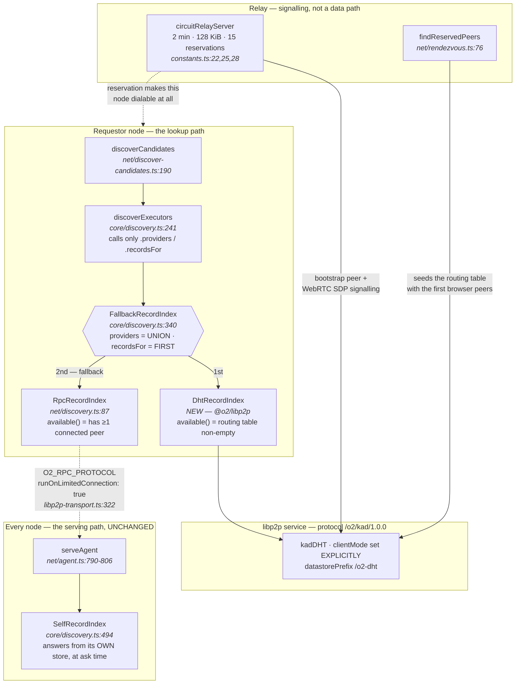

# DHT as the primary registration and discovery protocol

**Status:** design spec. No implementation. No file in the repository is modified by this document.
**Base:** `c94bc7a` (`docs(audit): G5 closed as a measured negative`), reached by fast-forward from
`main` (`4dd74fc`) in worktree `worktree-agent-a9eb34c91ea409301`. Every `file:line` below was read
at that commit.
**Requirement:** NET-06, SCHED-01. Closes the gap `packages/core/src/discovery.ts:338` records as
open.

> **AMENDED 2026-08-11, later the same day. Read this before the body.**
>
> The owner settled a capability model in conversation. **Two of its rulings land hard on this
> spec** — they reframe what the DHT is *for* (§5.5) and impose a hard bound on how a lookup may be
> keyed (§5.4) — and **one of them puts a whole subsection of §5.2 in question rather than merely
> correcting it.** §5.2, §5.3, §6.2, §9.1, §12 and §13 carry the corrections in place. Nothing is
> deleted; superseded text is struck and dated where it stands. **§16 is the ruling as it lands
> here**; the full statement is in `docs/superpowers/specs/2026-08-11-capability-registration-design.md`
> §9.
>
> **Citation base and two staleness facts.** Every `file:line` in §1–§15 was read at `c94bc7a` and
> is **left** there.
>
> 1. **Stale, not wrong.** Commit `32cba89` inserted ~260 lines into
>    `packages/core/src/discovery.ts` (at **two** sites) and ~90 into `packages/net/src/protocol.ts`,
>    so **every `core/discovery.ts` line number in this document is stale at `HEAD`.** Spot
>    corrections for the ones this spec leans on hardest, all read at `32cba89`: `RecordIndex`
>    `:141-146`→`:351-355` and its module doc `:134-140`→`:344-350`; `FallbackRecordIndex`
>    `:340-376`→`:596-632` with the first-non-empty `providers` at `:609-619`; `IndexSource`
>    `:310-314`→`:566-570`; the deferral docblock `:323-338`→`:572-595`, whose *"NET-06 stays open
>    and says so"* line — cited as `:338` in this document's own header — is `:594`; D1
>    `:428-442`→`:686-697`; the withholding invariant `:452-461`→`:710-717`; `SelfRecordIndex`
>    `:494`→`:750` with `providers` at `:767-776`; `discoverExecutors` `:241-300`→`:485-556` with
>    `:247`→`:492` and `:256`→`:501`; `ExclusionReason` `:165-187`→`:375-413`. The wire parser this
>    spec never cites also changed: `parseCapabilities` is `protocol.ts:759-773`.
> 2. **Wrong, and it was wrong when written.** §5.1 cites `packages/net/src/sovereign-egress.ts:151`
>    for `withholdingFrom`. **The export is at `:191`**, and that file was untouched by `32cba89`,
>    so this is not drift — it is a citation that never resolved. The parallel H3 spec cites `:191`
>    correctly. **Corrected in place at §5.1.** This repository treats a stale citation as a defect,
>    and finding one here is the reason this note enumerates rather than waves.
>
> **`ExclusionReason` gained a seventh arm** at `32cba89` — `critical-extension-not-understood`
> (`discovery.ts:383-398`) — which §8's poisoned-record row and §9.2's silent-exclusion claim both
> inherit for free, since both are claims about *every* rejection carrying a name.

---

## 0. The owner's direction, and what this spec turns it into

> "Relays' main purpose is to bootstrap DHT, do initial join to the mesh, get connected with a few
> peers that can relay queries over WebRTC and/or Websocket, etc. Once joined, DHT should be the
> major protocol for the registration and discovery, with relays as a fallback."

Restated as three claims this spec must make true:

1. A node's *primary* answer to "who holds this block" and "what is this node" comes from a
   Kademlia lookup, not from asking the peers it happens to be connected to.
2. The relay path (`RpcRecordIndex` over connected peers, plus `findReservedPeers`) remains, as a
   fallback, and remains *load-bearing during bootstrap* — it is how the routing table gets its
   first browser peers.
3. Neither change is visible to `discoverExecutors`.

Claim 3 is confirmed by reading, in §11.2. Claims 1 and 2 are a constructor argument plus **one
policy correction** — §4 — which is the only place the existing seam does not already do what this
design needs.

---

## 1. Problem

### 1.1 What discovery is today

Discovery is a union over **directly-connected peers** and nothing beyond them. Both halves say so
in their own source:

- `packages/net/src/discovery.ts:74-79` — *"No transitive routing and no DHT: the answer covers the
  peers this endpoint is currently connected to, and nothing beyond them… it is the honest limit of
  what a discovery answer covers."*
- `packages/net/src/discover-candidates.ts:38-44` — the same limit, inherited.

The peer set itself is discovered from the relay's reservation store:
`findReservedPeers` (`packages/net/src/rendezvous.ts:76`) asks each connected peer the
`reservations` question and builds `/p2p/<peer>/p2p-circuit/webrtc/p2p/<holder>` addresses
(`rendezvous.ts:97`). There is no DHT anywhere in the tree — `kadDHT` and `kad-dht` appear in no
`.ts` file under `packages/`, and no `@libp2p/kad-dht` entry exists in any `package.json`
(verified by grep at `c94bc7a`; this agrees with CLAUDE.md's "DHT reality check").

### 1.2 Why that ceiling matters

The reach of a lookup is the reach of the reservation store. `MAX_RESERVED_PEERS_PER_ANSWER = 64`
(`rendezvous.ts:45`) is sized against the largest reservation store any node here is configured for
(`SeedServer` at 64; `RELAY_MAX_RESERVATIONS = 15` is the libp2p default,
`packages/libp2p/src/constants.ts:28`). So the candidate set for a job is bounded by *how many tabs
happen to be reserved on relays this node is talking to* — not by how many nodes hold the data.
That bound is the thing a DHT removes.

### 1.3 The seam already exists

`RecordIndex` (`packages/core/src/discovery.ts:141-146`) is two methods:

```
providers(cid: CID): Promise<readonly PublicKeyHex[]>
recordsFor(nodeKey: PublicKeyHex): Promise<NodeRecords | undefined>
```

and its module doc (`discovery.ts:134-140`) states the intent verbatim: *"keeping them together is
what lets a single implementation be swapped for a DHT, a delegated HTTP router, or an in-memory
fixture without the discovery logic noticing."*

`FallbackRecordIndex` (`discovery.ts:340-376`) already takes ordered sources, skips those whose
`available()` is false (`:355`, `:367`), returns the first that answers, and records `lastSource`
(`:349-351`).

**So "DHT primary, relay fallback" is a constructor argument — for `recordsFor`. It is not, for
`providers`.** §4 is that correction, and it is the one architectural finding in this spec.

### 1.4 The class is currently unwired, deliberately, and this spec is the stated condition for
wiring it

`core/FallbackRecordIndex` and `core/MemoryRecordIndex` sit in `DEFERRED_IN_SOURCE`
(`packages/node/src/reachability-dispositions.ts:206-207`). The docblock they defer to
(`packages/core/src/discovery.ts:323-338`) says why:

> *"a fallback chain needs a genuine second source, and this repository does not have one yet… The
> candidate second source is a node's own store answering without a round trip. It is real work with
> a real test — the fallback must be *observed* to fire — and it is not scheduled here. Until it is,
> NET-06 stays open and says so."*

This spec supplies a genuine second source. Retiring those two register entries and that docblock is
therefore part of the work, not a follow-up (§11.4).

---

## 2. Architecture

### 2.1 Where the DHT plugs in — and where it does not

There are two independent places a `RecordIndex` appears, and only one of them changes.

| Side | Today | After |
|---|---|---|
| **Serving** — what this node tells a peer that asks | `SelfRecordIndex` handed to `serveAgent` as `AgentOptions.index` (`packages/net/src/agent.ts:149`; wired at `fabric-node.ts:2408` and `browser-node.ts:1664`) | **unchanged** |
| **Requesting** — how this node answers its own lookup | `new RpcRecordIndex(...)` constructed inside `discoverCandidates` (`packages/net/src/discover-candidates.ts:194`) | injected `FallbackRecordIndex([dht, rpc])` |

The serving side must not change, and the reason is owner ruling **D1**
(`packages/core/src/discovery.ts:428-442`): a node is authoritative about what it holds, computed at
ask time, so there is nothing to replicate in advance and nothing to go stale. `SelfRecordIndex`
stays exactly what it is.

### 2.2 Layering — why `DhtRecordIndex` cannot live in `@o2/net`

`packages/net/src/discover-candidates.ts:16-21` states the constraint:

> *"The derivation lives in `@o2/libp2p` as `peerIdForNodeKey`, and `@o2/net` does not depend on that
> package — it is the PORTABLE tier and must stay free of libp2p so it runs unchanged in a browser,
> in Node, and over the in-process transport."*

A DHT index must import libp2p. Therefore **`DhtRecordIndex` lives in `@o2/libp2p`** and implements
`RecordIndex` from `@o2/core`. The chain is composed at the tier factories (`fabric-node.ts`,
`browser-node.ts`) and at the one production `discoverCandidates` call site
(`packages/node/src/bin/bench.ts:1433`). `@o2/net` gains an option and no dependency.

### 2.3 Diagram



### 2.4 The narrow port — so the logic is testable without libp2p

`DhtRecordIndex` takes a port, not a `KadDHT`:

```
interface DhtLike {
  findProviders(cid: CID, opts): AsyncIterable<QueryEventLike>
  put(key: Uint8Array, value: Uint8Array, opts): AsyncIterable<unknown>
  get(key: Uint8Array, opts): AsyncIterable<QueryEventLike>
  routingTableSize(): number      // synchronous — see §4.3
  mode(): 'client' | 'server'
}
```

This is the same move `discover-candidates.ts` already makes with `peerIdFor`
(`discover-candidates.ts:110-116`) and for the same stated reason. It is what makes §10.2's T1 tier
possible at all.

---

## 3. Package selection with verified versions

All figures below from `npm view <pkg> …` run on **2026-08-11** from this worktree. Registry
metadata only — nothing was installed.

### 3.1 The package

| Field | Value | Source |
|---|---|---|
| `@libp2p/kad-dht` version | **`16.4.2`** | `npm view @libp2p/kad-dht version` |
| `time.modified` | `2026-08-10T20:36:43.367Z` | `npm view @libp2p/kad-dht time.modified` |
| `deprecated` | *(empty — not deprecated)* | `npm view @libp2p/kad-dht deprecated` |
| `peerDependencies` | *(none)* | `npm view @libp2p/kad-dht peerDependencies` |

**CLAUDE.md records `16.4.0`; the current version is `16.4.2`.** Pin `16.4.2` exactly, matching this
repo's convention of exact pins in every `packages/*/package.json`.

### 3.2 libp2p v3 alignment — the check that matters

This repo pins `@libp2p/interface: 3.2.5` and `libp2p: 3.3.6` (`packages/*/package.json`). A v2
module fails confusingly, so every dependency was checked:

| kad-dht dependency | Range | Resolves to | `@libp2p/interface` it depends on | v3? |
|---|---|---|---|:--:|
| `@libp2p/interface` | `^3.2.5` | 3.2.5 | — | ✅ |
| `@libp2p/interface-internal` | `^3.1.11` | 3.1.11 | `^3.2.5` | ✅ |
| `@libp2p/utils` | `^7.3.2` | 7.3.2 | `^3.2.5` | ✅ |
| `@libp2p/peer-collections` | `^7.0.26` | 7.0.26 | `^3.2.5` | ✅ |
| `@libp2p/record` | `^4.0.15` | 4.0.15 | *(no direct dep)* | ✅ n/a |
| `@libp2p/crypto` | `^5.1.22` | — | — | ✅ |
| `@libp2p/peer-id` | `^6.0.14` | — | — | ✅ |
| `@libp2p/ping` | `^3.1.11` | — | — | ✅ |
| `multiformats` | `^14.0.0` | 14.0.5 (repo `overrides`) | — | ✅ |
| `@multiformats/multiaddr` | `^13.0.3` | 13.0.3 (repo pin) | — | ✅ |
| `@multiformats/multiaddr-matcher` | `^3.0.2` | 3.0.2 | — | ✅ |
| `uint8arrays` | `^6.1.1` | 6.1.1 (repo `overrides`) | — | ✅ |
| `uint8arraylist` | `^3.0.2` | — | — | ✅ |
| `protons-runtime` | `^7.0.0` | — | — | ✅ |
| `interface-datastore` | `^10.0.1` | 10.0.1 | — | ✅ n/a |

**Verdict: `@libp2p/kad-dht@16.4.2` resolves cleanly onto libp2p v3 as this repo pins it.** The two
version traps CLAUDE.md names are both already closed here by the root `overrides` block
(`package.json`: `multiformats: 14.0.5`, `uint8arrays: 6.1.1`).

### 3.3 Three existing pins sit *below* kad-dht's floor — bump to dedup

| Package | Repo pins | kad-dht needs | Action |
|---|---|---|---|
| `@libp2p/ping` | `3.1.9` | `^3.1.11` | bump to `3.1.11` |
| `@libp2p/crypto` | `5.1.21` | `^5.1.22` | bump to `5.1.22` |
| `@libp2p/peer-id` | `6.0.12` | `^6.0.14` | bump to `6.0.14` |

These are **not** conflicts — npm will satisfy both by installing two copies. That is the problem:
CLAUDE.md's own `multiformats` note records what duplicate copies of an identity-bearing type cost
(`instanceof` / `CID` identity failures across package boundaries). `@libp2p/peer-id` is exactly such
a type. Bump all three so the tree dedups, and verify with `npm ls @libp2p/peer-id` after install.

### 3.4 New packages entering the browser bundle

`@libp2p/kad-dht`, `@libp2p/record`, `interface-datastore`, `@libp2p/peer-collections`,
`@multiformats/multiaddr-matcher`, and the `it-*` helpers. **Bundle-size impact is unmeasured and is
an open question (§12), not an assumption.** The gate is a measurement of
`packages/browser/vite.config.ts`'s output before and after, not a guess.

---

## 4. Configuration

### 4.1 Private keyspace

```
kadDHT({
  protocol:        '/o2/kad/1.0.0',
  datastorePrefix: '/o2-dht',
  logPrefix:       'o2:kad',
  metricsPrefix:   'o2_kad',
  clientMode:      <explicit — §4.2>,
  peerInfoMapper:  o2AddressMapper,   // §4.4
  validators:      { o2rec: validateNodeRecords },   // §5.2
  selectors:       { o2rec: selectNodeRecords },     // §5.2
  allowQueryWithZeroPeers: false,     // the default, chosen deliberately — §4.3
})
```

The upstream default protocol is `/ipfs/kad/1.0.0`
(source: `packages/kad-dht/src/index.ts`, js-libp2p `main`).

> **Provenance caveat on every upstream default quoted in §4 and §5.** These came from a *summarised*
> web fetch of `KadDHTInit`, and the same tool returned one verifiably wrong answer during this
> spec's preparation (§15). One documented default is already known to disagree with the
> implementation (`disjointPaths`, F3). **Re-read every number in §4 and §5 from the installed
> package before siting anything on it.** The verbatim-quoted findings F1–F3 are not affected — those
> were cross-checked against pinned source.

**All four prefixes, not just `protocol`.** The kad-dht README is explicit: *"When using multiple
DHTs, you should specify distinct datastore, metrics and log prefixes to ensure that data is kept
separate for each instance."* Setting `protocol` alone leaves `datastorePrefix` at `/dht` — so a
future second instance would share a datastore namespace with this one and the records would
interleave silently.

**Exactly one DHT instance. Do not add an Amino instance.** Helia's browser defaults keep
`kadDHT({clientMode:true})` against Amino as a secondary content router; this fabric does not want
that. The fabric's keyspace is `/o2/kad/1.0.0` and content routing for fabric CIDs is answered by
fabric peers.

**What breaks if the string collides with Amino** (i.e. if `protocol` were left at the default):

1. **Routing-table dilution — the worst of the four.** Amino peers advertise TCP/QUIC. They would
   enter o2 routing tables, and a browser cannot dial them at all. Each Kademlia hop would have a
   high probability of landing on an undialable contact, so an O(log N) lookup degrades toward a
   walk over dead entries. The lookup does not fail loudly; it gets slow and returns less.
2. **Record rejection in both directions.** o2 `PUT`s under the `o2rec` namespace would be offered
   to Amino peers whose validators do not know it and reject it, so records would not replicate.
   Amino records would arrive here and be rejected likewise.
3. **Provider answers from nodes that hold nothing.** Amino peers would answer `findProviders` for
   o2 CIDs — correctly, with nothing — but the query budget is spent.
4. **o2 becomes traffic on a public network.** The fabric's scheduling records would be offered to
   the public IPFS DHT, and CLAUDE.md's Disclosure constraint treats public exposure as a
   irreversible event for EPO/China patent rights.

Note what the private string is **not**: it is not a security control. It is in the source of a
publicly-served page. See §8.

### 4.2 Client vs server mode — set explicitly, on both tiers

**The rule, and it keys on an address state, never on what kind of node something is:**

| Condition | `clientMode` | Rationale |
|---|:--:|---|
| Node with ≥1 non-circuit listen address | `false` (server) | It can be dialled cold; it can answer. |
| Node listening only on `/p2p-circuit` (the `viaRelay` case) | `true` (client) | Same state a tab is in. |
| Browser tab | `true` (client) — **phase 1** | Pending the §4.5 measurement. |

The predicate for the first two rows **already exists and is already argued**:
`packages/node/src/fabric-node.ts:1703` computes
`const canRelay = listen.some((address) => !address.includes('/p2p-circuit'))`, with the reasoning at
`fabric-node.ts:1700-1703` — *"is not an address, it is a request for one, granted by somebody else
and revocable by them."* Reuse it; do not write a second copy.

This is consistent with NET-06 as `packages/core/src/discovery.ts:40-43` states it — *"ordered by
**availability at this moment**, never by what kind of node something is"* — because `canRelay` is a
state of the address set, not a tier. A browser whose listen set gained a non-circuit address would
be a server by the same rule.

**Never rely on automatic promotion, in either direction — and on this tier it is not merely
prudent, it prevents a concrete defect.** Upstream installs its promotion listener **only when
`init.clientMode == null`**, so setting the field to either `true` or `false` suppresses promotion
entirely (F2, §15). That matters here because the promotion predicate, read at the published
version's `gitHead`, would classify a browser's `/…/p2p-circuit/webrtc/p2p/SELF` address as *publicly
dialable* — `Circuit.exactMatch` rejects circuit addresses that carry a `/webrtc` component, and
`isPrivate` inspects the relay's leading IP rather than the browser's. A browser that left
`clientMode` unset would therefore promote itself to **server**, while by F1 being unable to answer a
single query over the relay that made it look public.

That is worse than either alternative: not a client, and not a real server, but a node advertising
service it cannot render, holding a routing-table slot in every peer it meets. Setting `clientMode`
explicitly on **both** tiers is what removes it. (§15 records the provenance and why this remains
upstream evidence rather than a measured fact about this tree.)

**Browser default is `clientMode: true` in phase 1, and this is a conservative choice rather than a
claim about capability.** CLAUDE.md's corrected position — that a browser node *can* serve records
within the fabric's own keyspace, because it is dialable over relay + WebRTC — is accepted here and
not re-litigated. The reason for client mode in phase 1 is a different and narrower one: a node
advertised as a DHT server that then fails to answer is *worse than absent*, because it occupies
routing-table slots in every peer that meets it and every lookup routed through it must time out
(`incomingMessageTimeout` 10 s upstream default) before proceeding. Promoting browsers to server
mode is therefore gated on §4.5's measurement showing they reliably answer, not on the argument that
they ought to be able to.

### 4.3 The DHT source's `available()` predicate

The brief's requirement — *a DHT that has not finished bootstrapping must not shadow the relay path*
— is enforced here. `available()` returns true iff **all** of:

1. `libp2p.status === 'started'`, and
2. **the routing table holds ≥ 1 peer**, and
3. at least one self-query has completed since start.

**(2) is the load-bearing one, and it is forced by an upstream default.**
`allowQueryWithZeroPeers` defaults to `false`, documented as *"After startup by default all queries
will be paused until there is at least one peer in the routing table."* **Paused, not failed.** A
`providers()` call against an empty routing table therefore *blocks* rather than returning `[]` — and
a blocking first source in a fallback chain is precisely the shadowing failure, in its worst form.
Keep `allowQueryWithZeroPeers: false` (an empty routing table must never masquerade as "nobody has
it") and gate on the routing-table size instead.

**`available()` must be synchronous and do no I/O.** It is called once per source per lookup
(`core/discovery.ts:355`, `:367`). The signature permits a promise
(`available(): boolean | Promise<boolean>`, `discovery.ts:313`) but a predicate that awaits a round
trip doubles the cost of every lookup. Hence `routingTableSize(): number` on the §2.4 port.

*Implementation check, not yet verified:* that kad-dht exposes routing-table size on its public
service interface at `16.4.2`. If it does not, the substitute is a counter maintained from the
`peer:connect`/`peer:disconnect` events on the DHT protocol — not a `getClosestPeers` probe, which
is I/O.

The RPC source's `available()` is `() => peers().length > 0`, mirroring the thunk
`RpcRecordIndex` already takes (`net/discovery.ts:91`).

### 4.4 `peerInfoMapper` — neither stock mapper is correct here

Upstream ships `removePublicAddressesMapper` (LAN) and `removePrivateAddressesMapper` (Amino).
**Both are wrong for this fabric.** The addresses that matter here are
`/p2p/<relay>/p2p-circuit/webrtc/p2p/<holder>` (the form `rendezvous.ts:97` builds) and
`/dns4/…/tls/ws`. `removePrivateAddressesMapper` would strip a LAN relay's address, breaking the
multi-machine demo; `removePublicAddressesMapper` would strip the public relay.

Specify a fabric mapper that **keeps** circuit, WebRTC, WSS and WebRTC-Direct addresses and drops
nothing else, since every address form this fabric uses is one a peer may legitimately need. Its one
job is to stop TCP/QUIC-only contacts — which no browser can dial — from consuming routing-table
slots. Whether to drop them outright or merely deprioritise them is **unmeasured**; phase 1 keeps
them (dropping them would partition Node-only peers from browser peers) and the question goes to
§12.

### 4.5 The promotion question — kept unmeasured, with the measurement specified

CLAUDE.md records, and this spec does **not** upgrade:

> *"js-libp2p promotes kad-dht to server mode when it detects a public dialable address. Whether a
> relayed `/p2p-circuit` address satisfies that check is **unmeasured** — the package is not
> installed, so it could not be read."*

The package is still not installed in this tree, and nothing here measures it. Upstream source read
over the web during this spec's preparation bears on it directly and is recorded in **§15 F2** as
evidence with its provenance, not as a fact about this repository. In summary: the predicate would
appear to classify a browser's relayed WebRTC address as publicly dialable, so an unset `clientMode`
would promote a browser to server mode. **That is the opposite of the intuitive expectation** — the
intuitive reading is that a `/p2p-circuit` address is excluded, and it is excluded only when nothing
follows it.

It does not gate the design either way, because §4.2 sets `clientMode` explicitly on every tier and
never consults promotion. What it changes is the *urgency* of running the measurement below: if the
evidence holds in a running process, then any future code path that omits `clientMode` — a new tier,
a test helper, an embedded host — reintroduces the defect silently.

**The measurement that would settle it** (T3 tier, §9):

1. Start a browser-tier node with `clientMode` **omitted** from the `kadDHT` init.
2. Let it complete a relay dial so it acquires a reservation and its `BROWSER_LISTEN` addresses
   (`packages/browser/src/browser-node.ts:474` — `['/p2p-circuit', '/webrtc']`).
3. Wait for `self:peer:update` to fire, then read the DHT service's `getMode()`.
4. Assert against a control arm: a Node-tier node with a real TCP listen address, same code path,
   whose `getMode()` must read `'server'`.
5. Record both readings, the multiaddr list each node held at the moment of reading, and the libp2p
   and kad-dht versions.

The comparative arm is what makes this a reading rather than an absolute (CLAUDE.md, Measurement):
it cancels timing, host and version.

*Note for whoever runs it:* CLAUDE.md cites `browser-node.ts:197` for the browser listen set. **That
citation is stale at `c94bc7a`** — the constant is defined at `browser-node.ts:474` and used at
`:1102`. The claim it supports (a browser listens on `/p2p-circuit` and `/webrtc`, and is therefore
dialable) is unchanged and correct.

---

## 5. Data flow

### 5.1 Register — provider records

**Only public/shared CIDs are provided into the DHT. Sovereign-eligible CIDs are never provided.**

This is a design decision with a stated cost, and it follows from two things already in the tree.

First, the withholding invariant (`packages/core/src/discovery.ts:452-461`):

> *"this index never advertises a block the `block` branch would refuse to serve"* — because an
> advertisement for a withheld block *"would convert **cannot tell** into **can tell**: a side channel
> around a refusal, obtained without ever asking for the bytes and without anything appearing on the
> refusing node's manifest."*

Second, and more sharply: **a DHT provider record is announce-on-write, which owner ruling D1
explicitly rejected** (`core/discovery.ts:434-442`). D1's three reasons, checked against kad-dht:

| D1's objection | Against kad-dht |
|---|---|
| "needs a new wire frame" | Not applicable — kad-dht has one. |
| "a node that evicts a block still reads as a provider until something retracts the announcement" | **Real and unfixable.** kad-dht has no retraction message. Records live until expiry: `ProvidersInit.provideValidity` 86 400 s (24 h) and `ReProvideInit.validity` 172 800 000 ms (48 h). |
| "lets an unverified peer grow another node's map without bound, which then needs a cap, and a cap that silently drops entries is the shape this project keeps removing" | **Real.** `ProvidersInit.cacheSize` defaults to 256 and is exactly such a cap. |

So a DHT provider index does not satisfy D1 and cannot be made to. The resolution is to **scope what
is provided** rather than to claim D1 is satisfied:

- A DHT provider record is a **hint**. It narrows a candidate set; it never authorises anything. The
  authoritative answer to "do you hold this" remains `SelfRecordIndex` answering at ask time, and the
  authoritative refusal remains `serveAgent`'s `block` branch. A stale provider record costs one
  failed fetch, not a wrong result.
- Because a stale record **cannot be retracted for up to 48 h**, a CID that could ever become
  sovereign must never enter the DHT. Sovereign data is owner-pinned to one node by construction, so
  global content routing buys it nothing — the cost of this exclusion is zero, and the leak it avoids
  is real (§8).

**The provide path therefore takes a supplier, not the blockstore:**

```
interface ProvidePolicy {
  cids(): AsyncIterable<CID>      // what to announce
  stillProvidable(cid: CID): Promise<boolean>   // re-asked on every reprovide
}
```

`stillProvidable` must consult **the same predicate** `SelfRecordIndex` is given — `@o2/net`'s
`withholdingFrom` (~~`packages/net/src/sovereign-egress.ts:151`~~ — **corrected 2026-08-11: the
export is at `:191`**, verified by reading; that file was untouched by `32cba89`, so `:151` never
resolved), which `core/discovery.ts:463-470`
(**`:719-726` at `32cba89`**)
names as *"that one construction"* and warns that any second spelling of the condition *"diverge[s]
the first time anything registers a payload under a label that is not its CID."* Do not write a
second predicate.

Taking `cids()` from a supplier is also what leaves room for the **H3 geographic-addressing spec** to
publish provider records for synthetic place-CIDs through this same path: it contributes a
`ProvidePolicy` and nothing here changes. That is the whole of the accommodation; H3 is not designed
here.

**Reprovide cadence:** upstream `ReProvideInit` defaults — `interval` 3 600 000 ms (1 h), `threshold`
86 400 000 ms (24 h before expiry), `validity` 172 800 000 ms (48 h) — are accepted for phase 1. They
are not tuned, because nothing has measured the churn they should be tuned against (§12).

### 5.2 Register — `NodeRecords`

> **PUT IN QUESTION 2026-08-11 by owner decision 2 (§16.2) — read this before implementing any of
> §5.2. It is not struck, because it is not yet decided; it is flagged, because the decision that
> lands on it is the largest single change the ruling makes to this spec.**
>
> The ruling is that **records arrive WITH the peer**: a peer presents the record it signed, on the
> connection already open to it, and discovery filters locally on what it was handed. **There is no
> per-candidate `recordsFor` round trip.** Read against §5.2, that says the `/o2rec/<nodeKey>` value
> record is answering a question that no longer gets asked over the network.
>
> **What specifically becomes questionable, and it is not a detail — it is most of the subsection:**
>
> - **The selector.** §5.2 argues, correctly, that *"two records with an identical `issuedAt` are
>   producible … and a selector that returned 'either' would make the DHT's answer depend on arrival
>   order."* **That whole problem exists only because the DHT holds a second copy.** A record taken
>   from the peer that signed it has no second copy and no tie to break. The selector is machinery
>   for a hazard the ruling removes.
> - **The republish cadence, the `/3` rule, its floor and its cap.** All of it exists to keep a
>   *remote* copy fresh. A presented record is as fresh as the connection.
> - **The validator's continued usefulness is the strongest remaining argument for §5.2**, and it is
>   a real one: a storing node that will not hold garbage is worth having whatever else is true. But
>   note what §5.2 itself says the validator is — *"a garbage filter, not a trust decision"* — and a
>   garbage filter for records nobody fetches is a cost with no reader.
>
> **What is NOT in question: `providers`.** §5.1's provider records are exactly the *existence*
> half, and the ruling keeps them (§5.5). The split the ruling draws runs straight between §5.1 and
> §5.2, which is why this flag is on the second and not the first.
>
> **This is recorded as a question and not as a strike for one reason.** A record presented by a
> peer requires *being connected to that peer*. §5.5 explains why that is compatible with a DHT that
> returns existence — you dial what the lookup named — but it does change the cost model, and
> nothing here has measured it. **It is added to §12.4 as an owner decision (item 5), because
> deleting §5.2 and keeping §5.2 are both defensible and this spec is not entitled to choose.**

**Key:** `/o2rec/<nodeKey>` where `<nodeKey>` is the lowercase 64-char hex the repo already
canonicalises (`packages/libp2p/src/identity.ts:147` — `parseKeyHex`, and see `:134-142` on why
lowercase is a namespace rule).

**Value:** the canonical encoding of `NodeRecords` (`core/discovery.ts:129-132` — `{ certificate,
capabilities }`), via `encodeCanonical` (`core/src/canonical/encode.ts`). Canonical encoding is
required, not cosmetic: two nodes must produce byte-identical values for the same record or the
selector cannot break ties deterministically.

**Validator** (`validators: { o2rec: … }`) — runs on every node that stores or forwards the record:

1. The key's `<nodeKey>` parses under `parseKeyHex`.
2. `certificate.nodeKey === capabilities.nodeKey === <nodeKey from the key>`. This is the same
   binding `discoverExecutors` enforces as `certificate-mismatch` (`core/discovery.ts:272-275`).
3. `verifyCapabilityRecord(capabilities, now)` (`core/discovery.ts:116`) — self-signature and
   `issuedAt`/`expiresAt` window.
4. The certificate's signature verifies **structurally**.

**The validator deliberately does NOT check issuer trust.** `verifyCertificate` takes
`trustedIssuers` (`core/discovery.ts:264`), and a storing node's pinned issuers are not the
requestor's. A validator that enforced its own pin set would silently drop records that are perfectly
valid for someone else. Storing-node validation is a garbage filter, not a trust decision, and it
must not pretend otherwise — the trust decision happens once, at `discoverExecutors`, against the
requestor's own pins.

**Selector** (`selectors: { o2rec: … }`) — Kademlia requires determinism or nodes disagree about
which of two records is current:

1. Discard any that fail the validator.
2. Prefer the greatest `capabilities.issuedAt`.
3. Break exact ties by lexicographic comparison of the canonical bytes.

Step 3 is not decoration: two records with an identical `issuedAt` are producible (a node re-signing
within the same millisecond), and a selector that returned "either" would make the DHT's answer
depend on arrival order.

**Republish interval:** `min(capability lifetime, certificate lifetime) / 3`, floored at 1 h, capped
at 6 h — plus an immediate republish on any change (new certificate, re-signed capability record,
changed `sovereignFor`). The `/3` is so that two consecutive failed republishes still leave a live
record. The floor and cap are **stated defaults, not measured optima** (§12).

**Record TTL** is carried by the record's own `expiresAt` (`core/discovery.ts:84`), not by a DHT
setting — `KadDHTInit` exposes no TTL for value records. This is the right place for it: the record
expires because the *capability claim* expires, and `discoverExecutors` re-checks the same field at
`:277` regardless of what any DHT believed.

### 5.3 Lookup

```mermaid
sequenceDiagram
  participant R as Requestor
  participant F as FallbackRecordIndex
  participant D as DhtRecordIndex
  participant P as RpcRecordIndex
  participant K as kad /o2/kad/1.0.0

  R->>F: providers(inputCid)
  Note over F: UNION, not first-non-empty — §4/§6
  F->>D: available()?
  alt routing table non-empty
    F->>D: providers(cid)
    D->>K: findProviders(cid)
    K-->>D: PROVIDER events (PeerIds)
    Note over D: nodeKeyForPeerId — identity.ts:177<br/>offline, no network call
    D-->>F: [nodeKey…]
  else bootstrapping — must NOT shadow
    Note over F: skipped; no query issued
  end
  F->>P: providers(cid) (always, for the union)
  P-->>F: [nodeKey…]
  F-->>R: sorted union
  R->>F: recordsFor(nodeKey)
  Note over F: FIRST non-undefined — a signed record<br/>is whole in one copy
  F->>D: get(/o2rec/<nodeKey>)
  D-->>F: NodeRecords | undefined
  Note over R: discoverExecutors re-verifies EVERYTHING<br/>against pinned issuers — core/discovery.ts:264-294
```

**The PeerId ↔ nodeKey bridge is offline in both directions and already exists.** DHT provider
records name PeerIds; `RecordIndex.providers` returns `PublicKeyHex`. `nodeKeyForPeerId`
(`packages/libp2p/src/identity.ts:177`) converts, and its docblock states the constraint: *"An
Ed25519 peer id carries its public key in an identity multihash, so this needs no network call. A
peer id of any other key type is refused rather than answered for."* A non-Ed25519 provider is
therefore dropped from the answer — correctly, since no certificate could ever name it.

`peerIdForNodeKey` (`identity.ts:159`) is the inverse and is already the production mapping
`discoverCandidates` uses (`bin/bench.ts:1443`).

> **Amended 2026-08-11 (§16.2).** The `recordsFor` leg of this diagram — *"`F->>D: get(/o2rec/…)`"*
> — is the leg §5.2's flag is about. The `providers` leg is untouched and is the whole of what §5.5
> keeps. Note that the diagram's own closing annotation is what survives all of this intact:
> **`discoverExecutors` re-verifies everything against pinned issuers**, so where a record came from
> was never load-bearing, which is precisely the ruling's argument for taking it from the peer.

### 5.4 Anchors and filters — the truncation bound, and why a class may never key a lookup

*Added 2026-08-11. Owner decision 3 (§16.3). This is the hardest constraint in the ruling and it is
arithmetic, not preference.*

**The rule: one selective anchor, then local filters.** A lookup is keyed on exactly one CID. Every
other capability dimension is applied as a filter over what that lookup returned, against the record
the peer presented (§16.2). Two anchors are never intersected.

**Why, stated as the failure it prevents.** A Kademlia provider lookup is **truncated by
construction**, and this spec has already cited both caps in other contexts:

| Cap | Value | Where this spec already cites it |
|---|---|---|
| `ProvidersInit.cacheSize` | **256** | §5.1's D1 table — quoted there as *"exactly such a cap"*, against D1's objection that *"a cap that silently drops entries is the shape this project keeps removing"* |
| `kBucketSize` | **20** (upstream default) | §8.1 item 3, where raising it is discussed and deliberately not sized |

**Intersecting two truncated samples of large sets returns approximately nothing.** Worked example,
with the assumptions stated so the number can be argued with rather than inherited: 10 000 nodes in
a cell; 9 900 of them also advertise a common capability class; both anchors drawn from a keyspace
population of order 1e6; each lookup capped at 256. Two independent 256-sized samples of a ~1e6
population have an expected overlap of about `256 × 256 / 1e6` ≈ **0.07 nodes** — while **9 900
actually qualify**.

**And it fails silently.** The result is empty, and empty is indistinguishable from *"nobody
matches"*. That is the exact failure `core/discovery.ts:25-30` was written against — *"silent
filtering is how a requestor ends up staring at an empty candidate list with no idea whether the
network is down, its clock is wrong, or the module needs a feature nobody has."* A capped
intersection is worse than silent filtering, because the code performing it looks correct.

**Consequences, in order of how easily each is got wrong:**

1. **`'parallel-compute'` — the least selective key in the system — must never be an anchor.** A
   class is a filter. This is §16.3 and it is not negotiable on tuning grounds: raising `cacheSize`
   moves the number without changing the shape.
2. **A COMPOSITE anchor is fine and is the sanctioned way to get selectivity back.** `app:X + cell`
   is **one** CID over **one** lookup — not an intersection of two — so no truncation compounds. The
   H3 spec's §14.3 records the trap that comes with it: a composite must be its own record kind with
   its own reserved key, never a place record with an extra field, or the geographic index silently
   repartitions.
3. **This is the same family of defect as §6.2's, and the two must be read together.** §6.2 is about
   an answer being **shadowed** — one source's non-empty result discarding another's. §5.4 is about
   an answer being **truncated** — a single source returning a capped sample that reads as a set.
   **A truncated union is the failure mode both sections are about**, and neither fix covers the
   other: unioning two capped sources yields a wider sample that is still a sample. §6.2's
   `lastProviderSources` addition is the beginning of the answer, because it makes *which* sources
   contributed legible; §16.4's `onTruncated` is the rest of it, because it makes *whether the cap
   was reached* legible. **Implement them together or neither reports the truth.**

### 5.5 What the DHT is FOR — existence discovery, and nothing beyond it

*Added 2026-08-11. Owner decision 9 (§16.9).*

**The DHT tells you a peer EXISTS. The facts come from the peer.**

This is a reframing rather than a change of mechanism, and it settles several things this spec left
uncomfortable:

- **§5.1's central concession stops being a concession.** §5.1 establishes that a DHT provider
  record *"does not satisfy D1 and cannot be made to"*, because kad-dht has **no retraction message**
  and records live to expiry — `provideValidity` 86 400 s, `ReProvideInit.validity` 172 800 000 ms
  (48 h). §5.1's resolution was to call the record *"a hint"* and scope what is provided. **The
  ruling generalizes that resolution into the DHT's whole job description.** A hint is all it was
  ever going to be; naming it that everywhere removes the temptation to lean on it.
- **The 48 h staleness is much less damaging than §5.1 had to allow.** A stale provider record costs
  **one wasted dial**, because the peer's *live* answer overrides it — `SelfRecordIndex` computes
  `has(cid)` plus `withhold` at ask time (`core/discovery.ts:767-776` at `32cba89`), which is D1's
  own construction. §5.1 already says this (*"a stale provider record costs one failed fetch, not a
  wrong result"*); the ruling promotes it from a mitigation to the design's premise.
- **It does not weaken §5.1's sovereign exclusion, and must not be read as licence to.** *"A CID
  that could ever become sovereign must never enter the DHT"* stands unchanged. The reason is
  disclosure, not correctness (§9.1's provider-record-staleness row), and existence-only framing
  does nothing about disclosure: **the existence of a provider record is itself the leak.**
- **It is the reason §5.2 is now in question** rather than merely adjusted — see the flag there. If
  the DHT's job is existence, a signed `NodeRecords` value record is the DHT doing a second job that
  the peer does better.

---

## 6. Wiring into `FallbackRecordIndex` — and the one correction

### 6.1 Source ordering

```
new FallbackRecordIndex([
  { name: 'dht', index: dhtRecordIndex, available: () => dhtReady() },   // §4.3
  { name: 'rpc', index: rpcRecordIndex, available: () => peers().length > 0 },
])
```

DHT first, relay/RPC second — the owner's direction, verbatim.

`SelfRecordIndex` is **not** in the requestor chain, and that is deliberate. It belongs on the
serving side (`AgentOptions.index`). Putting it first in a requestor chain under first-non-empty
semantics would be actively harmful: a requestor that happens to hold the input block would get a
candidate set of exactly itself and never ask anyone else.

### 6.2 `providers` must union. This is the correction.

**`FallbackRecordIndex.providers` returns the first source with a non-empty result**
(`core/discovery.ts:353-363`). **That is wrong for this design**, and the argument is not new — it is
the argument `RpcRecordIndex` already had and already won, at `packages/net/src/discovery.ts:38-53`:

> *"A **provider list** is a *set*, and under D1 each node answers `providers` only about its own
> store. So the first non-empty answer is exactly **one** element, and every other provider of that
> block is invisible to the requestor — however many peers hold it. Power-of-d sampling over one
> candidate is not sampling. It unions."*

The DHT source and the RPC source are **two views of the same provider set**, and they will disagree
routinely: the DHT knows peers this node has never connected to, and the RPC path knows peers that
joined since the last reprovide and are not yet in anyone's provider record. First-non-empty silently
discards whichever view answers second. Under DHT-primary ordering that means **the relay path's
answers are discarded whenever the DHT returns anything at all** — which would make "relay as
fallback" mean "relay is dead code unless the DHT is empty", the opposite of the owner's direction.

`recordsFor` **stays first-non-empty**, for the reason the same docblock gives
(`net/discovery.ts:43-47`): a record is a signed document, one copy of it is the whole of it, every
field is covered by a signature `discoverExecutors` verifies, so a second copy could only agree or be
discarded.

**Recommended change** — an explicit per-half policy on the constructor:

```
new FallbackRecordIndex(sources, { providers: 'union' })   // default stays 'first-non-empty'
```

*Why an option rather than changing the behaviour outright:* the asymmetry is the interesting fact
and an option makes it legible at every call site, mirroring how `RpcRecordIndex` documents its own
two halves as *"not two spellings of one policy"* (`net/discovery.ts:20-23`). *The alternative* —
changing `providers` to union unconditionally — is defensible, costs less API, and breaks only tests
(`core/src/discovery.test.ts:288-372`), since the class has no production caller
(`reachability-dispositions.ts:206`). Either is acceptable; the option is recommended because it does
not require re-litigating those tests' intent.

With a union, `lastSource` is ill-defined for `providers`. Add
`lastProviderSources: readonly string[]` and leave `lastSource` meaning what it means today for
`recordsFor`.

> **Cross-reference added 2026-08-11 — §5.4 is the other half of this, and neither is sufficient
> alone.** This section fixes an answer being **shadowed**: one source's non-empty result discarding
> another's. §5.4 (owner decision 3) is about an answer being **truncated**: a single Kademlia
> lookup capped at `ProvidersInit.cacheSize` = 256 returning a *sample* that reads as a *set*.
> **A truncated union is the failure mode both sections are about.** Unioning two capped sources
> gives a wider sample and still a sample, so this correction does not close §5.4's hole and §5.4's
> `onTruncated` field does not close this one. `lastProviderSources` makes *which sources
> contributed* legible; §16.4's `onTruncated` makes *whether the cap was reached* legible. **They
> land together or the result reports neither honestly.**
>
> This note also has a bearing on `recordsFor` staying first-non-empty. That policy rests on *"a
> record is a signed document, one copy of it is the whole of it"* — which is exactly the argument
> owner decision 2 (§16.2) pushes one step further: if one copy is the whole of it, the copy may as
> well come from the signer. See §5.2's flag.

### 6.3 What the union costs, stated rather than left to be discovered

Unioning pays the **slowest** available source, not the fastest. `RpcRecordIndex` already made and
measured this trade (`net/discovery.ts:55-67`) and this chain inherits it, with a DHT lookup — plural
network round trips, and per CLAUDE.md ~1.04 s per *cold* WebRTC hop — now potentially the slow leg.
The mitigation is the availability gate (§4.3), which skips the DHT entirely when it has nothing to
offer, and connection reuse. **No timeout is specified for the DHT leg**, on exactly the grounds
`net/discovery.ts:68-72` refuses one for the RPC leg: *"What would change this is a measurement, and
there is not one."*

---

## 7. Bootstrap sequence

### 7.1 A browser tab: relay → joined → DHT-participating

| # | Step | Where it already exists |
|---|---|---|
| 1 | Tab starts, opens IndexedDB, derives its identity from a persisted seed | `browser-node.ts:1069-1098` |
| 2 | `createLibp2p` with `listen: ['/p2p-circuit', '/webrtc']` | `browser-node.ts:474`, `:1102` |
| 3 | **Dial each relay in `options.relayAddrs`.** Failure propagates and the node does not start — a tab with no reservation cannot be reached by anyone | `browser-node.ts:1141-1145`, reasoning at `:1126-1140` |
| 4 | Reservation granted → the tab is dialable | Circuit Relay v2 |
| 5 | **The relay is the DHT's first routing-table entry.** It is a full DHT server (§4.2) | *new* |
| 6 | `findReservedPeers` returns `/p2p/<relay>/p2p-circuit/webrtc/p2p/<holder>` for other tabs | `net/rendezvous.ts:76`, `:97` |
| 7 | Dial those peers; WebRTC upgrades; they enter the routing table as **non-limited** connections | existing + *new* |
| 8 | Self-query populates the keyspace neighbourhood (`initialQuerySelfInterval` 1 000 ms upstream) | *new* |
| 9 | `dhtReady()` flips true → the DHT becomes the primary source | §4.3 |

**Step 6 is why the rendezvous is retained and is not legacy.** A DHT bootstrapped from the relay
alone has exactly one routing-table entry, so every lookup funnels through one peer — which is a
star topology wearing a Kademlia hat. `findReservedPeers` is what gives the routing table its first
*browser* peers, and it is the only mechanism that can, because no tab can be dialled cold
(`rendezvous.ts:1-8`).

### 7.2 What the relay is still needed for, afterwards

1. **WebRTC signalling, forever.** Browser↔browser is WebRTC and only WebRTC, and every new SDP
   handshake needs a relay leg. The DHT says *which* peer to reach; the relay is *how* you reach it.
   This never goes away and is the sense in which the relay is a signalling channel and not a data
   path.
2. **The tab's own reachability.** The reservation is what makes it dialable at all;
   `RELAY_MAX_RESERVATION_TTL_MS` is 7 200 000 ms / 2 h (`packages/libp2p/src/constants.ts:68`).
3. **The fallback index** — `RpcRecordIndex` over connected peers.
4. **Re-bootstrap after a reload**, when DHT state is gone (§8.1).

### 7.3 The measured relay constraints, and what this design does about each

| Constraint | Value | Source | Consequence here |
|---|---|---|---|
| Duration limit | 120 000 ms | `constants.ts:22` | A relayed connection dies after 2 min. DHT traffic must not depend on it — see below. |
| Data limit | 131 072 B (128 KiB) | `constants.ts:25` | A lookup that stayed on `/p2p-circuit` would exhaust the budget. |
| Max reservations | 15 (libp2p default) | `constants.ts:28` | Bounds tabs per relay, hence step 6's yield. |
| Protocols need `runOnLimitedConnection: true` to negotiate over a relayed connection | — | CLAUDE.md; the repo's own RPC sets it at `libp2p-transport.ts:322` and `:341` | **The open risk — §12.1.** |

**The design consequence: DHT query traffic must ride upgraded WebRTC connections, not the relayed
leg.** Concretely, a browser peer discovered at step 6 should be dialled to WebRTC *before* being
relied on as a routing-table contact, so the 2 min / 128 KiB budget is spent on signalling and not on
queries. Once WebRTC is established the relay drops out and the connection is not limited — which is
also why the `runOnLimitedConnection` question (§12.1) bounds the *relayed* window rather than
browser DHT participation as such.

---

## 8. Failure modes and fallback behaviour

| Failure | Detected by | Behaviour |
|---|---|---|
| DHT not bootstrapped (empty routing table) | `available()` — §4.3 | Source skipped; **no query issued**; relay path answers alone. Nothing hangs. |
| DHT bootstrapped, knows nothing about this CID | Empty result | Union already includes the relay path's answer — no shadowing. |
| DHT slow / partitioned | — | Pays the slowest leg (§6.3). **Unbounded in phase 1, deliberately** — no measurement exists to site a timeout against. |
| Relay unreachable at start (browser) | Dial rejects | `start` rejects, blockstore closes, libp2p stops — unchanged (`browser-node.ts:1126-1140`). |
| Relay unreachable at start (Node) | Dial rejects | Recorded on `FabricNode.relayFailures`, node keeps running — unchanged, NET-05. |
| No connected peers **and** empty routing table | Both `available()` false | `providers` → `[]`, `recordsFor` → `undefined`. `discoverExecutors` reports `providers: 0` and an empty `excluded` — an honest "the network told us nothing", distinguishable from "everyone was excluded". |
| Stale provider record (node evicted the block) | Fetch fails at dispatch | One wasted fetch. **Not retractable for up to 48 h** (§5.1). |
| Record poisoned in the DHT | `discoverExecutors` | Excluded by name — `invalid-certificate`, `invalid-capability-record` or `certificate-mismatch` (`core/discovery.ts:165-187`). |
| IndexedDB evicted mid-session (browser) | — | §8.1. |

### 8.1 Browser durability

**Recommendation: the browser DHT datastore stays in memory for phase 1.**

Both tier factories today pass **no** `datastore` to `createLibp2p` (`browser-node.ts:1100-1116`,
`fabric-node.ts:1746-1798`), so libp2p uses its in-memory default and there is nothing to evict. Keep
it that way in the browser, and the reason is not inertia:

- An **empty** routing table is *detectable* — `available()` returns false and the relay path answers.
- A **silently truncated** one is not. The node believes it has a keyspace view it does not have,
  `available()` returns true, and lookups return confidently incomplete answers. CLAUDE.md names
  silent IndexedDB eviction as a real weakness; persisting DHT state converts a detectable failure
  into an undetectable one.

Cost of memory-only: a reload re-bootstraps from the relay and re-runs one self-query. Given
`initialQuerySelfInterval` of 1 000 ms that is cheap, and step 3 of §7.1 already requires a relay dial
on every start regardless.

*If persistence is later wanted*, the conditions are: use `datastore-idb@5.0.1`, call
`navigator.storage.persist()`, and treat a **failed or absent** grant as "this node's DHT state is
ephemeral" — recorded and acted on, never assumed. A partially-evicted store must be detectable, or
it must not be used.

**Tab churn vs routing-table stability.** Kademlia assumes moderate contact stability; tabs do not
provide it. Three responses, in order of confidence:

1. **A hosted, always-reachable slice is needed — yes.** Seed/relay nodes run `clientMode: false`
   with a persistent `datastore-level@13.0.1`, so every fabric record has at least one durable
   holder. **This is not a tier and must not become one**: it is the same address-state predicate
   (`canRelay`, `fabric-node.ts:1703`) that already governs relay capability, and a browser that
   acquired a non-circuit listen address would qualify by the same rule. A browser-only fabric still
   functions; its records simply live only as long as the tabs holding them.
2. **Republish faster than holders churn** — the `/3` rule in §5.2.
3. **Raise `kBucketSize` above the upstream default of 20** so each bucket holds more replacement
   candidates. **Do not pick a number here.** It is unmeasured, it trades memory and ping traffic
   against churn tolerance, and §10.2's T3 tier is where the churn rate to size it against would come
   from.

---

## 9. Security non-claims

Stated plainly, because this repository treats an overclaim as a defect.

### 9.1 What this does NOT resist

- **Sybil.** Anyone can mint an Ed25519 key and join the DHT. kad-dht applies no admission control to
  its own protocol. The relay admission gate (`packages/libp2p/src/relay-admission.ts`, wired at
  `fabric-node.ts:1734-1751`) governs **reservations**, not DHT participation — a peer that dials in
  by any other route participates ungated.
- **Eclipse.** This spec builds nothing toward eclipse resistance. An adversary who can place enough
  peers around a target key controls every lookup for that key.

  **A correction to CLAUDE.md's premise, which does not rescue the claim.** CLAUDE.md states that
  S/Kademlia's disjoint-path lookups *"are not implemented in js-libp2p"*. Upstream source at the
  published version's `gitHead` indicates otherwise — starting peers are partitioned round-robin
  across `disjointPaths` paths and a **shared** visited-set enforces that no peer is queried on two
  of them, which is S/Kademlia §4.4's own construction (F3, §15). So lookup diversity is better
  than that note implies.

  **It buys no eclipse resistance this fabric may rely on**, for three reasons: node IDs are free to
  mint, so S/Kademlia's crypto-puzzle ID generation and sibling broadcast — the parts that actually
  cost an attacker something — are absent; the visited-set is a probabilistic filter sized at 1024
  entries, so false positives can drop a path's legitimate peer; and paths merge concurrently, so the
  partition is a scheduling artifact rather than a guarantee. CLAUDE.md's **conclusion** — sybil and
  eclipse resistance are **build, not configure** — stands unchanged, and this spec does not build
  them.
- **Routing-table poisoning.** kad-dht adds peers that speak the protocol. The private protocol string
  narrows who that is — but the string is compiled into a publicly-served page, so it is **obscurity,
  not a control**. §4.1's argument for the private string is about pollution and correctness, and
  none of it is a security argument.
- **Censorship / selective withholding.** A node closest to a key can simply not return it. The
  fallback to the relay path bounds the damage; **nothing detects the attack**, and no alarm fires.
- **Provider-record staleness as a disclosure channel.** A provider record cannot be retracted and
  lives up to 48 h (§5.1). §5.1's rule — never provide sovereign-eligible CIDs — is what keeps this
  out of the sovereignty claim; it is a scoping decision, not a mitigation, and if that rule is ever
  relaxed the leak returns in full.
- **Traffic analysis.** A DHT lookup tells every peer on the path which CID this node is looking for.
  The relay path told only directly-connected peers. **DHT-primary discovery is strictly more
  exposure than what it replaces**, and this spec does not claim otherwise.

  > **Softened, not removed, 2026-08-11 by owner decision 6 (§16.6) — and the distinction is the
  > whole of the note.** An `appIds` anchor is `cidOf(appId)`, so **the lookup key is opaque to
  > anyone who does not already know the app id.** A peer on the path sees a CID and learns nothing
  > from it unless it holds the pre-image. Plaintext ids appear only in a record handed to a peer
  > that is **already connected** (§16.2), which is the population that could observe the traffic
  > anyway. **The anchor is hashed for free**, since it has to be a CID regardless.
  >
  > **Three reasons this does not retire the row.** (a) A **correlation** channel survives
  > untouched: the same opaque CID looked up repeatedly still identifies a requestor's interest as
  > *one* interest, and joins across time and peers. (b) The pre-image space may be **small enough
  > to enumerate** — for a geographic anchor it certainly is, `c(r) = 2 + 120·7^r`, and the H3 spec's
  > Q5 records exactly this; **the softening applies to app ids and must not be generalized to
  > cells.** (c) The **path** itself — who asks whom — is unchanged, and §9.1's sentence above is
  > about the path as much as the key.
  >
  > So: **strictly more exposure than the relay path, by a smaller margin than the unhashed case,
  > for one of the two anchor kinds.** That is the whole claim.

### 9.2 What it DOES resist — and this is the whole of the claim

- **Forged `NodeRecords`.** Every record is signed, and `discoverExecutors` verifies it against
  **pinned** issuers, offline, at `core/discovery.ts:264-294`. A fully poisoned DHT can make discovery
  return *fewer*, *slower*, or *wrong-but-excluded* answers. It cannot make discovery return an
  **unenrolled** node.
- **Wrong-key pairing** — an attacker pairing a real node's certificate with capability claims of its
  own is refused as `certificate-mismatch` (`core/discovery.ts:272-275`).
- **Silent exclusion.** Every rejected provider arrives with a named reason
  (`core/discovery.ts:165-193`), so a poisoned lookup is *legible* even though it is not preventable.

**Explicitly not claimed:** that DHT-primary discovery is *safer* than relay discovery. It is
*wider*. It moves the question from "peers I am connected to" to "peers a keyspace walk led me to",
which is more exposure and more attack surface. Offline signature verification against pinned issuers
is what makes that acceptable, and it is the only thing that does.

---

## 10. Testing strategy

### 10.1 A correction to the brief's premise, found by reading

The brief asks for `@libp2p/memory` per repo convention. **`@libp2p/memory` is not installed** — it
appears in no `package.json` and no `.ts` file under `packages/` (grep at `c94bc7a`). The repo's
in-process transport is its **own** `MemoryNetwork` (`packages/core/src/transport/memory.ts:35`),
used at e.g. `packages/net/src/admission.test.ts:107` and `packages/bench/src/perf-workload.ts:178`.

That distinction is load-bearing: `MemoryNetwork` sits at the **RPC** seam, *above* libp2p. A kad-dht
is a libp2p **service**, *below* it. **`MemoryNetwork` therefore cannot exercise a real DHT at all.**
Adding `@libp2p/memory@2.0.24` is a real new dependency and a real decision, not an application of
existing convention.

### 10.2 Three tiers

**T1 — `RecordIndex` contract, no libp2p.** `DhtRecordIndex` is built over the §2.4 port, so union
semantics, ordering, and the availability gate are tested against a fake plus `MemoryRecordIndex`
fixtures (`core/discovery.ts:379`). Fast, deterministic, and where the §10.3 proofs live. **This tier
alone retires `core/MemoryRecordIndex` from the deferral register**, since it is a genuine second
source in a real chain.

**T2 — real kad-dht, N nodes, one Node process.** Needs a real libp2p transport. Add
`@libp2p/memory@2.0.24` as a devDependency (per §10.1, a decision to take explicitly). This is where
keyspace behaviour — lookup hop counts, record propagation, selector determinism under concurrent
writes — is measurable at 50–100 nodes with no sockets and no ports. **It cannot exercise the relayed
path**, so it measures keyspace behaviour and not connectivity cost.

**T3 — Playwright browser contexts.** `browser.newContext()` × N, real relay, real WebRTC. The only
tier that measures the connectivity tax, and the only one that can settle §12.1 and §4.5. Per
CLAUDE.md's benchmarking section both the T2 and T3 curves are needed and the gap between them is
itself a publishable number.

Run by project, never by bare path: `npx vitest run --project node|browser|e2e|perf`. Read `EXIT=$?`
on the line immediately after the command, with no pipe and no trailing `tail`.

### 10.3 Red-first proofs for the fallback ordering

Fixture: two sources whose provider answers are **disjoint and both non-empty** —
`dht → [keyA]`, `rpc → [keyB]`. Disjointness is the whole design of the fixture: with overlapping
answers, a union and a first-non-empty are indistinguishable and the test proves nothing.

| # | Claim | Plant | Expected red |
|---|---|---|---|
| **P1** | DHT is consulted first for `recordsFor` | Reverse the constructor array | `lastSource` reads `'rpc'` |
| **P2** | `providers` unions across sources | Revert `providers` to first-non-empty | Returns `[keyA]`, not `[keyA, keyB]` |
| **P3** | A bootstrapping DHT does not shadow the relay | Make `available()` return `true` unconditionally with an empty routing table | Lookup returns empty or blocks; `lastSource` is not `'rpc'` |
| **P4** | Withheld CIDs never reach the DHT | Make `stillProvidable` return `true` unconditionally | The withheld CID appears in the provide set |

**P2 is the one that catches the real defect** — it is the same defect `RpcRecordIndex` already fixed
once, for the same reason (`net/discovery.ts:38-53`), and without it the relay path is dead code
under DHT-primary ordering (§6.2).

Per CLAUDE.md's Proofs section: plant, **watch it go red**, record the observed failure text, then
restore **by the surgical inverse of your own edit** — never by `cp` — and verify with `cmp` against a
snapshot taken immediately before planting. A hunk count is a one-way alarm and is not the check. If
a plant leaves the file green, say so and name which case actually carries the claim.

Because these plants touch shared source, **do not run planting agents in parallel on these files**.

### 10.4 Also to be tested

- Selector determinism: two records, identical `issuedAt`, asserted to resolve identically on two
  independent nodes (T2).
- Validator rejects each of the four failure classes in §5.2 by name.
- `nodeKeyForPeerId` drops a non-Ed25519 provider rather than answering for it
  (`identity.ts:177`).
- `discoverExecutors` output is byte-identical between a `RpcRecordIndex` and a
  `FallbackRecordIndex([empty-dht, rpc])` over the same fixture — the migration-invisibility claim of
  §11.2.

---

## 11. Migration

### 11.1 Does anything depending on `RpcRecordIndex` change? No.

Nothing in this design edits `packages/net/src/discovery.ts`. `RpcRecordIndex` keeps its constructor,
both halves, its union-across-peers `providers` (`:96-115`) and its first-answer `recordsFor`
(`:124-131`). It becomes one source in a chain instead of the sole index.

### 11.2 Is the change observable to `discoverExecutors`? No — confirmed by reading, not asserted.

`discoverExecutors` (`packages/core/src/discovery.ts:241-300`) takes `index: RecordIndex` and touches
it in exactly two places:

- `discovery.ts:247` — `const providers = [...new Set(await index.providers(query.inputCid))].sort()`
- `discovery.ts:256` — `const records = await index.recordsFor(nodeKey)`

There is no reference to any concrete index type, no `instanceof`, and no branch on which source
answered. It already dedupes and sorts what it is handed (`:247`), so a union that returns duplicates
or arrives unordered is absorbed. **Substituting a `FallbackRecordIndex` is invisible to it.**
Confirmed.

The one caveat, stated because it is a behaviour change even though it is not an interface change: a
union returns *more* providers, so `DiscoveryResult.providers` (`:208`) and the `excluded` list
(`:206`) both grow. That is the intended effect — a wider candidate set — and it is exactly what any
test asserting an exact provider count will notice.

### 11.3 The one real code change

`discoverCandidates` constructs its index internally at
`packages/net/src/discover-candidates.ts:194` (`const index = new RpcRecordIndex(options.rpc,
options.peers)`). It must accept one instead:

```
readonly index?: RecordIndex     // default: new RpcRecordIndex(options.rpc, options.peers)
```

Defaulting to today's construction means **no existing call site moves**. Note that
`packages/node/src/serve-agent-hooks.node.test.ts:705` asserts
`occurrences(BENCH, 'await discoverCandidates(') === 1` — it pins the number of production call
sites. Adding an *option* does not disturb it; adding a second call site would.

The single production caller is `packages/node/src/bin/bench.ts:1433`. Tier factories
(`fabric-node.ts`, `browser-node.ts`) compose the chain and hand it down.

### 11.4 The reachability register must be retired in the same commit

- Remove `'core/FallbackRecordIndex'` and `'core/MemoryRecordIndex'` from `DEFERRED_IN_SOURCE`
  (`packages/node/src/reachability-dispositions.ts:206-207`) together with the comment at `:200-205`
  that argues for the deferral.
- Rewrite the deferral docblock at `packages/core/src/discovery.ts:323-338`. Its whole claim — *"a
  fallback chain needs a genuine second source, and this repository does not have one yet"* — stops
  being true at this commit. Leaving it is precisely the "comment that survives the arithmetic it
  explains" failure `reachability-dispositions.ts:350-362` was written about.
- **NET-06 closes here.** `core/discovery.ts:338` records it as open pending exactly this work.
- Both ceilings are asserted with `toBeLessThanOrEqual`
  (`packages/node/src/reachability-guard.node.test.ts:525`, `:556`), so a shrinking register cannot
  redden them. But the file's own rule is *"Lowering it is the work"* — so ratchet
  `DISPOSITION_CEILING` from 36 to the new register size, and re-site `OPEN_FINDING_CEILING` against
  a fresh measurement rather than leaving slack.

### 11.5 Dependency bumps

`@libp2p/ping` 3.1.9 → 3.1.11, `@libp2p/crypto` 5.1.21 → 5.1.22, `@libp2p/peer-id` 6.0.12 → 6.0.14
(§3.3), then `npm ls @libp2p/peer-id` to confirm a single copy.

---

## 12. Open questions

### 12.1 Does kad-dht register its protocol with `runOnLimitedConnection: true`? — **gating**

CLAUDE.md records the constraint as measured: *"Protocols will not negotiate over a relayed
connection unless registered with `runOnLimitedConnection: true`."* This repo's own RPC protocol sets
it, twice, and says why (`packages/libp2p/src/libp2p-transport.ts:318-322`, `:341`).

**Upstream source says it does not — in either direction** (F1, §15): neither the inbound
`registrar.handle` nor the outbound `openStream` carries the flag, `RoutingOptions` has no such
field, and a code search over `packages/kad-dht` returns zero occurrences. **This is recorded as
upstream evidence, not as a fact about this tree**, because the package is not installed here and
nothing was measured in a running process.

If it holds, the consequence is firm: **a browser reachable only over `/p2p-circuit` cannot serve DHT
queries with stock kad-dht**, and — by F2 — would nonetheless promote itself to server mode if
`clientMode` were left unset.

**Why it does not block phase 1:** §4.2 puts browsers in `clientMode: true` explicitly, so they issue
queries and never advertise service they cannot render, and §7.3 keeps DHT traffic on upgraded WebRTC
connections rather than relayed ones — and an upgraded WebRTC connection is not a limited connection,
so the flag does not apply to it. It blocks *phase 3* (browsers as DHT servers) and nothing earlier.

**The measurement:** T3. Two browser contexts, both `clientMode: false`, connected **only** over
`/p2p-circuit` with the WebRTC upgrade suppressed. Have one issue a lookup the other must answer.
Compare against the same pair after a WebRTC upgrade. If the relayed arm fails and the upgraded arm
succeeds, the constraint is confirmed for this stack.

**If confirmed, the options are:** (a) upstream patch adding the flag — correct, slow; (b) a wrapper
protocol registered with the flag — a fork of the transport layer, expensive; (c) accept browsers as
DHT clients and carry the durable slice on hosted nodes (§8.1) — **recommended for phase 1**, needs
no fork, and is what §4.2 already specifies.

### 12.2 `disjointPaths` — largely resolved, and it corrects CLAUDE.md

Upstream source indicates the paths **are** disjoint in S/Kademlia §4.4's sense: seeds are partitioned
round-robin and a shared visited-set stops any peer being queried on two paths (F3, §15). This
contradicts CLAUDE.md's premise that *"S/Kademlia disjoint-path lookups are not implemented in
js-libp2p"*, and **CLAUDE.md should be corrected** — separately from this spec, since it is a claim
about upstream rather than about this design.

**Nothing in this spec changes as a result**, and §9.1 still claims no eclipse resistance, because the
parts of S/Kademlia that cost an attacker something — crypto-puzzle node IDs, sibling broadcast — are
absent, and free-to-mint node IDs defeat disjoint routing on their own.

What remains genuinely open: the numeric defaults (`K` vs `ALPHA` — upstream's own doc comment and its
implementation disagree, F3), and whether the 1024-entry probabilistic visited-set's false-positive
rate is material at this fabric's scale. Neither is worth measuring until something depends on it.

### 12.3 Unmeasured, and left that way

- **Whether a relayed `/p2p-circuit` address satisfies libp2p's server-mode promotion check.**
  CLAUDE.md records this as unmeasured; §4.5 keeps it unmeasured and specifies the measurement.
  Upstream evidence (F2) points to **yes, for the circuit+WebRTC form a browser actually holds** —
  which is the counter-intuitive direction — but that is source read over the web for a package not
  installed here, and it is not promoted to a fact. Nothing in this design depends on the answer.
- **Whether kad-dht's inbound/outbound streams truly cannot run over a relayed connection in a
  running process.** F1 is upstream source, not a measurement here. §12.1 specifies the experiment.
- **Bundle-size cost** of kad-dht + transitive deps in the browser build (§3.4).
- **`kBucketSize` against real tab churn** (§8.1).
- **Whether the fabric `peerInfoMapper` should drop TCP/QUIC-only contacts** (§4.4).
- **A timeout for the DHT leg of the union** (§6.3) — refused for the same reason
  `net/discovery.ts:68-72` refuses one for the RPC leg.
- **Reprovide/republish cadences** — upstream defaults and a stated `/3` rule, neither tuned (§5.1,
  §5.2).
- **Whether kad-dht@16.4.2 exposes routing-table size on its public service interface** (§4.3).

### 12.4 Needs an owner decision

1. **`FallbackRecordIndex.providers`: constructor option, or change the behaviour outright?** (§6.2)
2. **Add `@libp2p/memory@2.0.24` as a devDependency?** Required for T2 at any useful N (§10.1).
3. **Confirm the sovereign-CID exclusion** from DHT provide (§5.1). It is the difference between the
   sovereignty claim surviving contact with a DHT and not.
4. **Correct CLAUDE.md's S/Kademlia note** (§12.2 / F3). Its premise — that disjoint-path lookups are
   not implemented — is contradicted by upstream source at `16.4.2`; its conclusion is unaffected.
   Separate from this spec, because it is a claim about upstream rather than about this design, and
   because this repository's own rule is that a note which stops describing the tree is a defect.
5. **Does `/o2rec/<nodeKey>` survive at all?** *(Added 2026-08-11.)* Owner decision 2 (§16.2) puts
   §5.2's validator, selector and republish cadence in question by removing the question they answer
   — see the flag at the head of §5.2. **Keeping §5.2 and deleting §5.2 are both defensible** and
   this spec is not entitled to choose: keeping it costs machinery for records nobody fetches;
   deleting it means a requestor must be *connected* to a peer before it can read that peer's
   record, which is a cost model nothing has measured. **If it is deleted, phases 2 and 5 of §13
   shrink substantially** and the `o2rec` validator/selector work disappears; if it is kept, §5.2's
   selector determinism test (§10.4) becomes load-bearing rather than defensive.
6. **Do `providers` results carry `onTruncated`?** *(Added 2026-08-11, §16.4.)* The field is
   specified; where it lives is not. It is a property of a *lookup*, not of a `RecordIndex`, and
   `RecordIndex.providers` returns a bare `readonly PublicKeyHex[]` (`core/discovery.ts:353` at
   `32cba89`) with nowhere to put it. Widening that return type touches every implementation —
   `MemoryRecordIndex`, `SelfRecordIndex`, `RpcRecordIndex`, `FallbackRecordIndex` and the new
   `DhtRecordIndex` — which is precisely the cost the H3 spec's §6.2 rejected a `nodesIn(cell)` verb
   for. **The cheaper alternative is a side-channel on `FallbackRecordIndex` beside
   `lastProviderSources`** (§6.2), which keeps the port narrow at the cost of making truncation
   readable only from the chain rather than from any index. Not chosen here.

---

## 13. Phased implementation outline

Each phase is independently landable and independently green.

**Phase 1 — the seam correction, no DHT.**
`FallbackRecordIndex` gains its `providers: 'union'` policy and `lastProviderSources`.
`discoverCandidates` gains its optional `index`. T1 proofs P1–P3 land against fakes.
*Verifiable without installing kad-dht.* Retires `core/MemoryRecordIndex` from the deferral register.

**Phase 2 — `DhtRecordIndex` over the port, still no libp2p.**
The port (§2.4), the PeerId↔nodeKey bridge over `identity.ts:177`, the `o2rec` key encoding, the
validator and the selector — all as pure functions with unit tests. No `kadDHT` instance anywhere.

**Phase 3 — real kad-dht on the Node tier only.**
Install `@libp2p/kad-dht@16.4.2` and the three version bumps (§11.5). `kadDHT` in `fabric-node.ts`
with `clientMode` from `canRelay` (§4.2). T2 with `@libp2p/memory`. Browsers untouched, still
relay-only. **The fabric works end-to-end at this point with Node-tier DHT and browser-tier relay.**

**Phase 4 — browser tier as DHT client.**
`kadDHT({ clientMode: true })` in `browser-node.ts`, in-memory datastore (§8.1). Bootstrap sequence
§7.1 steps 5–9. T3 measures the connectivity tax and settles §4.5's promotion question.

**Phase 5 — registration.**
`ProvidePolicy`, the sovereign exclusion, `NodeRecords` publish and republish (§5.1, §5.2). P4 lands.

**Phase 6 — the durable slice.**
Seed nodes get `datastore-level@13.0.1` and persistent DHT state (§8.1). Churn measured; `kBucketSize`
sited against it or explicitly left at the default with the measurement recorded.

**Phase 7 — retire the register, close NET-06.**
§11.4 in full: remove both entries, rewrite the `core/discovery.ts:323-338` docblock, ratchet both
ceilings against a fresh measurement.

**Not scheduled, and named so it is not assumed:** browsers as DHT *servers* (gated on §12.1);
anything toward sybil or eclipse resistance (§9.1); H3 place-CIDs (§5.1 leaves the seam and stops).

> **Amended 2026-08-11 — three changes to the phasing, none of which reorders it.**
>
> 1. **Phase 1 grows `onTruncated`.** §16.4 makes truncation a named condition, and §5.4/§6.2 argue
>    it must land with the union rather than after it — *"they land together or the result reports
>    neither honestly."* Phase 1 is where the union lands, so it is where this lands. Where the
>    field lives is §12.4 item 6 and is undecided.
> 2. **Phases 2 and 5 are contingent on §12.4 item 5.** If `/o2rec/<nodeKey>` does not survive owner
>    decision 2, the validator, the selector and the republish cadence go with it, and phase 2
>    reduces to the port plus the PeerId↔nodeKey bridge. **Do not start phase 2 before that decision
>    is taken** — it is the phase whose scope the decision halves.
> 3. **Phase 5's provider path is unaffected and is now the load-bearing half.** §5.5 makes
>    `providers` the DHT's whole job description, so `ProvidePolicy` and the sovereign exclusion (P4)
>    are the part of phase 5 that certainly survives.
>
> **Also unchanged and worth saying:** the ruling supplies no runnable surface. The G5 finding this
> spec's base commit closed as a measured negative — *"the work is not wiring, it is a role"* — is
> untouched by a capability model, and a DHT reachable only from a test is the same shape the audit
> refused.

---

## 14. Sources

**Code, read at `c94bc7a` in this worktree** — every `file:line` in this document.

**Registry metadata**, `npm view`, 2026-08-11, from this worktree; nothing installed:
`@libp2p/kad-dht` (version, time.modified, dependencies, peerDependencies, deprecated);
`@libp2p/record`, `@libp2p/utils`, `@libp2p/peer-collections`, `@libp2p/interface-internal`,
`interface-datastore`, `datastore-core`, `datastore-idb`, `datastore-level` (version, and
`dependencies.@libp2p/interface` where present).

**Upstream source and docs**, fetched over the web during preparation — recorded as evidence about
*upstream*, never as a measurement of this tree. Confidence differs by item and is stated:

*Summarised fetches — lower confidence, re-read before relying on (see the §4.1 caveat):*
- `libp2p/js-libp2p` — `packages/kad-dht/src/index.ts` (`KadDHTInit`, `ProvidersInit`, `ReProvideInit`
  and their documented defaults)
- `libp2p/js-libp2p` — `packages/kad-dht/README.md` (multi-instance example; the distinct-prefixes
  requirement)

*Verbatim quotes, pinned and cross-checked — the F1–F4 findings in §15:*
- `libp2p/js-libp2p` @ `59ccecc405e49b81ade4218b84a16c036b340b61` (the `gitHead` of the published
  `@libp2p/kad-dht@16.4.2`) — `packages/kad-dht/src/kad-dht.ts`, `.../src/network.ts`,
  `.../src/rpc/index.ts`, `.../src/query/manager.ts`, `.../src/query/query-path.ts`,
  `packages/interface/src/index.ts`
- `multiformats/js-multiaddr-matcher` @ `805490b0ce6bb4c7a94d77abee9922e7e363a478` (the `gitHead` of
  `@multiformats/multiaddr-matcher@3.0.2`) — `src/index.ts`, `src/utils.ts`, `test/index.spec.ts`
- `libp2p/js-libp2p` `main` — `packages/utils/src/multiaddr/is-private.ts` (**not** pin-verified, F4)

**CLAUDE.md** — Technology Stack, Transport reality matrix, DHT reality check, Conventions.
Two of its claims are contradicted by the evidence above and are flagged rather than silently
followed: the `browser-node.ts:197` citation is stale (§4.5), and the S/Kademlia premise needs
correcting (§12.2 / F3).

## 15. Upstream verification findings (F1–F4)

Everything in this subsection is **upstream source read over the web**, pinned to commit
`59ccecc405e49b81ade4218b84a16c036b340b61` — the `gitHead` of the published
`@libp2p/kad-dht@16.4.2` — and to `805490b0ce6bb4c7a94d77abee9922e7e363a478`, the `gitHead` of
`@multiformats/multiaddr-matcher@3.0.2`. **It is not a measurement of this repository**, nothing was
installed, and §12.1 / §12.2 / §4.5 keep their unmeasured status accordingly.

**A provenance warning that applies to this whole document.** The web-fetch tool's summarising model
returned one **verifiably incorrect** answer during this verification pass — it reported the
circuit+WebRTC multiaddrs as upstream's *good* Circuit fixtures when the source lists them under
`badCircuit`. The verbatim array and the `not(code(CODE_WEBRTC))` term both refute it, and the
corrected reading is what appears below. Consequence: **any figure in this spec that came from a
summarised fetch rather than a verbatim quote is lower-confidence** — specifically the
`KadDHTInit` / `ProvidersInit` / `ReProvideInit` default tables used in §4 and §5. Re-read them from
the installed package before siting anything on them.

#### F1 — `runOnLimitedConnection` is absent from kad-dht, in both directions

Inbound (`packages/kad-dht/src/kad-dht.ts`), the only `registrar.handle` in the package:

```
await this.components.registrar.handle(this.protocol, this.rpc.onIncomingStream.bind(this.rpc), {
  signal: options?.signal,
  maxInboundStreams: this.maxInboundStreams,
  maxOutboundStreams: this.maxOutboundStreams
})
```

Outbound (`packages/kad-dht/src/network.ts`):

```
stream = await this.components.connectionManager.openStream(to, this.protocol, options)
```

where `options` is `SendMessageOptions extends RoutingOptions`, and `RoutingOptions`
(`packages/interface/src/index.ts`) carries only `useNetwork` / `useCache` plus abort, progress and
trace options — no `runOnLimitedConnection` field exists on it. A GitHub code search for
`runOnLimitedConnection` scoped to `packages/kad-dht` returns **`total_count: 0`** — it is in neither
`src/` nor `test/`.

Corroborating, from `@libp2p/interface`'s own doc comment on `IsDialableOptions`: *"If the dial
attempt would open a protocol, and the multiaddr being dialed is a circuit relay address, passing
true here would cause the test to fail because that protocol would not be allowed to run over a
data/time limited connection."*

**Reading:** the kad-dht protocol cannot negotiate over a limited (relayed) connection, in either
direction. This is consistent with CLAUDE.md's measured constraint and with this repo's own RPC
protocol having to opt in explicitly at `libp2p-transport.ts:322` and `:341`.

#### F2 — the promotion predicate, and a footgun that makes §4.2 necessary rather than merely prudent

From `kad-dht.ts` at the same pin:

```
// if client mode has not been explicitly specified, auto-switch to server
// mode when the node's peer data is updated with publicly dialable
// addresses
if (init.clientMode == null) {
  components.events.addEventListener('self:peer:update', (evt) => {
    ...
      const hasPublicAddress = evt.detail.peer.addresses
        .some(({ multiaddr }) => {
          return !isPrivate(multiaddr) && !Circuit.exactMatch(multiaddr)
        })

      const mode = this.getMode()

      if (hasPublicAddress && mode === 'client') {
        await this.setMode('server')
      } else if (mode === 'server' && !hasPublicAddress) {
        await this.setMode('client')
      }
    ...
  })
}
```

with `import { Circuit } from '@multiformats/multiaddr-matcher'` and
`import { isPrivate } from '@libp2p/utils'`. **The listener is installed only when
`init.clientMode == null`** — setting it to either `true` or `false` suppresses promotion entirely.

Now the crux. From `@multiformats/multiaddr-matcher` at `805490b`:

```
const _Circuit = and(optional(_P2P), code(CODE_P2P_CIRCUIT), not(code(CODE_WEBRTC)), optional(value(CODE_P2P)))
```

The `not(code(CODE_WEBRTC))` term makes the chain fail the moment a `/webrtc` component follows
`/p2p-circuit`. Upstream's own fixtures confirm it — both circuit+WebRTC forms sit in **`badCircuit`**,
asserted by `assertMismatches(mafmt.Circuit, badCircuit)`:

```
'/ip4/0.0.0.0/tcp/12345/ipfs/Qm…/p2p-circuit/webrtc',
'/ip4/0.0.0.0/tcp/12345/ipfs/Qm…/p2p-circuit/webrtc/p2p/Qm…'
```

And `isPrivate` (`packages/utils/src/multiaddr/is-private.ts`) inspects only the **leading** network
tuple — for a circuit address, that is the **relay's** IP, not the browser's.

**Consequence, and it is the answer §4.5 was looking for.** A browser listening on
`['/p2p-circuit', '/webrtc']` (`browser-node.ts:474`) produces self-addresses of the form
`/…relay…/p2p-circuit/webrtc/p2p/SELF`. Against the predicate: `Circuit.exactMatch` is `false`, so
`!Circuit.exactMatch` is **true**; and `isPrivate` reads a public relay's IP, so `!isPrivate` is
**true**. `hasPublicAddress` is therefore **true**, and a browser that left `clientMode` unset would
**auto-promote itself to DHT server mode** — while, by F1, being unable to answer a single query over
the relay that made it "public".

That is the worst of the three possible outcomes: not a browser that stays a client, and not a browser
that genuinely serves, but a browser that **advertises itself as a server and then times out every
query routed through it**, occupying a routing-table slot in every peer that meets it.

**This does not become a fact about this repository.** It is upstream source, read over the web, for
a package that is not installed here; the address forms this fabric actually produces have not been
enumerated against the matcher in a running process. §4.5's measurement stands unchanged and is now
*more* worth running, not less. What the evidence does settle is the **design**: CLAUDE.md's
instruction to set `clientMode` explicitly is not defensive style, it is what prevents a concrete
defect, and §4.2 sets it on every tier.

#### F3 — `disjointPaths` IS implemented, and CLAUDE.md's premise needs correcting; its conclusion does not

CLAUDE.md states: *"S/Kademlia (design §3.4's fix for eclipse attacks) is not implemented in
js-libp2p… Treat sybil/eclipse resistance as build, not configure."*

**The premise appears wrong at `16.4.2`; the conclusion is still right.**

`packages/kad-dht/src/query/manager.ts` partitions the starting peers round-robin, so no two paths
share a seed:

```
.reduce((acc: PeerId[][], curr, index) => {
  acc[index % this.disjointPaths].push(curr)
  return acc
}, new Array(this.disjointPaths).fill(0).map(() => []))
```

and hands **one shared visited-set** to every path:

```
// make sure we don't get trapped in a loop
const peersSeen = createScalableCuckooFilter(1024)
```

whose own field doc reads *"Set of peers seen by this and other paths"*. `query-path.ts` marks every
peer on enqueue and skips any already marked:

```
if (peersSeen.has(closerPeer.id.toMultihash().bytes)) {
  log('already seen %p in query', closerPeer.id)
  continue
```

A shared visited-set across paths is not evidence *against* disjointness — it is the mechanism that
*enforces* it, and it is S/Kademlia §4.4's own construction. The option's doc comment cites that
paper section directly.

**Why the conclusion survives anyway, and why §9.1 claims nothing:**

1. Disjoint lookups are **one** of S/Kademlia's defences. The crypto-puzzle node-ID generation and the
   sibling broadcast are **not** present. Node IDs here are free to mint, so sybil resistance is
   absent regardless of how lookups are routed.
2. The visited-set is a **probabilistic** structure sized at 1024 entries, so false positives can drop
   a peer from a path that never queried it.
3. Paths are merged concurrently, so which path claims a contested peer is a scheduling artifact
   rather than a deterministic partition.

So: this fabric gets *better lookup diversity than CLAUDE.md's note implies*, and **no eclipse
resistance it may rely on**. §9.1 is unchanged.

**Doc/implementation mismatch, flagged for whoever tunes this:** `KadDHTInit.disjointPaths` is
documented `@default alpha` but implemented as `init.disjointPaths ?? K` in `manager.ts`. The numeric
values of `K` and `ALPHA` were **not** read and are not asserted here.

#### F4 — limits of this verification

- The "only two `registrar.handle` calls in the package" claim rests on a GitHub code search over the
  default branch plus a directory listing at the pin, not on opening all ~30 source files.
- `isPrivate` was read from `main`, not from the `59ccecc` pin — it lives in a separate package
  (`packages/utils`). Drift is unlikely but not pin-verified.
- `constants.ts` (for `K` and `ALPHA`) was not read.

---

## 16. Settled 2026-08-11 — the owner's capability ruling, as it lands here

*Recorded, not re-argued. The full statement is in
`docs/superpowers/specs/2026-08-11-capability-registration-design.md` §9; the geographic half is in
`docs/superpowers/specs/2026-08-11-h3-geographic-discovery-design.md` §14. Only what bears on the
DHT is restated. Citations added in this section were read at `32cba89`.*

### 16.1 Decision 1 — three dimensions, and only two of them are anchors

| Dimension | Where it lives | Anchor? |
|---|---|---|
| `appIds` | signed `CapabilityRecord` | **YES** — `cidOf(appId)` |
| Capability class (`parallel-compute`, a closed union, one member today) | signed `CapabilityRecord` | **NO** — §16.3 |
| H3 location | **not the record** — place blocks + `withhold`, answered at ask time | **YES** — `cellCid(cell)` |

**`cidOf` and `cellCid` do not exist in `packages/` at `32cba89`** as production functions; both are
proposed derivations over `canonicalCid` (`packages/core/src/canonical/encode.ts:138`). Stated so
the table is not read as a citation.

**What this means for the `providePolicy` seam §5.1 already left open.** §5.1 says taking `cids()`
from a supplier *"leaves room for the H3 geographic-addressing spec to publish provider records for
synthetic place-CIDs through this same path."* **The ruling widens that from one contributor to
two**: `appIds` anchors flow through the identical seam, and so would a composite `app:X + cell`
(§16.3). The seam is unchanged and this is the evidence it was the right shape.

### 16.2 Decision 2 — records arrive with the peer

**`providers(anchor)` then a local filter. No per-candidate `recordsFor` round trip.**

The justification, quoted from the source rather than paraphrased —
`packages/node/src/peer-verifier.ts:6-9`:

> *"it does so **offline by construction**: the trust anchors are an argument to
> `verifyCertificate`, so there is nothing for the verification step to reach out to. **The only
> network call this class makes is the `records` request that *fetches* the certificate; deciding
> whether to believe it touches nothing.**"*

and `packages/libp2p/src/relay-admission.ts:7`, on why the certificate is already in hand at the
earliest possible moment: *"A node's lifecycle in this fabric begins at the relay reservation"* —
with both advertisement surfaces derived from the reservation store **structurally**, *"with no
filter to add and no `if` to forget."*

**The signature is what matters; the channel never was.** Taking a record from the peer that signed
it therefore removes a third party who would otherwise choose which peers you are permitted to
evaluate — which is a *security* improvement and not merely a round-trip saving.

**Consequences here, in descending size:** §5.2 is put in question (flagged there, decision at
§12.4 item 5); §5.3's `recordsFor` leg becomes vestigial while its `providers` leg is untouched;
§6.2's `recordsFor` first-non-empty policy keeps its reasoning and loses its subject matter. **The
implementation is a `RecordIndex` whose `recordsFor` reads records peers have already presented** —
the exact substitution `core/discovery.ts:344-350` describes — **not an edit to
`discoverExecutors`**, which touches its index in only two places (`:492`, `:501`) and branches on
nothing.

### 16.3 Decision 3 — classes are filters, never anchors

Stated in full at **§5.4**, with the arithmetic and the cross-reference to §6.2 that both sections
need.

### 16.4 Decision 4 — the caller names the anchor; truncation is named

**No query planner.** The caller states the anchor. Building a planner is work the evidence does not
support, and this spec's own §12.3 already keeps six things unmeasured rather than guessing at them.

**`onTruncated: 'refuse' | 'report-partial'`.** If the anchor lookup returns *at* the cap, the result
is a **SAMPLE, not a SET**, and this codebase names every exclusion rather than letting an unmeasured
thing read as measured (`core/discovery.ts:25-30`). Neither value is a default; the caller states
which failure it wants.

**Note what it is not.** `onTruncated` is not a fix for truncation — nothing is, short of a different
index — it is the difference between a capped answer that says so and one that does not. §5.4 is why
it matters; §12.4 item 6 is the undecided part, namely where the flag lives given that
`RecordIndex.providers` returns a bare array with nowhere to put it.

### 16.5 Decision 5 — exact WASM features leave the discovery path

`features` stays on the record and stops being a discovery filter; a node that cannot run a module
**refuses at dispatch**. Little lands here directly — this spec never keyed a lookup on features —
but one thing does: **it removes a candidate anchor before anybody proposed it.** A feature label is
even less selective than a capability class, so §5.4's bound would have applied to it with more
force.

### 16.6 Decision 6 — the anchor is hashed for free

Recorded at **§9.1**, in the traffic-analysis row it qualifies.

### 16.7 Decision 7 — presented-record size bound

Records riding the connection must fit the measured budget `CLAUDE.md` records: **WebRTC max message
16 KiB, relayed connection total 128 KiB** — the latter being `constants.ts:25`'s 131 072 B, which
§7.3 already tabulates as a relay constraint.

**Where this bites in this spec:** §16.2 makes record presentation the normal path, so the budget
that §7.3 discusses as a *bootstrap* constraint becomes a constraint on the *steady state* as well.
A certificate plus a small record is fine. **Any capability field that can grow without bound is
not**, and that is an argument against ever letting a set-valued field into the record — which is a
second, transport-shaped reason for §16.1's decision to keep cells out of it.

### 16.8 Decision 8 — capability classes are not self-punishing

A false WASM feature claim fails the task and names the liar. **A node can claim `parallel-compute`
and merely be bad at it** — it executes, returns a correct answer, and nothing records that the
placement was poor. Classes therefore sit with H3 on the *not* self-punishing side, and the full
argument is in the capability spec's §4.2.

**Safe to self-sign anyway, for the reason this spec's §9.2 already relies on**: a record is only
meaningful bound to a certificate a pinned provider signed, and VER-04's operator anti-affinity
(`core/quorum.ts:176-179`, refusal at `:182-187` — unmoved by `32cba89`) already refuses the
one-operator-many-VMs case. **§9.1's sybil row is unchanged**: free-to-mint node IDs remain
free to mint, and a class claim adds nothing an attacker did not already have.

### 16.9 Decision 9 — the DHT is existence discovery only

Stated in full at **§5.5**.

### 16.10 Decision 10 — a coarse cell in the signed record, deferred

Recorded in the H3 spec §6.2, where the field it narrowly reopens was rejected. Nothing in this
document changes if it is later built: a coarse cell would be a **filter**, not an anchor, and would
therefore never touch a lookup key.

### 16.11 What the ruling did NOT touch

- **§9.1's non-claims in full.** No sybil resistance, no eclipse resistance, no censorship
  detection. A capability model changes what is looked up, not who can lie about it.
- **§12.1**, the gating `runOnLimitedConnection` question, and §4.5's promotion measurement. Both are
  about the transport, and the ruling is about the keyspace.
- **§4's configuration**, including the private protocol string and the explicit `clientMode` on
  both tiers. F2's footgun is unaffected.
- **§10's three test tiers**, except that T1's fixtures must now include a *capped* provider answer
  if §16.4's `onTruncated` is to be proved rather than asserted. **That is a new red-first proof and
  it belongs beside P2**: plant a lookup that returns exactly `cacheSize` results and assert the
  caller can tell. Without it, §16.4 is a field nobody watched fail.
